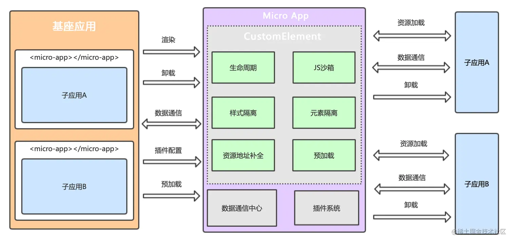

# 使用 micro-app 进行微前端接入

## 一、引言



微前端架构是一种将应用程序拆分成多个小型、独立的前端应用的开发模式，这些小型应用可以独立开发、部署和运行，同时又能无缝地集成到一个主应用中。`micro-app` 是一个基于 WebComponent 标准的微前端框架，它通过自定义的 `Shadow DOM` 实现了微应用之间的隔离，使得微应用可以像普通组件一样被嵌入到主应用中。本文将详细介绍如何使用 `micro-app` 进行微前端接入，包括主应用和子应用的配置、数据通信以及性能优化等方面。

- 我们这里使用的微前端框架是京东的 micro-app，你可以阅读[官方站点](https://jd-opensource.github.io/micro-app/docs.html)，以便对该框架有更加前面的了解和掌握。

## 二、主应用接入步骤

### （一）安装 `micro-app`

在主应用中，首先需要安装 `micro-app` 依赖。可以使用 npm 或 yarn 进行安装：

```bash
npm install @micro-zoe/micro-app --save
```

或者

```bash
yarn add @micro-zoe/micro-app
```

### （二）启动 `micro-app`

在主应用的入口文件（如 `main.js` 或 `main.ts`）中，引入 `micro-app` 并启动：

```javascript
import microApp from '@micro-zoe/micro-app';

microApp.start();
```

### （三）配置 `micro-app`

在主应用的配置文件（如 `vite.config.js` 或 `vue.config.js`）中，添加对 `micro-app` 的支持。例如，在 `vite.config.js` 中：

```javascript
import { defineConfig } from 'vite';
import vue from '@vitejs/plugin-vue';
import microApp from '@micro-zoe/micro-app';

export default defineConfig({
  plugins: [vue(), microApp()],
  server: {
    headers: {
      'Access-Control-Allow-Origin': '*',
    },
  },
});
```

### （四）页面引入子应用

在主应用的页面中，使用 `<micro-app>` 标签引入子应用：

```html
<template>
  <div>
    <h1>主应用</h1>
    <micro-app name="childApp" url="http://localhost:3001/"></micro-app>
  </div>
</template>
```

- `name`：子应用的名称，必须以字母开头，且不可以带有除中划线和下划线外的特殊符号。
- `url`：子应用的地址，必须指向子应用的 `index.html`。

## 三、子应用接入步骤

### （一）子应用配置

子应用通常不需要进行特殊的配置，只需确保支持跨域访问即可。在子应用的构建配置中，设置 `publicPath` 为 `./`，以确保资源路径正确：

```javascript
output: {
  publicPath: './',
},
```

### （二）启动子应用

启动子应用，确保子应用可以正常运行。例如，使用 `npm start` 或 `yarn start` 启动子应用。

## 四、数据通信

### （一）父传子

在主应用中，可以通过 `microApp.setData` 方法向子应用传递数据：

```javascript
microApp.setData('childApp', { message: 'Hello from parent' });
```

在子应用中，可以通过监听 `micro-app` 的 `data` 事件来接收数据：

```javascript
window.addEventListener('micro-app:data', (e) => {
  if (e.detail.appName === 'childApp') {
    console.log('Data from parent:', e.detail.data);
  }
});
```

### （二）子传父

在子应用中，可以通过 `microApp.dispatch` 方法向主应用传递数据：

```javascript
microApp.dispatch('eventName', { message: 'Hello from child' });
```

在主应用中，可以通过监听 `micro-app` 的 `event` 事件来接收数据：

```javascript
window.addEventListener('micro-app:event', (e) => {
  if (e.detail.eventName === 'eventName') {
    console.log('Data from child:', e.detail.data);
  }
});
```

## 五、性能优化

### （一）预加载

`micro-app` 支持预加载功能，可以在子应用尚未渲染时提前加载静态资源，从而提升子应用的首次渲染速度。预加载会在浏览器空闲时间执行，不会阻塞主应用的加载。

## 六、注意事项

### （一）name 属性

`name` 属性必须以字母开头，且不可以带有除中划线和下划线外的特殊符号。

### （二）url 属性

`url` 属性必须指向子应用的 `index.html`，子应用的页面渲染还是基于浏览器地址的。

### （三）跨域配置

子应用必须支持跨域访问，跨域配置参考 。

## 七、总结

通过上述步骤，你可以轻松地将 `micro-app` 集成到主应用中，实现微前端架构的高效开发和部署。`micro-app` 提供了简洁的 API 和强大的功能，使得微前端的接入变得非常简单。在实际项目中，可以根据需求进一步优化和扩展 `micro-app` 的功能，以满足特定的业务场景。
