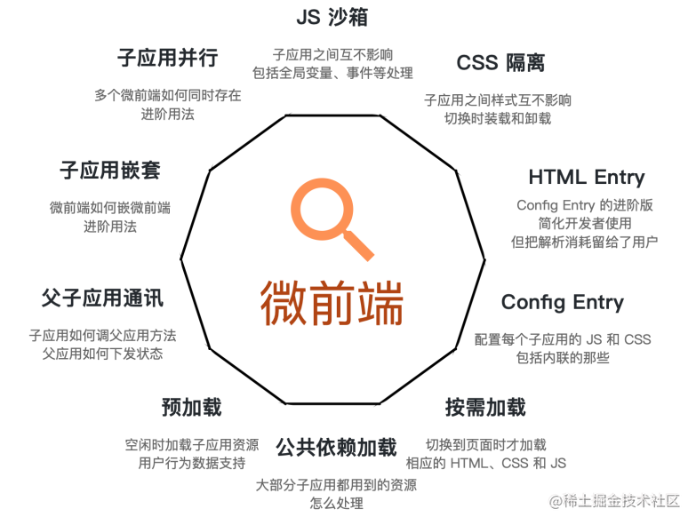

# 微前端：架构模式、技术实现与最佳实践

## 一、微前端：定义与意义



### （一）定义

微前端（Micro Frontends）是一种架构模式，它将大型前端应用拆分成多个小型、独立的模块。每个模块可以独立开发、测试和部署，同时作为一个整体协同工作，以提高应用的可维护性、可扩展性和开发效率。

### （二）意义

- **增强灵活性**：不同的团队可以专注于各自的微前端，使用最适合的技术栈。
- **加速迭代**：各微前端可以独立更新和部署，减少了对整个系统的依赖。
- **提升性能**：通过懒加载等策略，只在需要时加载特定的微前端，从而减少初始加载时间。
- **促进复用**：组件化设计使得代码和功能可以在不同项目间共享。

## 二、历史背景与发展

微前端概念由 ThoughtWorks 的技术总监 Cam Jackson 在 2016 年提出，随着 Web 应用复杂性的增长，传统的单体前端架构面临诸多挑战。微前端架构借鉴了微服务的思想，旨在解决这些问题，并为现代前端开发提供了新的解决方案。

### 微服务与微前端的比较


**微服务**是一种后端架构模式，将一个大型应用拆分为多个小型、独立的服务，每个服务专注于特定的业务功能，可以独立开发、部署和扩展。微服务的特点包括：

- **独立性**：每个服务独立运行，通常通过网络通信。
- **松耦合**：服务之间通过明确定义的接口通信，减少依赖。
- **技术多样性**：不同服务可以使用不同的技术栈。
- **渐进式升级**：可以逐步替换旧服务，而不影响整体系统。

**微前端**借鉴了微服务的理念，将前端应用拆分为多个小型、独立的模块。每个模块可以独立开发、测试和部署，同时作为一个整体协同工作。微前端的特点包括：

- **独立性**：每个微前端模块独立运行，通常通过路由或模块联邦集成。
- **松耦合**：模块之间通过明确定义的接口通信。
- **技术多样性**：不同模块可以使用不同的前端框架。
- **渐进式升级**：可以逐步替换旧模块，而不影响整体系统。

**差异**：

- **运行环境**：微服务运行在服务器端，而微前端运行在浏览器中。
- **通信方式**：微服务通过网络通信（如 REST API），而微前端通常通过事件总线或全局状态管理工具通信。
- **隔离性**：微服务天然隔离，而微前端需要通过沙箱、Shadow DOM 等方式实现隔离。

## 三、技术原理

微前端的核心思想在于**独立性**、**技术多样性**、**封装性**和**集成能力**：

- **独立性**：每个微前端是一个独立的应用，拥有自己的代码库、构建流程和部署周期。
- **技术多样性**：允许使用不同的前端框架和技术栈，满足不同业务场景的需求。
- **封装性**：确保微前端之间相互隔离，避免全局状态的共享，减少耦合。
- **集成能力**：通过宿主应用（Host Application），实现统一的路由管理、状态共享和通信机制。

## 四、核心技术方案

### （一）HTML Entry 的原理

HTML entry 是微前端架构中用于加载子应用资源的核心机制。基座应用通过获取子应用的HTML文件，解析其中的CSS和JS资源，并动态加载到基座应用中。这一过程通常通过以下步骤实现：

1. **获取HTML内容**：基座应用通过`fetch`请求获取子应用的HTML文件内容。
2. **解析HTML**：对HTML内容进行解析，提取其中的CSS和JS资源路径。
3. **动态加载资源**：根据解析出的资源路径，动态加载CSS和JS文件到基座应用中。
4. **处理资源冲突**：通过沙箱机制或其他隔离技术，确保子应用的资源不会与基座应用或其他子应用冲突。

### 核心实现示例

以下是基于`import-html-entry`的实现示例：

#### 1. 获取HTML内容

```javascript
// 使用fetch获取子应用的HTML内容
export function loadHtml(app) {
  fetch(app.url)
    .then((res) => res.text())
    .then((html) => {
      // 解析HTML内容
      const htmlDom = document.createElement('div');
      htmlDom.innerHTML = html;
      extractSourceDom(htmlDom, app);
    })
    .catch((e) => {
      console.error('加载HTML出错', e);
    });
}
```

#### 2. 解析HTML并提取资源

```javascript
// 提取HTML中的CSS和JS资源
function extractSourceDom(htmlDom, app) {
  const links = htmlDom.querySelectorAll('link[rel="stylesheet"]');
  const styles = htmlDom.querySelectorAll('style');
  const scripts = htmlDom.querySelectorAll('script');

  // 提取CSS资源
  Array.from(links).forEach((link) => {
    app.source.links.add(link.href);
  });

  // 提取内联CSS
  Array.from(styles).forEach((style) => {
    app.source.styles.add(style.textContent);
  });

  // 提取JS资源
  Array.from(scripts).forEach((script) => {
    if (script.src) {
      app.source.scripts.add(script.src);
    } else {
      app.source.scripts.add(script.textContent);
    }
  });
}
```

#### 3. 动态加载CSS资源

```javascript
// 加载CSS资源
export function fetchLinksFromHtml(app, microAppHead) {
  const linkEntries = Array.from(app.source.links.entries());
  const fetchLinkPromise = [];

  for (const [url] of linkEntries) {
    fetchLinkPromise.push(fetchSource(url));
  }

  Promise.all(fetchLinkPromise)
    .then((res) => {
      for (let i = 0; i < res.length; i++) {
        const code = res[i];
        const link2Style = document.createElement('style');
        link2Style.textContent = code;
        microAppHead.appendChild(link2Style);
      }
    })
    .catch((e) => {
      console.error('加载CSS出错', e);
    });
}
```

#### 4. 动态加载JS资源

```javascript
// 加载JS资源
export function fetchScriptsFromHtml(app) {
  const scriptEntries = Array.from(app.source.scripts.entries());
  const fetchScriptPromise = [];

  for (const [url, info] of scriptEntries) {
    fetchScriptPromise.push(
      info.code ? Promise.resolve(info.code) : fetchSource(url),
    );
  }

  Promise.all(fetchScriptPromise)
    .then((res) => {
      for (let i = 0; i < res.length; i++) {
        const code = res[i];
        // 在沙箱中执行JS代码
        executeScriptInSandbox(code, app);
      }
    })
    .catch((e) => {
      console.error('加载JS出错', e);
    });
}
```

### （二）JavaScript 隔离

1. **环境快照**

   - **演示代码**：

     ```js
     function executeScriptInSandbox(code, dependencies) {
       const globalSnapshot = JSON.parse(JSON.stringify(window));
       Object.assign(window, dependencies);
       eval(code);
       Object.assign(window, globalSnapshot);
     }
     ```

   - **优点**：简单易行，有效防止全局变量污染。
   - **缺点**：不适合多实例场景，频繁切换可能影响性能。

2. **代理和闭包**

   - **演示代码**：

     ```js
     function executeScriptInSandbox(code) {
       (function () {
         const proxy = new Proxy(window, {
           get(target, prop) {
             return prop === 'sandbox' ? this : target[prop];
           },
           set(target, prop, value) {
             if (prop === 'sandbox') {
               this[prop] = value;
             } else {
               target[prop] = value;
             }
           },
         });
         with (proxy) {
           eval(code);
         }
       })();
     }
     ```

   - **优点**：提供强隔离性，模拟完整的沙箱环境。
   - **缺点**：实现复杂，需深度封装浏览器原生对象。

3. **iFrame**

   - **演示代码**：

     ```html
     <iframe id="sandbox" style="display: none;"></iframe>
     <script>
       const iframe = document.getElementById('sandbox');
       iframe.onload = function () {
         const iframeWindow = iframe.contentWindow;
         iframeWindow.eval('console.log("Hello from iframe!");');
       };
     </script>
     ```

   - **优点**：天然隔离，适合完全隔离的场景。
   - **缺点**：与主页面交互复杂，性能开销较大。

### （三）CSS 隔离

#### 1. **Shadow DOM**

Shadow DOM 是一种浏览器内置技术，允许开发者创建封闭的 DOM 和样式作用域，从而实现样式隔离。

- **核心原理**：

  1. **独立 DOM 树**：通过 `attachShadow()` 方法创建一个独立的 DOM 树，样式仅作用于该树内的元素。
  2. **样式封装**：Shadow DOM 内的样式不会影响外部 DOM，从而实现样式隔离。
  3. **性能优化**：Shadow DOM 提供了天然的样式隔离，减少了样式冲突的可能性，提升了性能。

- **实现示例**：

  ```javascript
  const shadowRoot = document
    .createElement('div')
    .attachShadow({ mode: 'open' });
  shadowRoot.innerHTML = `
    <style>
      :host .my-class {
        color: red;
      }
    </style>
    <div class="my-class">Hello</div>
  `;
  document.body.appendChild(shadowRoot);
  ```

#### 2. **CSS Modules**

CSS Modules 是一种通过模块化方式管理样式的工具，确保样式仅作用于当前组件。

- **核心原理**：
  1. **AST解析**：CSS文件被解析为抽象语法树（AST），用于分析和操作CSS节点。
  2. **类名唯一化**：为每个类名生成一个唯一的标识符，通常通过哈希算法实现。
  3. **样式作用域限制**：通过为类名添加前缀或后缀，确保样式仅作用于当前组件。
  4. **编译输出**：生成的CSS文件中，类名被替换为唯一的标识符，避免全局样式污染。

以下是常见的 CSS 隔离方式及其核心原理和实现示例：

##### 2.1. Scoped CSS

Scoped CSS 是一种通过 `scoped` 属性限制样式作用域的机制，确保样式仅应用于当前组件或模块。

- **核心原理**：当在 `<style>` 标签中添加 `scoped` 属性时，Vue 会使用 PostCSS 对 CSS 进行转换。这个过程包括：

  1. 为组件的元素添加一个唯一的 `data-*` 属性（例如 `data-v-f3f3eg9`）。
  2. 重写 CSS 选择器，使其包含这个唯一属性。

- **实现示例**：

  ```html
  <template>
    <div class="example">Hello</div>
  </template>
  <style scoped>
    .example {
      color: red;
    }
  </style>
  ```

  编译后：

  ```html
  <div class="example" data-v-f3f3eg9>Hello</div>
  ```

  ```css
  .example[data-v-f3f3eg9] {
    color: red;
  }
  ```

  在上述代码中，`.example` 的样式仅作用于带有 `data-v-f3f3eg9` 属性的元素。

- **注意事项**：
  1. **父子组件的 Scoped CSS 行为**：父组件的样式会影响子组件的根节点，但不会影响子组件内部的其他节点。
  2. **样式覆盖问题**：由于 Scoped CSS 通过属性选择器限制作用域，类名仍然是全局的，因此在其他地方对相同类名设置样式仍可能造成污染。

##### 2.2. CSS 命名空间

通过为每个微前端的样式添加唯一的命名空间前缀，避免样式冲突。

- **核心原理**：在构建过程中，为每个微前端的 CSS 类名添加唯一标识符（如 `data-qiankun="appName"`）。
- **实现示例**：

  ```css
  /* 子应用中 */
  .my-class {
    color: red;
  }
  ```

  转换后：

  ```css
  div[data-qiankun='appName'] .my-class {
    color: red;
  }
  ```

  通过这种方式，样式仅作用于特定微前端的容器。

### （四）路由管理

微前端通常需要一个中心化的路由系统来协调各个微前端之间的导航。这可以通过配置文件或动态加载的方式实现。

在实际项目中，子应用通常使用基座传入的 `history` 对象进行路由管理。这种设计的原因包括：

- **统一性**：基座提供的 `history` 对象确保所有子应用使用相同的路由管理机制，避免路由冲突。
- **全局控制**：基座可以统一管理路由状态，确保子应用之间的导航一致。
- **性能优化**：通过基座的路由管理，可以实现懒加载和代码分割，减少初始加载时间。

### （五）通信机制

为了确保微前端之间能够安全有效地交换数据，必须有一套完善的通信机制。

#### 1. micro-app 通信机制

micro-app 通过 `EventEmitter` 或 `window.postMessage` 实现主应用和子应用之间的通信。

##### 1.1 **`EventEmitter`**

- **主应用中使用**：

  ```javascript
  import { EventEmitter } from 'micro-app';

  const eventEmitter = new EventEmitter();

  // 发布事件
  eventEmitter.emit('dataUpdated', { data: 'Hello from main app' });
  ```

- **子应用中使用**：

  ```javascript
  import { EventEmitter } from 'micro-app';

  const eventEmitter = new EventEmitter();

  // 订阅事件
  eventEmitter.on('dataUpdated', (data) => {
    console.log('Received data:', data);
  });
  ```

- **优点**：适合主应用和子应用之间的双向通信，事件机制灵活。

##### 1.2 **`window.postMessage`**

- **主应用中使用**：

  ```javascript
  window.postMessage({ type: 'DATA', data: 'Hello from main app' }, '*');
  ```

- **子应用中使用**：

  ```javascript
  window.addEventListener('message', (event) => {
    if (event.data.type === 'DATA') {
      console.log('Received data:', event.data.data);
    }
  });
  ```

- **优点**：适合跨域通信，主应用和子应用之间可以直接传递消息。

#### 2. qiankun 通信机制

qiankun 提供了多种通信方式，包括 `initGlobalState`、`props` 属性和自定义事件等。

##### 2.1 **`initGlobalState` 方法**

- **简介**：`initGlobalState` 是 qiankun 提供的全局状态管理方法，基于 `mitt` 库实现了一个简单的事件总线机制，允许主应用和子应用之间共享数据并响应数据变化。
- **主应用中使用**：

  ```javascript
  import { initGlobalState } from 'qiankun';

  // 初始化全局状态
  const state = {
    testId: null,
  };
  const actions = initGlobalState(state);

  // 监听全局状态变化
  actions.onGlobalStateChange((state, prev) => {
    console.log('onGlobalStateChange', state, prev);
  });

  // 在主应用中更新状态
  registerMicroApps(
    [
      // 子应用配置
    ],
    {
      afterMount: (app) => {
        actions.setGlobalState({ testId: 11111 });
      },
    },
  );
  ```

- **子应用中使用**：

  ```javascript
  import { createApp } from 'vue';
  import App from './App.vue';

  let instance = null;
  const actions = {};

  function render(props = {}) {
    if (props) {
      actions.onGlobalStateChange = props.onGlobalStateChange;
      actions.setGlobalState = props.setGlobalState;
    }

    instance = createApp(App);
    instance.mount(
      props.container ? props.container.querySelector('#app') : '#app',
    );
  }

  // 在子应用中更新状态
  export async function bootstrap() {
    console.log('[vue] vue app bootstraped');
  }

  export async function mount(props) {
    console.log('[vue] props from main framework', props);
    render(props);
  }

  export async function unmount() {
    instance.$destroy();
    instance = null;
  }
  ```

- **优点**：简单易用，与 qiankun 的其他机制（如生命周期管理）集成良好，适合主应用和子应用之间的全局状态共享。

##### 2.2 **`props` 属性**

- **主应用中使用**：

  ```javascript
  registerMicroApps([
    {
      name: 'silvia-micro',
      entry: '//localhost:5174',
      container: '#container',
      activeRule: '/silvia-micro',
      props: {
        mainInfo: {
          name: 'zhangsan',
        },
      },
    },
  ]);
  ```

- **子应用中使用**：

  ```javascript
  function render(props = {}) {
    console.log('props from main app', props);
    // 使用 props 数据
  }
  ```

- **优点**：适合单向数据流，主应用可以向子应用传递初始数据。

##### 2.3 **自定义事件**

- **主应用中使用**：

  ```javascript
  const event = new CustomEvent('microAppMessage', {
    detail: {
      message: '这是主应用发送的消息',
    },
  });

  const click = () => {
    window.dispatchEvent(event);
  };
  ```

- **子应用中使用**：

  ```javascript
  window.addEventListener('microAppMessage', (event) => {
    console.log('微应用收到消息:', event.detail.message);
  });
  ```

- **优点**：灵活，适合主应用和子应用之间的单向消息传递。

## 五、市面上流行的微前端框架

### （一）Single-spa

- **特点**：支持多种框架，提供生命周期管理。
- **优点**：灵活性高，易于集成；强大的社区支持。
- **缺点**：初次学习成本较高。

### （二）qiankun

- **特点**：基于 Single-spa，强化了沙箱隔离。
- **优点**：上手容易，良好的中文文档和支持。
- **缺点**：对于新手来说，某些高级特性可能较难掌握。

### （三）micro-app

- **特点**：由京东前端团队推出，借鉴 WebComponent 思想。
- **优点**：易于使用，内置样式隔离。
- **缺点**：相比其他框架，社区规模较小。

### （四）Module Federation

- **特点**：Webpack 提供的一种新型微前端解决方案，允许模块级别的按需加载。
- **优点**：与 Webpack 生态系统无缝集成，支持热模块替换。
- **缺点**：配置复杂，对 Webpack 版本有要求。

## 六、实际案例与最佳实践

微前端的成功实施不仅依赖于正确选择框架和技术栈，还需要遵循一些最佳实践：

- **明确职责划分**：清晰界定每个微前端的责任范围，避免过度重叠。
- **持续集成/持续部署 (CI/CD)**：建立自动化的构建和部署流程，确保快速响应变化。
- **监控与调试**：引入合适的监控工具，及时发现并解决问题。
- **安全性考量**：确保所有微前端都遵循相同的安全标准，保护用户数据。

## 七、微前端的优缺点

### （一）优点

- **适用于大规模 Web 应用的开发**：微前端架构特别适合大型企业级应用，能够有效管理复杂度。
- **更快的开发速度**：独立的微前端可以并行开发，减少开发周期。
- **支持迭代可开发和增强升级**：微前端可以独立更新和部署，不影响其他部分。
- **拆解后的部分降低了开发者的理解成本**：每个微前端相对较小，易于理解和维护。
- **同时具备 UX 和 DX 的开发模式**：微前端架构既保证了用户体验，又提升了开发体验。

### （二）缺点

- **复杂度从代码转向基础设施**：微前端架构需要更多的基础设施支持，如部署平台、监控系统等。
- **整个应用的稳定性和安全性变得更加不可控**：微前端之间的隔离和通信增加了系统的复杂性，可能导致稳定性问题。
- **具备一定的学习和了解成本**：微前端架构需要开发者掌握新的概念和技术。
- **需要建立全面的微前端周边设施**：为了充分发挥微前端的优势，需要建立调试工具、监控系统、上层 Web 框架和部署平台等。

## 八、何时使用微前端

- **大规模企业级 Web 应用开发**：微前端架构特别适合大型企业级应用，能够有效管理复杂度。
- **跨团队及企业级应用协作开发**：微前端架构支持多个团队并行开发，减少相互依赖。
- **长期收益高于短期收益**：虽然微前端架构的初期投入较大，但长期来看能够带来更高的收益。
- **不同技术选型的项目**：微前端架构允许使用不同的技术栈，满足不同业务场景的需求。
- **内聚的单个产品中部分需要独立发布、灰度等能力**：微前端架构支持独立部署和灰度发布，提高灵活性。

## 九、结论

微前端架构为复杂的前端应用带来了前所未有的灵活性和可维护性。通过合理选择和组合各种技术和工具，开发者可以根据自身需求定制出理想的解决方案。无论是初创企业还是大型组织，都可以从中受益，提高生产力和用户体验。微前端架构虽然带来了一定的复杂度，但通过建立完善的基础设施和遵循最佳实践，可以有效应对这些挑战。
