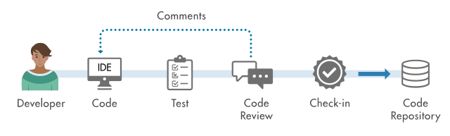

# Git 使用指南

## 一、Git 简介

Git 是一个分布式版本控制系统，用于跟踪代码文件的更改，记录历史版本，并协同开发团队之间的代码交流与合作。它可以帮助开发团队协同工作，并对代码进行有效管理。

## 二、Git 基本操作

### 1. 安装与配置

- **安装 Git**：从 Git 官网下载适合你操作系统的安装包，然后按照安装向导进行安装。
- **配置 Git**：安装完成后，配置 Git 的用户信息，包括用户名和邮箱地址：

```bash
git config --global user.name "Your Name"
git config --global user.email "your_email@example.com"
```

### 2. 创建仓库

在你的项目文件夹中，运行以下命令来初始化一个新的 Git 仓库：

```bash
git init
```

### 3. 添加文件

将你的项目文件添加到 Git 仓库中：

```bash
git add <文件名>  # 添加单个文件
git add .         # 添加所有文件
```

### 4. 提交更改

将暂存区的文件提交到 Git 仓库中：

```bash
git commit -m "commit message"
```

这里的 "commit message" 是你对这次提交所做更改的简要描述。

### 5. 查看状态

使用以下命令可以查看当前仓库的状态：

```bash
git status
```

这可以帮助你了解哪些文件被添加、修改或删除，还可以查看当前分支信息。

### 6. 查看提交历史记录

使用以下命令可以查看仓库的提交历史记录：

```bash
git log
```

这个命令可以列出仓库中的所有提交记录，包括作者、时间和提交信息等。

## 三、Git 分支管理

### 1. 创建分支

创建新分支并切换到该分支：

```bash
git checkout -b <branchname>
```

例如：

```bash
git checkout -b feature-xyz
```

### 2. 切换分支

切换到指定的分支：

```bash
git checkout <branchname>
```

例如：

```bash
git checkout main
```

### 3. 查看分支

查看所有分支：

```bash
git branch
```

查看远程分支：

```bash
git branch -r
```

查看所有本地和远程分支：

```bash
git branch -a
```

### 4. 合并分支

将其他分支合并到当前分支：

```bash
git merge <branchname>
```

例如，切换到 main 分支并合并 feature-xyz 分支：

```bash
git checkout main
git merge feature-xyz
```

### 5. 解决合并冲突

当合并过程中出现冲突时，Git 会标记冲突文件，你需要手动解决冲突。打开冲突文件，按照标记解决冲突。标记冲突解决完成：

```bash
git add <conflict-file>
```

提交合并结果：

```bash
git commit
```

### 6. 删除分支

删除本地分支：

```bash
git branch -d <branchname>
```

强制删除未合并的分支：

```bash
git branch -D <branchname>
```

删除远程分支：

```bash
git push origin --delete <branchname>
```

## 四、Git 分支管理最佳实践：Git Flow

Git Flow 是一种流行的分支管理模型，它为团队提供了一种清晰的流程和规范来管理代码分支，特别适用于多人协作的项目。


### 1. 主要分支

- **master/main 分支**：这是主分支，通常用于保存已经发布的稳定代码。只有经过充分测试和验证的代码才能合并到此分支。
- **develop 分支**：这是开发分支，用于整合开发人员提交的新功能代码。在每次发布之前，develop 分支会被合并到 master 分支。

### 2. 功能分支

- **feature 分支**：用于开发新功能。从 develop 分支创建，功能开发完成后合并回 develop 分支。

### 3. 发布分支

- **release 分支**：用于准备发布。从 develop 分支创建，用于进行最终的发布准备和测试。在 release 分支上完成测试后，将其合并到 master 分支进行发布，并同时合并回 develop 分支以确保后续开发基于最新的代码。

### 4. 修复分支

- **hotfix 分支**：用于快速修复线上出现的紧急问题。从 master 分支创建，修复完成后合并回 master 分支和 develop 分支。

## 五、Code Review 和 Pull Request（PR）操作流程



### 1. Code Review

Code Review 是团队协作中非常重要的一环，它可以帮助发现代码中的问题、提高代码质量，并促进团队成员之间的交流和学习。

- **提交代码**：开发人员在完成功能开发或修复后，将代码提交到对应的分支。
- **发起 Code Review**：在代码提交后，通过团队约定的方式（如邮件、即时通讯工具等）通知团队成员进行 Code Review。
- **审查代码**：团队成员对代码进行审查，检查代码的逻辑、结构、风格等方面是否符合规范和要求，是否存在潜在的问题。
- **反馈意见**：审查人员将发现的问题和建议反馈给开发人员，开发人员根据反馈进行修改和完善。
- **确认通过**：在代码通过审查后，开发人员可以将其合并到主分支。

### 2. Pull Request（PR）

Pull Request 是一种在 Git 平台上（如 GitHub、GitLab 等）用于请求将一个分支的更改合并到另一个分支的机制，它提供了一种方便的代码审查和讨论方式。

- **创建 Pull Request**：在完成代码开发并推送到远程仓库后，通过平台的界面创建一个新的 Pull Request，指定源分支和目标分支，并填写相关的描述信息。
- **审查和讨论**：团队成员对 Pull Request 中的代码进行审查，可以查看代码的更改、提交历史等，并在评论区发表意见和建议。开发人员可以根据反馈进行修改并推送新的提交。
- **合并 Pull Request**：在代码通过审查且满足合并条件后，由有权限的团队成员（如项目负责人或代码管理员）点击合并按钮，将源分支的代码合并到目标分支。
- **关闭 Pull Request**：如果 Pull Request 不需要合并或者已经被其他方式替代，可以关闭该 Pull Request。
