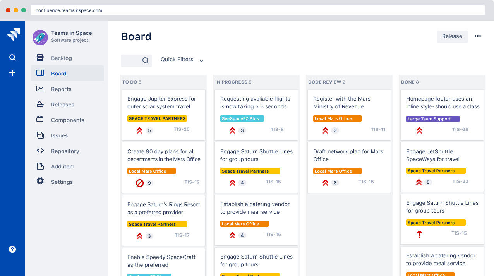
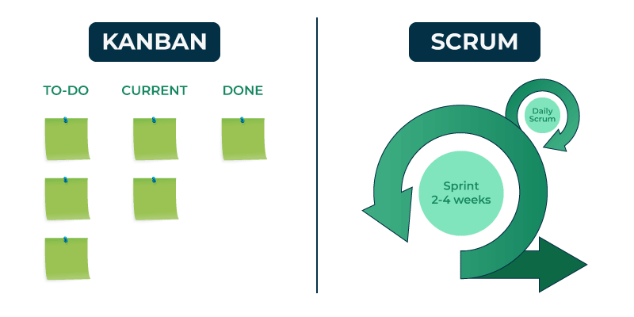

# 敏捷开发指南

## 一、敏捷开发概述

敏捷开发是一种以用户为中心、迭代式开发的软件开发方法。它强调快速响应变化，通过频繁的交付和反馈来不断优化产品。敏捷开发的核心价值观包括个体和互动、工作的软件、客户合作以及响应变化。

## 二、Scrum 框架

Scrum 是敏捷开发中常用的一种框架，它通过迭代式开发和定期的回顾会议来不断优化团队的工作流程和产品质量。

### 1. Scrum 角色

- **产品负责人（Product Owner）**：负责管理产品待办事项列表，确定需求的优先级，并与团队沟通产品愿景和目标。
- **Scrum Master**：负责确保团队遵循 Scrum 流程，消除团队遇到的障碍，并促进团队与外部利益相关者之间的沟通。
- **开发团队**：由专业人员组成，负责实际的开发工作，包括编程、测试等。

### 2. Scrum 流程

- **Sprint 规划会议**：在每个 Sprint 开始时召开，团队共同确定本次 Sprint 的目标和任务，从产品待办事项列表中选取适量的任务放入 Sprint 待办事项列表。
- **每日站会**：每个工作日固定时间（通常为 15 分钟）召开，团队成员依次分享昨天完成了哪些工作、今天计划做什么以及目前遇到的困难。
- **Sprint Review 会议**：在 Sprint 结束时召开，团队向产品负责人和利益相关者展示 Sprint 的成果，收集反馈意见。
- **Sprint 回顾会议**：在 Sprint 结束后召开，团队内部回顾本次 Sprint 的工作情况，总结经验教训，提出改进措施。

### 3. Scrum 工件

- **产品待办事项列表（Product Backlog）**：包含产品所有需求的列表，按优先级排序。
- **Sprint 待办事项列表（Sprint Backlog）**：在 Sprint 规划会议中从产品待办事项列表中选取的任务列表。
- **增量（Increment）**：每个 Sprint 结束时团队完成的工作成果，可是一个可发布的软件版本。

## 三、站会的实践

站会是 Scrum 框架中重要的沟通机制，通过每日的短暂会议，团队成员可以及时了解彼此的工作进展和遇到的问题。

### 1. 站会的目的

- **信息同步**：让团队成员了解彼此的工作内容和进度，确保大家对项目目标和当前状态有清晰的认识。
- **问题暴露**：及时发现团队成员在工作中遇到的困难和阻碍，便于快速解决，避免问题积累。
- **促进协作**：通过交流，团队成员可以找到合作的机会，共同完成复杂的任务。

### 2. 站会的流程

- **时间控制**：站会通常限制在 15 分钟以内，以确保高效。
- **固定时间地点**：每天在固定的时间和地点召开站会，形成规律。
- **发言顺序**：团队成员依次发言，可以按照顺时针或逆时针方向，或者按照任务相关性等顺序。

### 3. 站会的注意事项

- **避免冗长讨论**：站会不是问题解决会议，对于复杂的问题可以在会后单独讨论。
- **准时参加**：所有团队成员都应该准时参加站会，以示对团队和工作的尊重。
- **真实反馈**：团队成员应如实分享工作进展和遇到的问题，不要隐瞒或夸大。

## 四、Jira 管理工具的使用

Jira 是一款流行的项目管理和问题跟踪工具，特别适用于敏捷开发团队。

### 1. 创建项目

- **登录 Jira**：打开 Jira 官网，使用账号登录。
- **点击创建项目**：在 Jira 界面中找到创建项目的入口。
- **选择项目类型**：选择适合敏捷开发的项目模板，如 Scrum 或 Kanban。
- **填写项目信息**：输入项目名称、描述等信息，然后创建项目。

### 2. 管理需求

- **创建用户故事**：在项目中创建用户故事，描述用户的需求和期望。
- **拆分任务**：将用户故事拆分为具体的任务，分配给团队成员。
- **设置优先级**：根据产品负责人的要求，为需求设置优先级，以便团队合理安排工作顺序。

### 3. Sprint 计划

- **进入 Sprint 规划**：在 Jira 的 Scrum 板中，找到 Sprint 规划的入口。
- **选择任务**：从产品待办事项列表中选择适合本次 Sprint 的任务，放入 Sprint 待办事项列表。
- **估算工作量**：团队成员对任务进行工作量估算，可以使用故事点或其他估算方法。

### 4. 跟踪进度

- **查看 Scrum 板**：在 Jira 的 Scrum 板上，可以直观地看到每个任务的进展情况，包括待办、进行中、已完成等状态。
- **更新任务状态**：团队成员在完成任务后，及时在 Jira 中更新任务状态，以便准确反映项目进度。
- **生成报表**：Jira 提供了多种报表功能，如燃尽图等，可以帮助团队了解 Sprint 的进展情况和工作负载分布。

## 五、看板的使用

看板是一种可视化的工作管理工具，可以帮助团队清晰地看到任务的流转情况，优化工作流程。

### 1. 创建看板

- **进入看板创建界面**：在 Jira 中找到创建看板的入口。
- **选择看板类型**：选择适合团队工作方式的看板类型，如 Scrum 看板或 Kanban 看板。
- **配置看板**：根据需要对看板进行配置，如设置列、限制在制品数量等。

### 2. 管理任务

- **添加任务**：在看板上添加新的任务，填写任务相关信息，如标题、描述、负责人等。
- **移动任务**：随着任务的进展，将任务从一列移动到另一列，如从待办移动到进行中，再移动到已完成。
- **限制在制品数量**：通过设置在制品数量的限制，避免团队成员同时处理过多的任务，提高工作效率。

### 3. 优化流程

- **分析流程瓶颈**：通过观察看板上任务的流转情况，发现流程中的瓶颈环节，如某一列任务堆积过多。
- **调整工作方式**：根据分析结果，调整团队的工作方式和资源配置，优化流程，提高整体效率。
