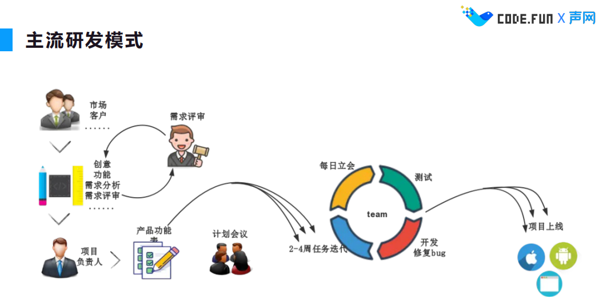
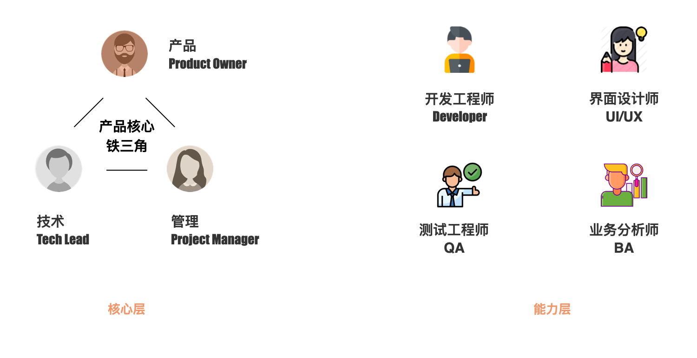

# 数字中台项目开发流程及团队角色解析

## 一、数字中台项目开发流程

### 1. 项目规划阶段

- **业务背景**：以某金融行业安全领域企业为例，该企业希望通过构建数字中台，整合内部多个安全领域的子系统，打破系统壁垒，提升整体安全防护能力和服务效率。具体目标包括统一用户权限管理、统一技术栈、收口基础能力，并通过微前端和微服务架构实现系统集成。
- **流程**：项目经理与企业高层、业务部门（如安全研发、运维、市场等）进行深入沟通，明确企业的数字化转型目标和对数字中台的期望功能。根据这些信息，制定项目的范围、目标、时间表和资源分配计划。

### 2. 需求分析阶段

- **产品经理**：产品经理与各部门深入沟通，收集详细的功能需求，如用户权限的统一管理、安全数据的实时监控、安全服务的模块化集成等。将这些需求整理成详细的需求文档，包括功能需求列表、业务流程图和页面跳转流程图等。
- **输出物**：《数字中台功能需求文档》、业务流程图、页面跳转流程图。

### 3. 设计阶段

- **原型设计**：产品经理使用Axure或Figma等工具，根据需求文档设计数字中台的原型图，展示各个页面的布局和交互逻辑，如用户权限管理页面的字段设置、安全监控页面的操作步骤等。
- **UI设计**：UI设计师根据原型图，设计出高保真的系统界面，包括颜色搭配、字体选择、图标设计等，确保界面美观且易于使用。
- **架构设计**：架构师设计整体技术架构，包括微服务架构和微前端架构，抽象和整合企业的共性安全能力，形成可复用的服务模块，如用户认证服务、安全监控服务等。

### 4. 开发阶段

- **前后端分离开发**：前端开发人员根据UI设计图，使用HTML、CSS、JavaScript等技术实现用户界面和交互功能；后端开发人员根据架构设计，使用Java、Python等语言实现业务逻辑和数据处理功能。
- **API网关开发**：开发API网关，实现对上层应用的统一管理，包括路由、认证和限流等功能。
- **代码管理**：开发团队使用Git等版本控制系统进行代码管理，确保多人协作时代码的稳定性和可追溯性。

### 5. 测试阶段

- **测试用例设计**：测试工程师根据需求文档和设计文档，设计测试用例，覆盖功能测试、性能测试、安全测试等多个方面，如测试用户权限的分配是否正确、系统的响应时间是否符合要求、数据传输是否安全等。
- **缺陷跟踪与修复**：测试过程中发现的缺陷会被记录在缺陷跟踪系统中，开发人员根据缺陷的严重程度和优先级进行修复，测试工程师对修复后的功能进行回归测试。

### 6. 部署上线阶段

- **上线准备**：运维团队在上线前对服务器环境进行配置，确保硬件资源充足、网络连接稳定，并安装必要的软件和中间件。
- **上线部署**：将经过测试的数字中台系统部署到生产环境，进行最后的验证和调整，确保系统能够稳定运行。
- **用户培训与文档**：为企业的安全人员、运维人员等提供系统的使用培训，并编写详细的用户手册和操作指南，帮助他们快速上手新系统。

### 7. 运维与迭代阶段

- **监控与维护**：运维团队实时监控系统的运行状态，包括服务器的性能指标、数据库的查询效率、用户的操作日志等，及时处理出现的故障和性能问题。
- **用户反馈与迭代**：收集企业用户在使用过程中的反馈意见，产品经理根据反馈对系统进行功能迭代和优化，不断提升用户体验和系统性能。

## 二、团队角色及职责

### 1. 项目经理

- **职责**：负责项目的整体规划、进度控制和资源协调。制定项目计划，明确各阶段的里程碑和交付物；定期与团队成员和利益相关者沟通，解决项目中出现的问题和风险；监控项目进度，确保项目按时、按质、按预算完成。
- **在数字中台项目中的表现**：项目经理需要协调产品经理、开发团队、测试团队和运维团队的工作，确保各部门能够紧密配合，按时完成各自的任务。例如，在项目规划阶段，与企业高层沟通确定项目的范围和目标；在开发阶段，解决开发过程中出现的技术难题和人员调配问题；在上线阶段，确保系统的顺利部署和上线。

### 2. 产品经理

- **职责**：负责收集和分析用户需求，制定产品功能和业务流程。撰写详细的需求文档，包括功能需求列表、业务流程图和页面跳转流程图等；与设计师、开发人员和测试人员沟通，确保他们对需求的理解一致；在项目过程中，根据用户反馈和市场变化，对产品进行迭代和优化。
- **在数字中台项目中的表现**：产品经理需要深入了解企业的安全业务需求，与安全研发部门、运维部门等密切合作，梳理出清晰的业务流程和功能需求。例如，与安全研发部门讨论用户权限管理系统的功能需求，确定需要在数字中台中实现的功能，如用户认证、权限分配、行为审计等；根据运维部门的需求，设计安全监控和预警功能，如实时日志分析、异常检测等。

### 3. UI设计师

- **职责**：根据产品原型图，设计出美观、易用的用户界面。确定页面的布局、颜色、字体、图标等元素，确保界面风格与品牌形象一致；设计交互效果，提升用户体验；输出设计规范和设计图，供前端开发人员实现。
- **在数字中台项目中的表现**：UI设计师需要将产品经理提供的原型图转化为高保真的界面设计图，考虑到不同设备和屏幕尺寸的适配性。例如，设计用户权限管理页面时，合理安排各个字段的位置和大小，使页面简洁明了；为安全监控页面设计直观的操作按钮和提示信息，帮助用户快速完成操作。

### 4. 架构师

- **职责**：设计数字中台的整体技术架构，包括微服务架构和微前端架构。抽象和整合企业的共性安全能力，形成可复用的服务模块；设计数据存储和处理方案，确保系统的高效运行和扩展性。
- **在数字中台项目中的表现**：架构师需要根据企业的安全业务需求，设计合理的技术架构。例如，设计微服务架构，将用户认证、安全监控等功能模块化，便于集成和扩展；设计统一的用户权限管理系统，确保不同子系统之间的权限一致性；通过微前端架构实现多个安全子系统的无缝集成。

### 5. 前端开发工程师

- **职责**：根据UI设计图，使用HTML、CSS、JavaScript等技术实现用户界面和交互功能。确保页面在不同浏览器和设备上的兼容性；与后端开发人员协作，完成数据的获取和展示。
- **在数字中台项目中的表现**：前端开发工程师需要将UI设计师提供的设计图转化为可运行的前端代码，实现各种页面的布局和交互效果。例如，实现用户权限管理页面的表单录入和查询功能，使用JavaScript进行表单验证和数据提交；为安全监控页面设计动态效果，如数据加载时的进度条显示等。

### 6. 后端开发工程师

- **职责**：根据架构设计，使用Java、Python等语言实现业务逻辑和数据处理功能。开发API接口，供前端调用；进行后端代码的测试和优化，确保系统的稳定性和性能。
- **在数字中台项目中的表现**：后端开发工程师负责实现数字中台的核心业务逻辑，如用户权限管理、安全数据监控等。例如，开发用户认证和权限分配功能，设计数据库表结构来存储用户信息和权限配置；实现安全数据的实时监控功能，通过API接口将数据提供给前端展示。

### 7. 测试工程师

- **职责**：根据需求文档和设计文档，设计测试用例，对系统进行全面测试。执行功能测试，确保系统的各项功能符合需求；进行性能测试，评估系统的响应时间和资源占用情况；进行安全测试，检查系统的漏洞和安全隐患。
- **在数字中台项目中的表现**：测试工程师需要对数字中台的各个模块进行详细的测试，确保系统的质量和稳定性。例如，测试用户权限的分配功能，检查权限配置是否正确、数据是否安全；对系统进行性能测试，模拟大量用户同时访问的情况，评估系统的响应时间和并发处理能力。

### 8. 运维工程师

- **职责**：负责系统的上线部署、运行维护和故障排除。配置服务器环境，确保硬件资源充足、网络连接稳定；监控系统的运行状态，及时处理出现的故障和性能问题；进行系统的备份和恢复，保障数据的安全性。
- **在数字中台项目中的表现**：运维工程师需要在系统上线前准备好服务器环境，安装必要的软件和中间件，并进行性能调优。例如，根据预计的用户数量和数据量，配置服务器的CPU、内存、存储等资源；在系统上线后，实时监控服务器的性能指标，如CPU使用率、内存占用、网络带宽等，及时发现并解决性能瓶颈。

## 三、总结

通过以上详细的数字中台项目开发流程和团队角色解析，我们可以看到，一个成功的数字中台项目离不开各个角色的紧密协作和明确的职责分工。从项目规划到运维迭代，每个阶段都有其独特的任务和挑战，而团队成员通过发挥各自的专业技能和经验，共同推动项目的顺利进行。

在实际的数字中台开发过程中，可能会根据项目的规模、复杂度和团队的组织结构进行适当的调整和优化。但无论项目如何变化，保持良好的沟通、明确的目标和高效的合作始终是确保项目成功的关键因素。希望本文能够帮助你深入了解数字中台项目开发的全过程以及团队成员的角色与职责，为你的数字化转型之旅提供有益的参考。

## 四、参考资料

[敏捷团队的关键角色](https://shaogefenhao.com/column/agile-team/20.team-role.html)
