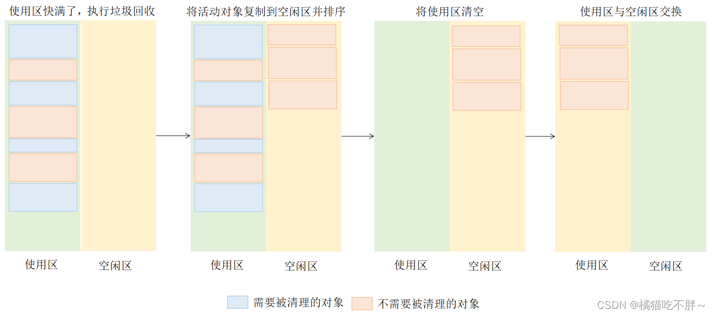
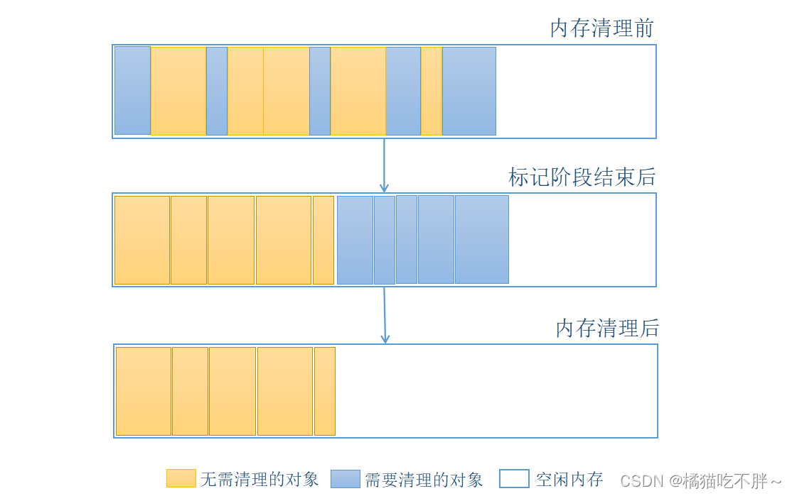

# 浏览器垃圾回收机制详解

## 1. 垃圾回收的概念与基础

垃圾回收（Garbage Collection, GC）是自动管理内存的重要机制。在 JavaScript 运行过程中，会动态分配内存存储变量和值。当某些变量或值不再被使用时，垃圾回收机制会释放这些内存资源。

### 1.1 自动垃圾回收机制的特点

- **自动化**：JavaScript 不需要手动分配和释放内存，垃圾回收器会定期检测并清理。
- **变量生命周期**：
  - 全局变量：生命周期与页面生命周期一致，只有在页面关闭时才会被清理。
  - 局部变量：随着函数调用开始分配，调用结束后自动清理，除非被外部引用（如闭包）。

### 1.2 闭包与垃圾回收

如果局部变量被外部函数引用（闭包），即使函数结束后，这些变量仍然存活，垃圾回收器无法清理它们。这种特性需要开发者注意管理引用，以避免内存泄漏。

#### 示例代码

```javascript
function createClosure() {
    let localVar = "I am in a closure";

    return function() {
        console.log(localVar); // 输出: I am in a closure
    };
}

const closure = createClosure();
closure(); // 调用闭包，localVar 仍然存在
```

#### 内存占用示意图

为了更好地理解闭包如何影响内存分配，我们来看以下详细的内存分配过程：

##### 初始状态

在全局执行上下文中，`createClosure` 函数被定义。

```
Global Execution Context:
+-------------------+
| Variable Object   |
| +---------------+ |
| | createClosure | |
| +---------------+ |
+-------------------+
| Lexical Environment: |
| +------------------|
| | createClosure -> [variable object] |
| +------------------|
| This Binding: window |
+-------------------+
```

##### 当 `createClosure` 被调用

在 `createClosure` 执行期间，创建了一个新的执行上下文，并且 `localVar` 被声明为该上下文的一部分。

```
Global Execution Context:
+-------------------+
| Variable Object   |
| +---------------+ |
| | createClosure | |
| | closure       | | -> null
| +---------------+ |
+-------------------+
| Lexical Environment: |
| +------------------|
| | createClosure -> [variable object] |
| | closure -> [variable object] |
| +------------------|
| This Binding: window |
+-------------------+

Create Closure Execution Context:
+-------------------+
| Activation Object |
| +---------------+ |
| | arguments     | |
| | localVar      | | -> "I am in a closure"
| +---------------+ |
+-------------------+
| Lexical Environment: |
| +------------------|
| | arguments -> [activation object] |
| | localVar -> [activation object] |
| +------------------|
| This Binding: Global Execution Context's this binding |
| Scope Chain: |
| -> Global Execution Context |
+-------------------+
```

##### 返回闭包函数

`createClosure` 返回一个匿名函数，并将这个函数赋值给 `closure` 变量。此时，闭包形成了对 `localVar` 的引用。

```
Global Execution Context:
+-------------------+
| Variable Object   |
| +---------------+ |
| | createClosure | |
| | closure       | | -> [closure function]
| +---------------+ |
+-------------------+
| Lexical Environment: |
| +------------------|
| | createClosure -> [variable object] |
| | closure -> [variable object] |
| +------------------|
| This Binding: window |
+-------------------+

Closure Function Execution Context (when calling closure):
+-------------------+
| Activation Object |
| +---------------+ |
| | arguments     | |
| +---------------+ |
+-------------------+
| Lexical Environment: |
| +------------------|
| | arguments -> [activation object] |
| +------------------|
| This Binding: Create Closure Execution Context's this binding |
| Scope Chain: |
| -> Create Closure Execution Context |
| -> Global Execution Context |
+-------------------+
```

##### 调用闭包函数

当调用 `closure` 函数时，它仍然可以访问 `localVar`，因为它保存了对外部变量的引用。

```
Global Execution Context:
+-------------------+
| Variable Object   |
| +---------------+ |
| | createClosure | |
| | closure       | | -> [closure function]
| +---------------+ |
+-------------------+
| Lexical Environment: |
| +------------------|
| | createClosure -> [variable object] |
| | closure -> [variable object] |
| +------------------|
| This Binding: window |
+-------------------+

Closure Function Execution Context (during call):
+-------------------+
| Activation Object |
| +---------------+ |
| | arguments     | |
| +---------------+ |
+-------------------+
| Lexical Environment: |
| +------------------|
| | arguments -> [activation object] |
| +------------------|
| This Binding: Create Closure Execution Context's this binding |
| Scope Chain: |
| -> Create Closure Execution Context |
| -> Global Execution Context |
+-------------------+

Create Closure Execution Context (still alive due to closure):
+-------------------+
| Activation Object |
| +---------------+ |
| | arguments     | |
| | localVar      | | -> "I am in a closure"
| +---------------+ |
+-------------------+
| Lexical Environment: |
| +------------------|
| | arguments -> [activation object] |
| | localVar -> [activation object] |
| +------------------|
| This Binding: Global Execution Context's this binding |
| Scope Chain: |
| -> Global Execution Context |
+-------------------+
```

##### 解除闭包引用

当不再需要闭包时，手动解除引用，使 `localVar` 成为可回收的对象。

```
Global Execution Context:
+-------------------+
| Variable Object   |
| +---------------+ |
| | createClosure | |
| | closure       | | -> null
| +---------------+ |
+-------------------+
| Lexical Environment: |
| +------------------|
| | createClosure -> [variable object] |
| | closure -> [variable object] |
| +------------------|
| This Binding: window |
+-------------------+

Closure Function Execution Context (after dereferencing):
[No longer exists]

Create Closure Execution Context (no references left, ready for garbage collection):
+-------------------+
| Activation Object |
| +---------------+ |
| | arguments     | |
| | localVar      | | -> "I am in a closure"
| +---------------+ |
+-------------------+
| Lexical Environment: |
| +------------------|
| | arguments -> [activation object] |
| | localVar -> [activation object] |
| +------------------|
| This Binding: Global Execution Context's this binding |
| Scope Chain: |
| -> Global Execution Context |
+-------------------+
```

##### 详细解释

- **初始状态**: 仅包含 `createClosure` 函数。
- **调用 `createClosure`**: 创建一个新的执行上下文，`localVar` 存在于该上下文中。
- **返回闭包**: 闭包函数保留对外部变量的引用。
- **调用闭包**: 闭包仍然可以访问 `localVar`，因为它持有对该变量的引用。
- **解除引用**: 将 `closure` 设置为 `null`，移除对闭包函数的引用，使其成为可回收的对象。

## 2. 垃圾回收的方式

### 2.1 标记清除

- **工作原理**
  - 垃圾回收器会给所有变量添加标记。
  - 任何能够被引用的变量（全局变量、闭包变量、函数调用栈中的变量）会被标记为"可到达"。
  - 未被标记为"可到达"的变量会被认为无法访问并被清理。

- **优点**
  - 简单高效，适用于大部分场景。
  - 不会因循环引用问题而失败。

- **缺点**
  - 暂时性停顿（Stop-the-World）：垃圾回收器运行时，可能会暂停程序的执行。

#### 示例代码

```javascript
let objA = { value: 'A' };
let objB = { value: 'B' };

objA.ref = objB;
objB.ref = objA;

objA = null; // 解除对 objA 的引用
objB = null; // 解除对 objB 的引用

// 此时 objA 和 objB 都无法再被访问，等待垃圾回收
```

#### 内存占用示意图

```
Initial State:
+-------------------+
| Variable Object   |
| +---------------+ |
| | objA          | |
| | objB          | |
| +---------------+ |
+-------------------+
| Lexical Environment: |
| +------------------|
| | objA -> [variable object] |
| | objB -> [variable object] |
| +------------------|
| This Binding: window |
+-------------------+

After setting objA and objB to null:
+-------------------+
| Variable Object   |
| +---------------+ |
| | objA          | | -> null
| | objB          | | -> null
| +---------------+ |
+-------------------+
| Lexical Environment: |
| +------------------|
| | objA -> [variable object] |
| | objB -> [variable object] |
| +------------------|
| This Binding: window |
+-------------------+
```

#### 详细解释

- **Initial State**: `objA` 和 `objB` 相互引用。
- **After setting objA and objB to null**: `objA` 和 `objB` 都被设置为 `null`，无法再被访问，等待垃圾回收。

### 2.2 引用计数

- **工作原理**
  - 每个对象被引用时，记录一个引用计数。
  - 当引用计数为 0 时，清理该对象。

- **问题**: 循环引用会导致内存无法释放。例如：

```javascript
function example() {
  let obj1 = {};
  let obj2 = {};
  obj1.a = obj2;
  obj2.a = obj1;
}
```

- **解决方案**: 在不需要对象时手动解除引用：

```javascript
obj1.a = null;
obj2.a = null;
```

- **优缺点**
  - **优点**: 实时性强，内存清理即刻完成。
  - **缺点**: 容易引发循环引用问题，增加开发者管理复杂度。

#### 示例代码

```javascript
function example() {
  let obj1 = {};
  let obj2 = {};
  obj1.a = obj2;
  obj2.a = obj1;

  // 手动解除引用
  obj1.a = null;
  obj2.a = null;
}
```

#### 详细解释

- **Before Manual Dereference**: `obj1` 和 `obj2` 形成循环引用。
- **After Manual Dereference**: 手动将 `obj1.a` 和 `obj2.a` 设置为 `null`，解除循环引用，等待垃圾回收。

## 3. 垃圾回收的分代设计

### 3.1 分代垃圾回收的原理

现代垃圾回收机制通常采用分代设计，将内存分为几代，依据对象的生命周期优化回收效率。

### 3.2 划代

#### 新生代（Young Generation）



- **存储生命周期较短的对象**，如局部变量、临时对象。
- **回收算法**: Scavenge算法，将内存分为两个区域（From 和 To），大部分对象存活时间短，每次 GC 仅清理 From 区域。
- **过程**
  - 活动对象被移动到 To 区域。
  - 清空 From 区域。
  - 交换 From 和 To 区域角色。
- **优点**: 处理速度快，适合短生命周期的对象。

#### 老生代（Old Generation）



- **存储生命周期较长的对象**，如全局变量、闭包中的变量。
- **回收算法**: 标记清除 + 标记整理 + 增量式压缩。
  - 标记清除: 标记和清理不可达对象。
  - 标记整理: 减少内存碎片，优化内存使用。
  - 增量式压缩: 分阶段完成对象移动和内存整理，减少停顿时间。
- **优点**: 适合长期存活对象，优化内存管理。

#### 大对象空间（Large Object Space）

- **用于存储无法在新生代容纳的大型对象**。
- **不参与常规分代回收**，单独管理。

### 3.3 设计意义

- 减少垃圾回收停顿时间。
- 提高短生命周期对象的回收效率。
- 优化长生命周期对象的存储与整理。

#### 示例代码

```javascript
function shortLivedObjects() {
    for (let i = 0; i < 1000; i++) {
        let tempObj = { index: i }; // 短生命周期对象
    }
}

shortLivedObjects();

function longLivedObjects() {
    let largeArray = new Array(1e6).fill('data'); // 长生命周期对象
    return largeArray;
}

const globalArray = longLivedObjects();
```

#### 内存占用示意图

```
Initial State:
+-------------------+
| Variable Object   |
| +---------------+ |
| | shortLivedObjects | |
| | longLivedObjects | |
| +---------------+ |
+-------------------+
| Lexical Environment: |
| +------------------|
| | shortLivedObjects -> [variable object] |
| | longLivedObjects -> [variable object] |
| +------------------|
| This Binding: window |
+-------------------+

During shortLivedObjects Execution:
New Generation (Young Generation):
+-------------------+
| From Space        |
| +---------------+ |
| | tempObj[0]    | |
| | ...           | |
| | tempObj[999]  | |
| +---------------+ |
+-------------------+
| To Space          |
| +---------------+ |
| |                 | |
| +---------------+ |
+-------------------+

After shortLivedObjects Execution:
New Generation (Young Generation):
+-------------------+
| From Space        |
| +---------------+ |
| |                 | |
| +---------------+ |
+-------------------+
| To Space          |
| +---------------+ |
| |                 | |
| +---------------+ |
+-------------------+

During longLivedObjects Execution:
Old Generation:
+-------------------+
| Large Objects     |
| +---------------+ |
| | largeArray    | |
| +---------------+ |
+-------------------+
| New Generation (Young Generation): |
| From Space        |
| +---------------+ |
| | largeArrayRef | |
| +---------------+ |
| To Space          |
| +---------------+ |
| |                 | |
| +---------------+ |
+-------------------+

After longLivedObjects Execution:
Old Generation:
+-------------------+
| Large Objects     |
| +---------------+ |
| | largeArray    | |
| +---------------+ |
+-------------------+
| New Generation (Young Generation): |
| From Space        |
| +---------------+ |
| |                 | |
| +---------------+ |
| To Space          |
| +---------------+ |
| |                 | |
| +---------------+ |
+-------------------+
| Global Execution Context: |
| +-------------------|
| | globalArray     | | -> largeArray
| +-------------------|
| This Binding: window |
+-------------------+
```

#### 详细解释

- **Initial State**: 初始化状态，包含 `shortLivedObjects` 和 `longLivedObjects` 函数。
- **During shortLivedObjects Execution**: 短生命周期对象 `tempObj` 存储在新生代的 From Space 中。
- **After shortLivedObjects Execution**: From Space 清空，To Space 成为空间。
- **During longLivedObjects Execution**: 长生命周期对象 `largeArray` 存储在老生代中，同时在新生代中保留对其的引用。
- **After longLivedObjects Execution**: 新生代清空，`largeArray` 移动到老生代中，`globalArray` 保持对其的引用。

## 4. 垃圾回收技术的历史背景

### 4.1 背景

- **早期计算机内存管理**: 开发者需手动分配和释放内存，容易引发内存泄漏或程序崩溃。
- **自动垃圾回收的提出**: 20 世纪 60 年代，Lisp 语言首次实现垃圾回收机制，解决了内存管理的复杂性。

### 4.2 意义

- 减少开发者的内存管理负担。
- 提高程序健壮性，降低内存泄漏风险。
- 增强语言的抽象性和生产力。

### 4.3 优缺点

- **优点**
  - 自动化: 无需手动释放内存。
  - 安全性高: 减少内存错误。

- **缺点**
  - 性能开销: 垃圾回收可能导致程序短暂停顿。
  - 不可预测性: 回收时间和频率不可控。

## 5. V8 引擎的垃圾回收设计

### 5.1 针对浏览器场景的优化

- **增量式垃圾回收**:
  - 将大任务拆分为多个小任务，逐步完成垃圾回收。
  - 减少 "Stop-the-World" 的停顿时间。

- **并发回收**:
  - 利用多核 CPU 的优势，在后台线程并发执行垃圾回收任务，不影响主线程。

- **内存占用的优化**:
  - **小内存设计**: V8 引擎采用小内存占用设计，以尽快完成垃圾回收，减少对浏览器渲染的影响。
  - **限制新生代容量**: 新生代内存通常限制在 1-8 MB，回收快速，避免过多对象占用内存导致性能下降。

- **优化内存分配**:
  - **新生代采用快速分配与清理策略**。
  - **老生代引入内存压缩**, 减少碎片化。

### 5.2 与 Java 的垃圾回收的对比

- **Java**
  - 使用多种算法（如 CMS、G1 GC）处理大规模服务器内存。
  - 更关注内存使用效率与吞吐量。

- **V8**
  - 针对浏览器环境优化，重点关注低延迟和交互性。
  - 增量式和并发回收更适合实时响应的应用场景。
  - 内存占用小，减少对 UI 渲染的阻塞。

## 6. 减少垃圾回收与内存泄漏的建议

### 6.1 优化数组与对象

- **清空数组**: `array.length = 0`。
- **释放对象**: `object = null`。

#### 示例代码

```javascript
let myArray = [1, 2, 3];
myArray.length = 0; // 清空数组

let myObject = { key: 'value' };
myObject = null; // 释放对象
```

### 6.2 合理使用闭包

- **避免不必要的闭包引用**。
- **在不使用时解除引用**。

#### 示例代码

```javascript
function createClosure() {
    let localVar = "I am in a closure";

    return function() {
        console.log(localVar); // 输出: I am in a closure
    };
}

const closure = createClosure();
closure(); // 调用闭包，localVar 仍然存在

// 当不再需要闭包时，解除引用
closure = null;
```

### 6.3 管理定时器与事件监听器

- **确保 setInterval 和事件监听器在不需要时清理**。

#### 示例代码

```javascript
let intervalId = setInterval(() => {
    console.log("Interval running");
}, 1000);

setTimeout(() => {
    clearInterval(intervalId); // 清除定时器
}, 5000);
```

### 6.4 避免意外的全局变量

- **使用严格模式 (`use strict`)**, 避免隐式全局变量。

#### 示例代码

```javascript
'use strict';

function testFunction() {
    var localVar = "I am local"; // 正确声明局部变量
    globalVar = "I am global";   // 抛出 ReferenceError
}

testFunction();
console.log(globalVar); // 抛出 ReferenceError
```

## 参考

[高性能 JavaScript 引擎 V8 - 垃圾回收](https://mp.weixin.qq.com/s/TnaQRMpJaxxIUIZS2MK9-g)
