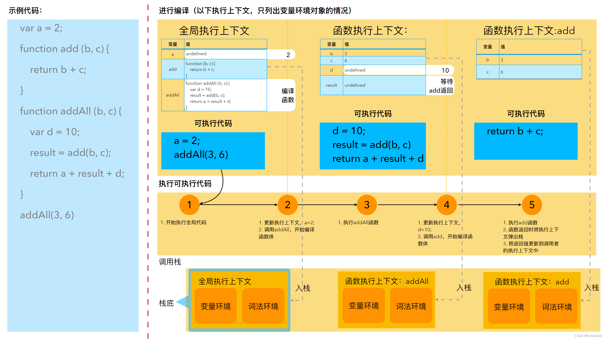

# JavaScript 执行上下文、作用域、作用域链与 `this`

理解JavaScript中的执行上下文（Execution Context）、作用域（Scope）、作用域链（Scope Chain）以及`this`关键字对于掌握其运行机制至关重要。本文将详细介绍这些概念，并通过详细的代码示例帮助你更好地理解和应用它们。



## 1. 执行上下文（Execution Context）

执行上下文是指代码在运行时所处的环境，决定了变量、函数如何解析以及它们的行为。每次函数调用都会创建一个新的执行上下文。主要分为三种类型：

- **全局执行上下文（Global Execution Context）**：默认的执行上下文，在浏览器中就是window对象。
- **函数执行上下文（Function Execution Context）**：每当一个函数被调用时就会创建。
- **Eval执行上下文（Eval Execution Context）**：由`eval`函数创建。

### 全局执行上下文（Global Execution Context）

全局执行上下文是在脚本加载时创建的，默认情况下，在浏览器环境中指向window对象。它是所有未声明为局部的变量和函数的作用域。

#### 属性

- **Variable Object (VO)**: 包含所有变量和函数声明。
- **Lexical Environment**: 定义了标识符与变量之间的映射关系。
- **This Binding**: 在浏览器中指向window对象。

#### 示例代码

```javascript
var globalVar = 'I am in the global scope';

function outerFunction() {
  console.log(globalVar); // 输出: I am in the global scope
}
outerFunction();
```

#### 内存示意图

```
Global Execution Context:
+-------------------+
| Variable Object   |
| +---------------+ |
| | globalVar     | |
| | outerFunction | |
| +---------------+ |
+--------------------------------------+
| Lexical Environment:                 |
| +------------------------------------|
| | globalVar -> [variable object]     |
| | outerFunction -> [variable object] |
| +------------------------------------|
| This Binding: window                 |
+--------------------------------------+
```

#### 详细解释

- **Variable Object (VO)**: 包含 `globalVar` 和 `outerFunction`。
- **Lexical Environment**: 映射 `globalVar` 和 `outerFunction` 到变量对象。
- **This Binding**: 指向 `window` 对象。

### 函数执行上下文（Function Execution Context）

每当一个函数被调用时，会创建一个新的函数执行上下文。每个函数执行上下文都有自己的变量和函数，并且有自己的作用域链，用于查找变量。

#### 属性

- **Activation Object (AO)**: 当前函数的活动对象，包含了函数的参数和内部变量。
- **Variable Object (VO)**: 在函数执行上下文中，`VO` 实际上是 `AO` 的别名。
- **Lexical Environment**: 定义了标识符与变量之间的映射关系。
- **This Binding**: 根据调用方式不同而不同（如隐式绑定、显式绑定等）。
- **Scope Chain**: 用于查找变量和函数的作用域链。

#### 示例代码

```javascript
function outerFunction(param) {
  var outerVar = 'I am in the outer function scope';

  function innerFunction(innerParam) {
    var innerVar = 'I am in the inner function scope';

    console.log(innerVar); // 输出: I am in the inner function scope
    console.log(outerVar); // 输出: I am in the outer function scope
    console.log(param); // 输出: outerParamValue
    console.log(innerParam); // 输出: innerParamValue
  }

  innerFunction('innerParamValue');
}

outerFunction('outerParamValue');
```

#### 内存示意图

```
Global Execution Context:
+-------------------+
| Variable Object   |
| +---------------+ |
| | outerFunction | |
| +---------------+ |
+--------------------------------------+
| Lexical Environment:                 |
| +------------------------------------|
| | outerFunction -> [variable object] |
| +------------------------------------|
| This Binding: window                 |
+--------------------------------------+

When outerFunction is called with "outerParamValue":
Outer Function Execution Context:
+-------------------+
| Activation Object |
| +---------------+ |
| | arguments     | | -> {0: "outerParamValue", length: 1}
| | param         | | -> "outerParamValue"
| | outerVar      | | -> "I am in the outer function scope"
| | innerFunction | | -> [function]
| +---------------+ |
+-------------------------------------------------------+
| Lexical Environment:                                  |
| +-----------------------------------------------------|
| | arguments -> [activation object]                    |
| | param -> [activation object]                        |
| | outerVar -> [activation object]                     |
| | innerFunction -> [activation object]                |
| +-----------------------------------------------------|
| This Binding: Global Execution Context's this binding |
| Scope Chain:                                          |
| -> Global Execution Context                           |
+-------------------------------------------------------+

When innerFunction is called with "innerParamValue":
Inner Function Execution Context:
+-------------------+
| Activation Object |
| +---------------+ |
| | arguments     | | -> {0: "innerParamValue", length: 1}
| | innerParam    | | -> "innerParamValue"
| | innerVar      | | -> "I am in the inner function scope"
| +---------------+ |
+---------------------------------------------------------------+
| Lexical Environment:                                          |
| +-------------------------------------------------------------|
| | arguments -> [activation object]                            |
| | innerParam -> [activation object]                           |
| | innerVar -> [activation object]                             |
| +-------------------------------------------------------------|
| This Binding: Outer Function Execution Context's this binding |
| Scope Chain:                                                  |
| -> Outer Function Execution Context                           |
| -> Global Execution Context                                   |
+---------------------------------------------------------------+
```

#### 详细解释

- **Activation Object (AO)**:

  - **arguments**: 包含传递给函数的参数。
  - **param**: 外部函数的参数。
  - **outerVar**: 外部函数内部的变量。
  - **innerFunction**: 内部函数。

- **Variable Object (VO)**: 在函数执行上下文中，`VO` 实际上是 `AO` 的别名。
- **Lexical Environment**: 映射 `arguments`, `param`, `outerVar`, 和 `innerFunction` 到激活对象。
- **This Binding**: 继承自外层执行上下文的 `this` 绑定。
- **Scope Chain**: 包括当前函数执行上下文和全局执行上下文。

### Eval执行上下文（Eval Execution Context）

Eval执行上下文是由`eval`函数创建的。这种执行上下文比较特殊，通常不推荐使用，因为它可能导致安全问题并且难以调试。

#### 属性

- **Variable Object (VO)**: 包含所有变量和函数声明。
- **Lexical Environment**: 定义了标识符与变量之间的映射关系。
- **This Binding**: 继承自调用`eval`的执行上下文的`this`绑定。
- **Scope Chain**: 继承自调用`eval`的执行上下文的作用域链。

#### 示例代码

```javascript
var x = 10;
eval('console.log(x);'); // 输出: 10
```

#### 内存示意图

```
Global Execution Context:
+-------------------+
| Variable Object   |
| +---------------+ |
| | x             | |
| +---------------+ |
+--------------------------+
| Lexical Environment:     |
| +------------------------|
| | x -> [variable object] |
| +------------------------|
| This Binding: window     |
+--------------------------+

When eval("console.log(x);") is executed:
Eval Execution Context:
+-------------------------------------------------------+
| Variable Object                                       |
| +---------------------------------------------------+ |
| |                                                   | |
| +---------------------------------------------------+ |
+-------------------------------------------------------+
| Lexical Environment:                                  |
| +-----------------------------------------------------|
| |                                                   | |
| +-----------------------------------------------------|
| This Binding: Global Execution Context's this binding |
| Scope Chain:                                          |
| -> Global Execution Context                           |
+-------------------------------------------------------+
```

#### 详细解释

- **Variable Object (VO)**: 不包含任何变量或函数声明。
- **Lexical Environment**: 不包含任何映射。
- **This Binding**: 继承自全局执行上下文的 `this` 绑定。
- **Scope Chain**: 包括全局执行上下文。

## 2. 执行上下文的生命周期

执行上下文的生命周期分为两个阶段：

- **创建阶段（Creation Phase）**
- **执行阶段（Execution Phase）**

### 创建阶段（Creation Phase）

在这个阶段，JavaScript引擎会做以下几件事：

1. **确定 `this` 值**：根据函数调用的方式确定 `this` 的值。
2. **初始化词法环境（Lexical Environment）**：创建变量环境和函数环境。
3. **初始化变量对象（Variable Object）**：将函数声明提升到变量对象中，但不会赋值；将变量声明也提升到变量对象中，初始值为 `undefined`。

#### 示例代码

```javascript
function exampleFunction(param) {
  var localVar;
  console.log(localVar); // 输出: undefined

  function innerFunction() {}

  console.log(typeof innerFunction); // 输出: function
  console.log(typeof localVar); // 输出: undefined

  localVar = 5;
  console.log(localVar); // 输出: 5
}

exampleFunction('paramValue');
```

#### 内存示意图

```
Global Execution Context:
+---------------------+
| Variable Object     |
| +-----------------+ |
| | exampleFunction | |
| +-----------------+ |
+----------------------------------------+
| Lexical Environment:                   |
| +--------------------------------------|
| | exampleFunction -> [variable object] |
| +--------------------------------------|
| This Binding: window                   |
+----------------------------------------+

When exampleFunction is called with "paramValue":
Example Function Execution Context:
+-------------------+
| Activation Object |
| +---------------+ |
| | arguments     | | -> {0: "paramValue", length: 1}
| | param         | | -> "paramValue"
| | localVar      | | -> undefined
| | innerFunction | | -> [function]
| +---------------+ |
+-------------------------------------------------------+
| Lexical Environment:                                  |
| +-----------------------------------------------------|
| | arguments -> [activation object]                    |
| | param -> [activation object]                        |
| | localVar -> [activation object]                     |
| | innerFunction -> [activation object]                |
| +-----------------------------------------------------|
| This Binding: Global Execution Context's this binding |
| Scope Chain:                                          |
| -> Global Execution Context                           |
+-------------------------------------------------------+
```

#### 详细解释

- **Activation Object (AO)**:

  - **arguments**: 包含传递给函数的参数。
  - **param**: 外部函数的参数。
  - **localVar**: 初始化为 `undefined`。
  - **innerFunction**: 提升并初始化为函数对象。

- **Variable Object (VO)**: 在函数执行上下文中，`VO` 实际上是 `AO` 的别名。
- **Lexical Environment**: 映射 `arguments`, `param`, `localVar`, 和 `innerFunction` 到激活对象。
- **This Binding**: 继承自全局执行上下文的 `this` 绑定。
- **Scope Chain**: 包括当前函数执行上下文和全局执行上下文。

### 执行阶段（Execution Phase）

在这个阶段，JavaScript引擎会按照代码顺序执行语句，分配具体的值给变量，并执行函数调用。

#### 示例代码

```javascript
function exampleFunction(param) {
  var localVar;
  console.log(localVar); // 输出: undefined

  function innerFunction() {}

  console.log(typeof innerFunction); // 输出: function
  console.log(typeof localVar); // 输出: undefined

  localVar = 5;
  console.log(localVar); // 输出: 5
}

exampleFunction('paramValue');
```

#### 内存示意图

```
Global Execution Context:
+---------------------+
| Variable Object     |
| +-----------------+ |
| | exampleFunction | |
| +-----------------+ |
+----------------------------------------+
| Lexical Environment:                   |
| +--------------------------------------|
| | exampleFunction -> [variable object] |
| +--------------------------------------|
| This Binding: window                   |
+----------------------------------------+

When exampleFunction is called with "paramValue":
Example Function Execution Context:
+-------------------+
| Activation Object |
| +---------------+ |
| | arguments     | | -> {0: "paramValue", length: 1}
| | param         | | -> "paramValue"
| | localVar      | | -> undefined -> 5
| | innerFunction | | -> [function]
| +---------------+ |
+-------------------------------------------------------+
| Lexical Environment:                                  |
| +-----------------------------------------------------|
| | arguments -> [activation object]                    |
| | param -> [activation object]                        |
| | localVar -> [activation object]                     |
| | innerFunction -> [activation object]                |
| +-----------------------------------------------------|
| This Binding: Global Execution Context's this binding |
| Scope Chain:                                          |
| -> Global Execution Context                           |
+-------------------------------------------------------+
```

#### 详细解释

- **Activation Object (AO)**:

  - **arguments**: 包含传递给函数的参数。
  - **param**: 外部函数的参数。
  - **localVar**: 初始化为 `undefined`，然后赋值为 `5`。
  - **innerFunction**: 提升并初始化为函数对象。

- **Variable Object (VO)**: 在函数执行上下文中，`VO` 实际上是 `AO` 的别名。
- **Lexical Environment**: 映射 `arguments`, `param`, `localVar`, 和 `innerFunction` 到激活对象。
- **This Binding**: 继承自全局执行上下文的 `this` 绑定。
- **Scope Chain**: 包括当前函数执行上下文和全局执行上下文。

## 3. 作用域（Scope）

JavaScript中的作用域确实可以分为几种不同的类型。通常情况下，我们可以将其分为以下三种主要类型：

1. **全局作用域（Global Scope）**
2. **函数作用域（Function Scope）**
3. **块级作用域（Block Scope）**

接下来，我们将详细介绍这三种作用域，并通过代码示例来说明它们的特点和区别。

### 1. 全局作用域（Global Scope）

全局作用域是指在所有其他作用域之外声明的变量和函数的作用域。这些变量和函数在整个脚本中都可以访问。

#### 特点

- 变量和函数可以在任何地方被访问。
- 在浏览器环境中，全局变量是`window`对象的属性。
- 全局作用域是最顶层的作用域。

#### 示例代码

```javascript
var globalVar = 'I am in the global scope';

function accessGlobalVar() {
  console.log(globalVar); // 输出: I am in the global scope
}

accessGlobalVar();
console.log(globalVar); // 输出: I am in the global scope
```

#### 内存示意图

```
Global Execution Context:
+---------------------+
| Variable Object     |
| +-----------------+ |
| | globalVar       | |
| | accessGlobalVar | |
| +-----------------+ |
+----------------------------------------+
| Lexical Environment:                   |
| +--------------------------------------|
| | globalVar -> [variable object]       |
| | accessGlobalVar -> [variable object] |
| +--------------------------------------|
| This Binding: window                   |
+----------------------------------------+
```

##### 详细解释

- **Variable Object (VO)**: 包含 `globalVar` 和 `accessGlobalVar`。
- **Lexical Environment**: 映射 `globalVar` 和 `accessGlobalVar` 到变量对象。
- **This Binding**: 指向 `window` 对象。

### 2. 函数作用域（Function Scope）

函数作用域是指在函数内部声明的变量和函数的作用域。这些变量和函数只能在该函数内部访问。

#### 特点

- 变量和函数只能在定义它们的函数内部访问。
- 使用 `var` 声明的变量具有函数作用域。
- 函数声明也具有函数作用域。

#### 示例代码

```javascript
function localScopeExample() {
  var localVar = 'I am in the local scope';
  console.log(localVar); // 输出: I am in the local scope

  function innerFunction() {
    var innerVar = 'I am in the inner function scope';
    console.log(innerVar); // 输出: I am in the inner function scope
  }

  innerFunction();
  // console.log(innerVar); // 抛出 ReferenceError: innerVar is not defined
}

localScopeExample();
// console.log(localVar); // 抛出 ReferenceError: localVar is not defined
```

#### 内存示意图

```
Global Execution Context:
+-----------------------+
| Variable Object       |
| +-------------------+ |
| | localScopeExample | |
| +-------------------+ |
+------------------------------------------+
| Lexical Environment:                     |
| +----------------------------------------|
| | localScopeExample -> [variable object] |
| +----------------------------------------|
| This Binding: window                     |
+------------------------------------------+

When localScopeExample is called:
Local Scope Example Execution Context:
+-------------------+
| Activation Object |
| +---------------+ |
| | arguments     | |
| | localVar      | |
| | innerFunction | |
| +---------------+ |
+-------------------------------------------------------+
| Lexical Environment:                                  |
| +-----------------------------------------------------|
| | arguments -> [activation object]                    |
| | localVar -> [activation object]                     |
| | innerFunction -> [activation object]                |
| +-----------------------------------------------------|
| This Binding: Global Execution Context's this binding |
| Scope Chain:                                          |
| -> Global Execution Context                           |
+-------------------------------------------------------+

When innerFunction is called:
Inner Function Execution Context:
+-------------------+
| Activation Object |
| +---------------+ |
| | arguments     | |
| | innerVar      | |
| +---------------+ |
+--------------------------------------------------------------------+
| Lexical Environment:                                               |
| +------------------------------------------------------------------|
| | arguments -> [activation object]                                 |
| | innerVar -> [activation object]                                  |
| +------------------------------------------------------------------|
| This Binding: Local Scope Example Execution Context's this binding |
| Scope Chain:                                                       |
| -> Local Scope Example Execution Context                           |
| -> Global Execution Context                                        |
+--------------------------------------------------------------------+
```

##### 详细解释

- **Activation Object (AO)**:

  - **arguments**: 包含传递给函数的参数。
  - **localVar**: 函数内部的局部变量。
  - **innerFunction**: 内部函数。

- **Variable Object (VO)**: 在函数执行上下文中，`VO` 实际上是 `AO` 的别名。
- **Lexical Environment**: 映射 `arguments`, `localVar`, 和 `innerFunction` 到激活对象。
- **This Binding**: 继承自全局执行上下文的 `this` 绑定。
- **Scope Chain**: 包括当前函数执行上下文和全局执行上下文。

### 3. 块级作用域（Block Scope）

块级作用域是指在一对花括号 `{}` 内部声明的变量和函数的作用域。ES6 引入了 `let` 和 `const` 关键字，使得 JavaScript 支持块级作用域。

#### 特点

- 变量和函数只能在其所在的代码块内部访问。
- 使用 `let` 和 `const` 声明的变量具有块级作用域。
- `var` 声明的变量不具有块级作用域，而是提升到最近的函数或全局作用域。

#### 示例代码

```javascript
if (true) {
  var blockVar = 'I am in a block with var';
  let blockLet = 'I am in a block with let';
  const blockConst = 'I am in a block with const';

  console.log(blockVar); // 输出: I am in a block with var
  console.log(blockLet); // 输出: I am in a block with let
  console.log(blockConst); // 输出: I am in a block with const
}

console.log(blockVar); // 输出: I am in a block with var
// console.log(blockLet); // 抛出 ReferenceError: blockLet is not defined
// console.log(blockConst); // 抛出 ReferenceError: blockConst is not defined
```

#### 内存示意图

```
Global Execution Context:
+-------------------+
| Variable Object   |
| +---------------+ |
| | blockVar      | |
| +---------------+ |
+---------------------------------+
| Lexical Environment:            |
| +-------------------------------|
| | blockVar -> [variable object] |
| +-------------------------------|
| This Binding: window            |
+---------------------------------+

Inside Block:
+---------------------------------------------+
| Lexical Environment:                        |
| +-------------------------------------------|
| | blockLet -> [block lexical environment]   |
| | blockConst -> [block lexical environment] |
| +-------------------------------------------|
+---------------------------------------------+
```

##### 详细解释

- **Variable Object (VO)**:

  - **blockVar**: 使用 `var` 声明的变量，具有函数作用域，因此在全局作用域中可见。

- **Lexical Environment**:
  - **blockLet**: 使用 `let` 声明的变量，具有块级作用域，仅在块内可见。
  - **blockConst**: 使用 `const` 声明的常量，具有块级作用域，仅在块内可见。

#### 进一步理解块级作用域

使用 `let` 和 `const` 声明的变量不会被提升到函数或全局作用域，而是被限制在声明它们的块内。这种特性有助于避免一些常见的编程错误，比如变量污染全局命名空间或意外覆盖变量。

##### 示例代码

```javascript
for (var i = 0; i < 3; i++) {
  setTimeout(function () {
    console.log(i); // 输出: 3, 3, 3
  }, 1000);
}

for (let j = 0; j < 3; j++) {
  setTimeout(function () {
    console.log(j); // 输出: 0, 1, 2
  }, 1000);
}
```

#### 内存示意图

```
Global Execution Context:
+-------------------+
| Variable Object   |
| +---------------+ |
| | i             | |
| +---------------+ |
+--------------------------+
| Lexical Environment:     |
| +------------------------|
| | i -> [variable object] |
| +------------------------|
| This Binding: window     |
+--------------------------+

For Loop with var:
+------------------------------+
| Lexical Environment:         |
| +----------------------------|
| | i -> [lexical environment] |
| +----------------------------|
+------------------------------+

For Loop with let:
+------------------------------+
| Lexical Environment:         |
| +----------------------------|
| | j -> [lexical environment] |
| +----------------------------|
+------------------------------+
```

##### 详细解释

- **Using `var`**:

  - **i**: 被提升到全局作用域，循环结束后值为 3。
  - 所有回调函数共享同一个 `i`，因此输出都是 3。

- **Using `let`**:
  - **j**: 具有块级作用域，每次迭代都会创建一个新的 `j`。
  - 每个回调函数捕获的是当前迭代的 `j`，因此输出分别是 0, 1, 2。

## 4. 作用域链（Scope Chain）

作用域链是执行上下文中用来查找变量的一个有序列表。当查找一个变量或函数时，如果在当前作用域找不到，则会沿着作用域链向上查找，直到找到为止或到达全局作用域。如果没有找到则抛出ReferenceError异常。

#### 示例代码

```javascript
var x = 10;

function firstLevel() {
  var y = 20;

  function secondLevel() {
    var z = 30;
    console.log(x + y + z); // 输出: 60
  }

  secondLevel();
}

firstLevel();
```

#### 内存示意图

```
Global Execution Context:
+-------------------+
| Variable Object   |
| +---------------+ |
| | x             | |
| | firstLevel    | |
| +---------------+ |
+-----------------------------------+
| Lexical Environment:              |
| +---------------------------------|
| | x -> [variable object]          |
| | firstLevel -> [variable object] |
| +---------------------------------|
| This Binding: window              |
+-----------------------------------+

When firstLevel is called:
First Level Execution Context:
+-------------------+
| Activation Object |
| +---------------+ |
| | arguments     | |
| | y             | |
| | secondLevel   | |
| +---------------+ |
+-------------------------------------------------------+
| Lexical Environment:                                  |
| +-----------------------------------------------------|
| | arguments -> [activation object]                    |
| | y -> [activation object]                            |
| | secondLevel -> [activation object]                  |
| +-----------------------------------------------------|
| This Binding: Global Execution Context's this binding |
| Scope Chain:                                          |
| -> Global Execution Context                           |
+-------------------------------------------------------+

When secondLevel is called:
Second Level Execution Context:
+-------------------+
| Activation Object |
| +---------------+ |
| | arguments     | |
| | z             | |
| +---------------+ |
+------------------------------------------------------------+
| Lexical Environment:                                       |
| +----------------------------------------------------------|
| | arguments -> [activation object]                         |
| | z -> [activation object]                                 |
| +----------------------------------------------------------|
| This Binding: First Level Execution Context's this binding |
| Scope Chain:                                               |
| -> First Level Execution Context                           |
| -> Global Execution Context                                |
+------------------------------------------------------------+
```

#### 详细解释

- **Scope Chain**:
  - **secondLevel**: 查找 `z` 在当前激活对象中找到。
  - **y**: 查找 `y` 在第一级函数的激活对象中找到。
  - **x**: 查找 `x` 在全局变量对象中找到。

## 5. `this` 关键字

`this` 关键字在JavaScript中指向当前执行上下文的对象。它的值取决于函数的调用方式。

### 隐式绑定

当函数作为对象的方法被调用时，`this` 指向调用该方法的对象。

#### 示例代码

```javascript
var person = {
  name: 'Alice',
  greet: function () {
    console.log(`Hello, my name is ${this.name}`);
  },
};

person.greet(); // 输出: Hello, my name is Alice
```

### 显式绑定

使用 `call`、`apply` 或 `bind` 方法可以显式地指定 `this` 的值。

#### 示例代码

```javascript
function greet() {
  console.log(`Hello, my name is ${this.name}`);
}

var person = { name: 'Bob' };

greet.call(person); // 输出: Hello, my name is Bob
greet.apply(person); // 输出: Hello, my name is Bob

var boundGreet = greet.bind(person);
boundGreet(); // 输出: Hello, my name is Bob
```

### 构造函数绑定

当使用 `new` 关键字调用函数时，`this` 指向新创建的对象。

#### 示例代码

```javascript
function Person(name) {
  this.name = name;
}

var alice = new Person('Alice');
console.log(alice.name); // 输出: Alice
```

### 箭头函数

箭头函数没有自己的 `this` 绑定，它从定义时所在的父作用域继承 `this`。

#### 示例代码

```javascript
var person = {
  name: 'Charlie',
  greet: function () {
    setTimeout(() => {
      console.log(`Hello, my name is ${this.name}`);
    }, 1000);
  },
};

person.greet(); // 输出: Hello, my name is Charlie
```

## 6. 总结

理解JavaScript中的执行上下文、作用域、作用域链以及`this`关键字对于掌握其运行机制至关重要。通过了解全局执行上下文、函数执行上下文和Eval执行上下文的不同属性和行为，你可以更好地编写和调试JavaScript代码。以下是关键点总结：

- **全局执行上下文**：默认的执行上下文，在浏览器中指向window对象。
- **函数执行上下文**：每当一个函数被调用时创建，包含激活对象、词法环境、`this`绑定和作用域链。
- **Eval执行上下文**：由`eval`函数创建，继承自调用`eval`的执行上下文。
- **执行上下文的生命周期**：包括创建阶段和执行阶段。
- **作用域**：变量和函数在其声明位置可访问的区域。
- **作用域链**：用于查找变量和函数的有序列表。
- **`this` 关键字**：指向当前执行上下文的对象，其值取决于函数的调用方式。
