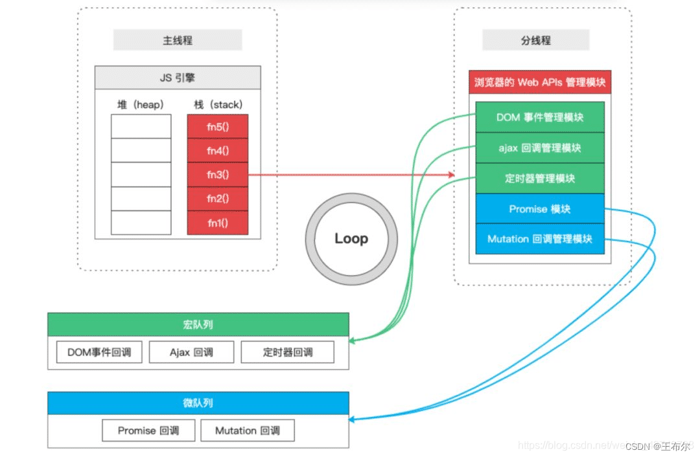

# 深入解析 JavaScript 事件执行队列

## 一、前言

在前端开发中，JavaScript 的事件执行机制是一个重要且复杂的话题。本文将详尽地探讨 JavaScript 事件执行队列，包括其核心概念、工作原理、常见的应用场景以及优化方法。

## 二、JavaScript 事件执行队列概述



JavaScript 事件执行队列是 JavaScript 单线程特性与异步操作相结合的产物。JavaScript 是单线程语言，这意味着同一时间只能执行一个任务。因此，在浏览器环境中，需要一种机制来协调任务的执行顺序，这个机制就是事件队列模型。

JavaScript 的任务可以分为同步任务（Synchronous Tasks）和异步任务（Asynchronous Tasks）。同步任务直接在主线程上执行，而异步任务则由事件触发器管理，并在适当的时机将它们添加到任务队列中。当主线程完成当前同步任务后，会从任务队列中取出一个任务并执行。

## 三、关键概念详解

### （一）调用栈（Call Stack）

调用栈是 JavaScript 中用于管理函数调用的核心数据结构。当 JavaScript 代码执行时，所有的函数调用都会被压入调用栈中，并按照后进先出（LIFO）的原则进行处理。这意味着最后被调用的函数会优先得到执行，执行完毕后从栈中弹出，然后继续执行栈中剩余的函数。

例如，以下代码展示了调用栈的工作方式：

```JavaScript
function greet(name) {
  console.log(`Hello, ${name}!`);
}

function sayHi() {
  greet("Alice");
  console.log("Hi, everyone!");
}

sayHi();
```

执行时，函数的调用顺序为：

1. sayHi() 被调用，压入调用栈。
2. greet("Alice") 被调用，压入调用栈。
3. greet() 执行完毕，从栈中弹出。
4. sayHi() 中的剩余代码继续执行，console.log("Hi, everyone!") 被执行。
5. sayHi() 执行完毕，从栈中弹出。

### （二）Web API

除了调用栈之外，浏览器环境还提供了许多 Web API，比如 setTimeout、setInterval、fetch 等。这些 API 允许我们执行一些异步任务，它们不是由 JavaScript 引擎直接处理的，而是由浏览器提供的 API 来完成。

例如，setTimeout 是浏览器提供的 Web API，用于在指定的时间后执行一段代码。fetch 用于发起网络请求并处理响应。

### （三）任务队列（Task Queue）

当一个异步任务准备就绪（例如，计时器到期或 HTTP 响应返回），相关的回调函数会被放置在一个任务队列中等待执行。任务队列可以分为宏任务（macrotask）队列和微任务（microtask）队列。

#### 宏任务（macrotask）

宏任务是 JavaScript 中较大的任务单元，常见的宏任务包括：

- 整体代码块：例如，整个脚本的初始执行。
- setTimeout 和 setInterval：延迟执行的回调函数。
- requestAnimationFrame：用于在浏览器重绘之前执行动画。
- I/O 操作：如文件读写等。

#### 微任务（microtask）

微任务是较轻量级的任务，具有更高的优先级。常见的微任务包括：

- Promise 的回调函数：无论 Promise 是处于 fulfilled 还是 rejected 状态，其回调函数都会被放入微任务队列中。
- MutationObserver：用于观察 DOM 变化的回调函数。
- process.nextTick（在 Node.js 中）：特意设计的微任务，用于在当前操作完成后立即执行。

## 四、事件循环（Event Loop）

事件循环是 JavaScript 核心机制之一，用于协调宏任务和微任务的执行。其主要工作流程如下：

1. 执行当前调用栈中的所有代码：所有同步任务按顺序执行，形成当前的执行上下文。
2. 检查微任务队列：在当前执行上下文结束时，所有已有的微任务会被收集到微任务队列中。
3. 执行微任务队列：立即将微任务队列中的任务依次执行完毕，直到队列为空。
4. 渲染页面（如果有必要）：浏览器进行渲染更新。
5. 从宏任务队列中取出最老的任务：将其推入调用栈执行。
6. 重复上述步骤：不断循环处理宏任务和微任务，确保任务队列中的任务得到正确执行。

## 五、任务队列的执行顺序

JavaScript 的任务队列遵循以下执行顺序：

1. 同步任务：首先执行主线程中的所有同步任务，直到遇到异步操作或事件。
2. 微任务队列：在当前同步任务执行完毕后，立即将微任务队列中的所有任务依次执行完毕。
3. 宏任务队列：微任务队列处理完成后，才会开始从宏任务队列中取出一个任务执行。
4. 渲染与休眠：在每个宏任务执行完毕后，浏览器会进行渲染更新，然后主线程进入休眠状态，等待下一个事件被触发。

## 六、案例分析

### （一）宏任务与微任务的顺序

以下代码展示了宏任务和微任务的执行顺序：

```JavaScript
console.log('Start');

setTimeout(() => {
  console.log('Timeout');
}, 0);

Promise.resolve().then(() => {
  console.log('Promise');
});

console.log('End');
```

执行结果为：

```plaintext
Start
End
Promise
Timeout
```

解释：

1. 发出宏任务 setTimeout 和微任务 Promise。
2. 同步任务 Start 和 End 执行完毕。
3. 处理微任务队列，执行 Promise。
4. 回到主线程，处理宏任务队列中的 setTimeout。

### （二）嵌套异步任务

以下是包含嵌套异步任务的代码示例：

```JavaScript
setTimeout(() => {
  console.log('Timeout 1');
  Promise.resolve().then(() => {
    console.log('Promise 1');
  });
}, 0);

setTimeout(() => {
  console.log('Timeout 2');
  Promise.resolve().then(() => {
    console.log('Promise 2');
  });
}, 0);
```

执行结果为：

```plaintext
Timeout 1
Promise 1
Timeout 2
Promise 2
```

解释：

1. 两个 setTimeout 宏任务按顺序被放入宏任务队列。
2. 执行第一个宏任务时，Promise 微任务被放在微任务队列中，并在宏任务结束后立即执行。
3. 重复此过程处理第二个宏任务，确保微任务总在宏任务之后执行。

## 七、如何优化任务队列

虽然 JavaScript 的事件队列机制在大多数情况下运行良好，但在处理大量异步任务或复杂逻辑时，可能会出现卡顿或性能问题。以下是一些优化任务队列的建议：

### （一）合理使用宏任务与微任务

1. 微任务优先级更高：在需要立即执行某些逻辑时，可以使用 Promise 的回调函数或 MutationObserver，使其成为微任务，从而更快地执行。
2. 宏任务用于大块操作：将需要长时间运行的逻辑拆分为宏任务，避免阻塞主线程。例如，对于大型数据处理，可以使用 setTimeout 或 requestIdleCallback 将代码分块执行。

```JavaScript
let data = [/* 大量数据 */];
let index = 0;

function processData() {
  // 每次处理 100 条数据
  for (let i = 0; i < 100 && index < data.length; i++) {
    process(data[index++]);
  }

  if (index < data.length) {
    // 使用宏任务继续处理
    setTimeout(processData, 0);
  }
}

processData();
```

### （二）避免不必要的异步操作

并非所有异步操作都是必要的。如果某些操作不需要等待结果或不需要在事件队列中处理，可以将其同步化。例如，避免为简单的计算逻辑使用 setTimeout 或 Promise。

### （三）使用 Web Worker

对于特别耗时的计算任务，可以将其放入 Web Worker 中执行，避免阻塞主线程。Web Worker 是独立于主线程的另一个线程，它可以处理复杂的计算任务，如数据加密、图像处理等，同时不会影响主线程的事件队列。

```JavaScript
// 主线程
const worker = new Worker('worker.js');

worker.onmessage = (event) => {
  console.log('Result:', event.data);
};

worker.postMessage('Start processing');
```

```JavaScript
// worker.js
onmessage = (event) => {
  // 进行复杂计算
  const result = heavyComputation(event.data);

  postMessage(result);
};
```

### （四）任务队列的监控与分析

在开发过程中，可以使用一些工具来监控和分析任务队列的状态。例如，浏览器的开发者工具中的性能面板可以查看事件循环的执行时间、主线程的占用情况等。通过分析这些数据，可以发现潜在的性能瓶颈，从而有针对性地进行优化。

## 八、应用场景

深入了解 JavaScript 事件执行队列机制可以在多个实际场景中发挥作用，以下是几个常见应用场景：

### （一）异步操作的顺序控制

在需要精确控制异步操作顺序时，合理安排宏任务和微任务可以避免竞态条件和意外行为。例如，先异步加载数据，然后进行 DOM 操作时，确保 DOM 操作在数据加载后的微任务中执行，可以保证数据和界面的一致性。

```JavaScript
fetch('/data.json')
  .then((response) => response.json())
  .then((data) => {
    // 数据加载完毕后更新 DOM
    Promise.resolve().then(() => {
      updateDOM(data);
    });
  });
```

### （二）动画与性能优化

利用 requestAnimationFrame 和事件队列机制可以更加高效地进行动画开发。requestAnimationFrame 具有较高的优先级，能够在浏览器重绘之前执行，保证动画流畅。

```JavaScript
let count = 0;
let animationId;

function animate() {
  // 绘制动画逻辑
  count++;
  console.log('Animation frame:', count);

  animationId = requestAnimationFrame(animate);
}

// 启动动画
requestAnimationFrame(animate);

// 停止动画
setTimeout(() => {
  cancelAnimationFrame(animationId);
  console.log('Animation stopped');
}, 1000);
```

### （三）长任务的拆分

对于长时间运行的脚本，将其拆分成多个宏任务，利用事件队列的间歇休息机制，可以避免阻塞主线程，提高用户体验。

```JavaScript
function longTask() {
  console.log('Processing start');

  let data = Array.from({ length: 1e8 });

  setTimeout(() => {
    // 模拟长耗时操作
    for (let i = 0; i < data.length; i++) {
      // ... 复杂处理
    }

    console.log('Processing complete');
  }, 0);

  // 微任务用于展示状态
  Promise.resolve().then(() => {
    console.log('Processing in progress...');
  });
}
```

## 九、常见问题解答

### （一）为什么 JavaScript 是单线程的？

JavaScript 的单线程设计主要是为了简化编程模型，避免在共享内存的多线程环境中出现复杂的状态管理问题。通过事件队列和回调机制，JavaScript 可以高效地处理异步操作，同时保持代码的简洁性和可维护性。

### （二）async/await 和事件队列的关系如何？

async/await 是基于 Promise 的语法糖，用于简化异步代码的编写。在内部，async/await 仍然遵循事件队列的机制。await 表达式会暂停函数的执行，并将后续代码放入微任务队列中。当异步操作完成时，微任务队列中的回调函数会被执行。

```JavaScript
async function asyncFunction() {
  console.log('Start');

  await new Promise(resolve => {
    setTimeout(resolve, 0);
  });

  console.log('End');
}

asyncFunction();
console.log('Global');
```

执行结果为：

```plaintext
Start
Global
End
```

### （三）MutationObserver 和事件队列的关系如何？

MutationObserver 用于监听 DOM 变化的回调函数，其回调函数的执行时机类似于 Promise 的回调函数，会被放入微任务队列中。

```JavaScript
const observer = new MutationObserver(() => {
  console.log('DOM changed');
});

observer.observe(document.body, {
  childList: true,
});

document.body.appendChild(document.createElement('div'));

console.log('After append');
```

执行结果为：

```plaintext
After append
DOM changed
```

## 十、结论

JavaScript 事件执行队列是一个复杂但非常重要的机制，它通过宏任务和微任务的概念，以及事件循环的协调，实现了单线程下的异步操作。深入理解事件队列的工作原理，不仅可以帮助开发者编写更高效、更可靠的代码，还能在性能优化和代码调试过程中发挥关键作用。

在实际开发中，开发者需要根据应用场景，合理安排任务的优先级，优化任务队列的执行顺序，同时避免不必要的异步操作。此外，利用事件队列机制，可以更好地控制异步任务的顺序，提升代码的可维护性和可读性。
