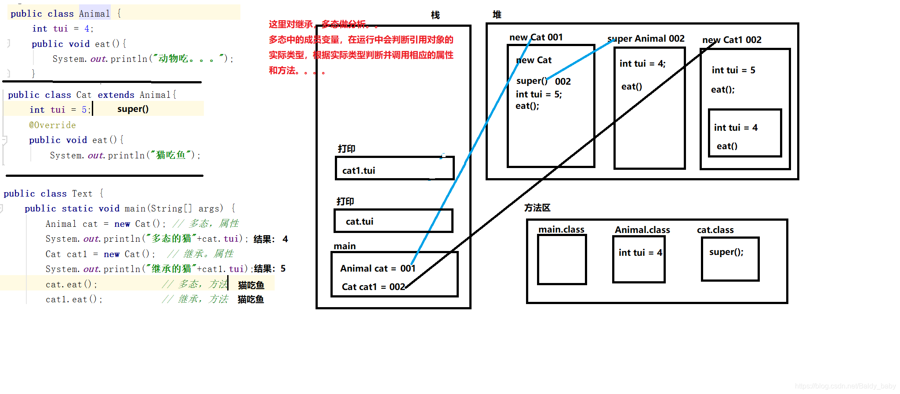
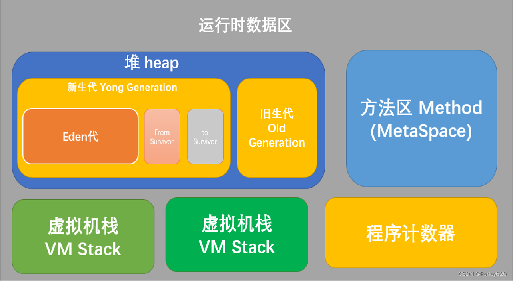

# 原型继承和类继承的详细介绍

## JavaScript 原型继承

### 实现机制
* 原型对象：在 JavaScript 中，每个函数都有一个 prototype 属性，该属性指向一个对象，即原型对象。当你通过构造函数创建一个新对象时，这个新对象的内部 [[Prototype]] 属性（可通过 __proto__ 访问）会被设置为构造函数的 prototype 属性所指向的对象。
* 原型链：当访问一个对象的属性或方法时，JavaScript 引擎会首先在对象自身属性中查找。如果找不到，就会沿着 [[Prototype]] 链向上查找，直到找到该属性或方法，或者到达 Object.prototype 的末端（Object.prototype 的 [[Prototype]] 是 null）。
* 共享属性和方法：由于所有实例都通过 [[Prototype]] 链共享同一个原型对象，因此它们可以共享原型对象上的属性和方法。这使得原型继承在内存使用上更加高效。

### 创建对象时的内存分配
* 实例对象：创建对象时，会为其分配内存空间来存储自身的属性和指向原型对象的 [[Prototype]] 指针。
* 原型对象：原型对象本身也是一个对象，它存储了所有实例共享的方法和属性。原型对象的内存空间相对独立于实例对象，但通过 [[Prototype]] 指针与实例对象相连。
* 内存共享：由于实例对象共享原型对象上的属性和方法，所以不需要为每个实例单独分配这些属性和方法的内存空间，从而减少了内存占用。

### 优点：
* 灵活性：允许动态地为对象添加属性和方法。
* 内存效率：所有实例共享同一个原型对象上的方法，减少了内存占用。

### 缺点：
* 复杂性：理解 [[Prototype]] 链和构造函数之间的关系可能比较困难。
* 共享问题：原型链上的引用类型属性会被所有实例共享，可能导致数据污染。

## Java 类继承

### 实现机制
* 类定义：在 Java 中，类是通过关键字 class 定义的，类可以继承其他类，形成类层次结构。类继承是通过 extends 关键字实现的，子类继承父类的属性和方法。
* 继承关系：子类会继承父类的所有非私有属性和方法（包括构造方法），并且可以重写（Override）或添加新的属性和方法。Java 支持单继承，即一个类只能继承一个父类，但可以通过接口（Interface）实现多继承的特性。
* 内存模型：Java 的内存模型主要分为栈（Stack）和堆（Heap）。栈用于存储局部变量和方法调用的上下文，而堆用于存储对象实例和数组。

### 创建对象时的内存分配
* 对象实例：当创建一个对象时，会在堆内存中为其分配空间，存储对象的实例属性和指向类元数据的指针。每个对象都有自己的属性副本，即使它们是继承自同一个父类。
* 类元数据：类的元数据（包括类的结构信息、方法信息等）存储在方法区（Method Area）。当类被加载到 JVM 时，类的元数据会被加载到方法区，而对象实例则在堆中创建。对象实例通过指针访问类元数据中的方法和属性。
* 内存独立性：每个对象实例都有独立的内存空间来存储自己的属性值，即使它们继承自同一个父类。这使得对象之间的属性值互不影响，保证了封装性和数据的安全性。

### 优点：
* 代码复用：子类可以重用父类的代码，减少了代码的冗余。
* 结构清晰：类和继承关系清晰，易于理解和维护。
* 封装性：通过访问修饰符（如 private、protected）控制属性和方法的访问权限。

### 缺点：
* 高耦合性：类与类之间紧密的结合在一起，相互依赖性高。
* 灵活性较低：子类必须拥有父类的属性和方法，可能造成子类代码冗余。

## 区别总结
|特性 | JavaScript 原型继承	| Java 类继承|
| --- | ------------------ | ---------- |
|继承方式 | 基于原型对象和原型链 | 基于类和类层次结构|
|共享机制 | 实例共享原型对象上的属性和方法 | 每个对象实例有自己的属性副本，方法共享类元数据|
|内存效率 | 更高效，因为属性和方法共享 | 每个对象实例占用独立的内存空间，内存使用相对较高|
|灵活性 | 高，可以动态修改原型对象 | 低，类结构相对固定，需要重新编译|
|可读性 | 可能较复杂，需要理解原型链 | 高，类和继承关系清晰，易于理解|
|封装性 | 较弱，属性和方法容易被外部访问和修改 | 强，通过访问修饰符（如 private、protected）控制属性和方法的访问权限|
|多继承 | 不支持多继承，但可以通过原型链实现类似效果 | 不支持多继承，但可以通过接口实现多继承的特性|
|创建对象方式 | 使用构造函数和 new 关键字 | 使用 new 关键字和类名|
|内存模型 | 原型对象和实例对象通过 [[Prototype]] 相连 | 对象实例和类元数据通过指针相连，分别存储在堆和方法区|

## 底层实现机制对比

### JavaScript 原型继承：
* 内存分配：实例对象和原型对象分别分配内存空间，实例对象存储自身属性和 [[Prototype]] 指针，原型对象存储共享的属性和方法。
* 属性查找：属性查找通过原型链进行，先在实例对象自身属性中查找，如果找不到，再沿着 [[Prototype]] 链向上查找。

### Java 类继承：
* 内存分配：对象实例在堆内存中分配空间，存储实例属性和指向类元数据的指针；类元数据存储在方法区，包含类的结构信息和方法信息。
* 属性查找：属性查找通过对象实例的指针访问类元数据中的属性和方法，每个对象实例都有自己的属性副本，方法调用通过虚方法表（VTable）实现多态。

## 适用场景
* JavaScript 原型继承：适用于需要高灵活性和内存效率的场景，如动态添加属性和方法、共享大量方法的场景。但由于原型链的复杂性，可能导致代码难以理解和维护。
* Java 类继承：适用于需要强类型、封装性和多态性的场景，如大型企业级应用、需要严格控制对象属性和方法访问权限的场景。类继承提供了清晰的结构和易于理解的继承关系，但内存使用相对较高，灵活性较低。

在实际开发中，开发者可以根据具体需求和项目特点选择合适的继承方式。JavaScript 的原型继承在 Web 开发中具有广泛的应用，而 Java 的类继承在企业级应用开发中得到了广泛应用。
