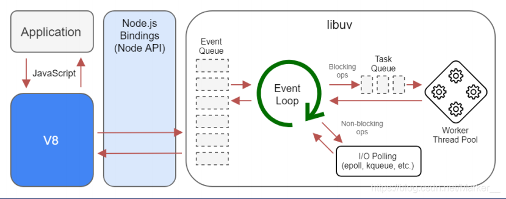
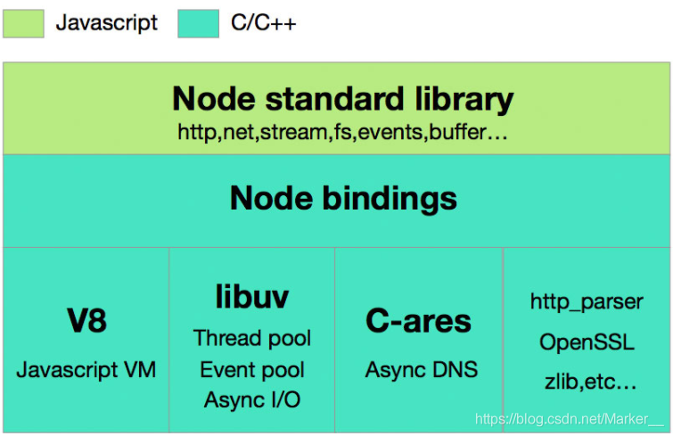
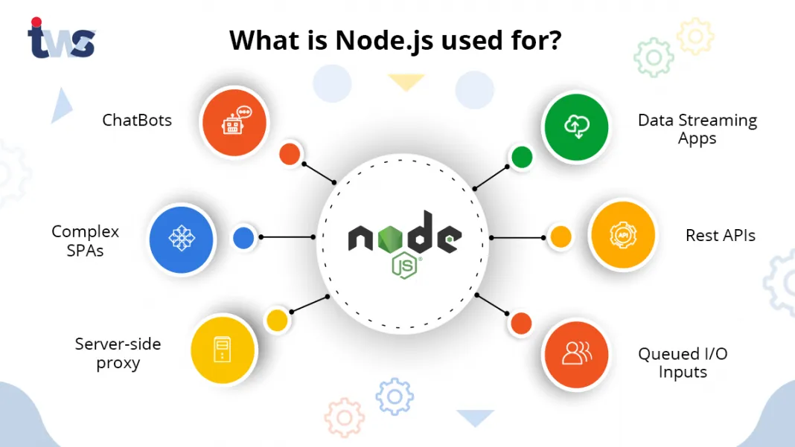
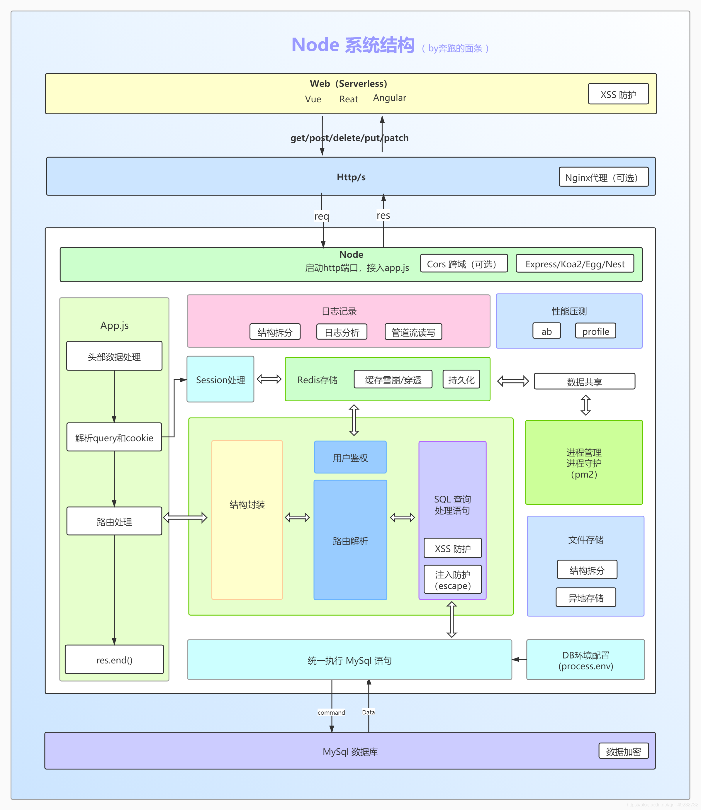
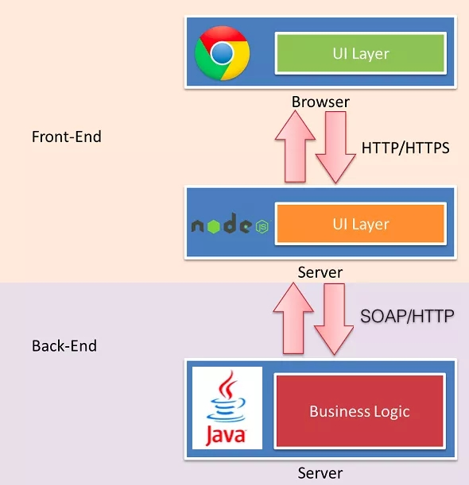

# Node.js 全面解析

## 一、引言

在现代 Web 开发领域，Node.js 已经成为了一个不可或缺的技术栈。它以其独特的优势和强大的生态系统，为开发者提供了构建高性能、可扩展的服务器端应用程序的能力。本文将全面深入地解析 Node.js，从其基础概念到实际应用，帮助读者更好地理解和掌握这一技术。

## 二、Node.js 简介

### （一）什么是 Node.js？

Node.js 是一个基于 Chrome V8 引擎的 JavaScript 运行环境，它允许开发者使用 JavaScript 编写服务器端代码。这使得 JavaScript 成为了唯一一个可以在浏览器（客户端）和服务器（服务端）上运行的语言。Node.js 以其事件驱动、非阻塞 I/O 模型而闻名，这种模型让 Node.js 在处理并发连接时表现出色，尤其是在高负载的情况下。

### （二）Node.js 的历史

* 创始人：由 Ryan Dahl 于 2009 年创立。
* 初衷：为了解决传统服务器架构在处理大量并发连接时遇到的性能问题。

## 三、Node.js 的核心特性



### （一）事件驱动

Node.js 采用事件驱动模型，所有 I/O 操作都是异步的，并且通过事件触发回调函数来响应结果。这种模型使得 Node.js 能够高效地处理大量并发连接，而不会被阻塞在某个特定的操作上。

### （二）非阻塞 I/O

Node.js 的 API 设计为非阻塞模式，不会等待 I/O 操作完成后再继续执行下一行代码。这种特性使得 Node.js 在处理 I/O 密集型应用时表现出色，能够快速响应用户请求。

### （三）单线程

Node.js 使用单个线程来处理任务，但是可以通过 libuv 库提供的工作线程池来并行处理一些特定的任务。这种设计既保证了高并发处理能力，又避免了多线程编程中的复杂性。

### （四）高效的网络应用开发

Node.js 非常适合用于创建实时性要求高的 Web 应用程序和服务，如聊天室、在线游戏等。其高性能和高并发处理能力使得这些应用能够快速响应用户操作，提供流畅的用户体验。

## 四、Node.js 的架构设计



### （一）V8 引擎

V8 是 Google 开发的开源 JavaScript 引擎，也是 Chrome 浏览器的核心组件之一。Node.js 基于 V8 引擎构建，这使得 Node.js 具有高性能的 JavaScript 执行能力。V8 引擎将 JavaScript 代码编译为机器码，从而提高了执行效率。

### （二）libuv 库

libuv 是一个跨平台的异步 I/O 库，它为 Node.js 提供了事件循环、异步 I/O、多线程等核心功能。libuv 使用了事件驱动和非阻塞 I/O 模型，使得 Node.js 能够高效地处理大量并发连接。

### （三）模块系统

Node.js 内置了两种模块系统，分别是默认的 CommonJS 模块和浏览器所支持的 ECMAScript 模块标准。CommonJS 模块是为 Node.js 打包 JavaScript 代码的原始方式，而 ECMAScript 模块则是浏览器和其他 JavaScript 运行时使用的标准。

## 五、Node.js 的内置模块

Node.js 提供了丰富的内置模块，这些模块涵盖了文件系统、网络编程、加密、缓冲区处理等多个方面。以下是一些常用的内置模块：

### （一）fs 模块

fs 模块提供了文件系统的操作接口，如读取文件、写入文件、创建目录、删除文件等。它支持同步和异步两种操作方式，方便开发者根据需求选择合适的模式。

**示例代码**

异步读取文件：

```JavaScript
const fs = require('fs');

fs.readFile('example.txt', 'utf8', (err, data) => {
  if (err) {
    console.error(err);
    return;
  }
  console.log(data);
});
```

同步读取文件：

```JavaScript
const fs = require('fs');

try {
  const data = fs.readFileSync('example.txt', 'utf8');
  console.log(data);
} catch (err) {
  console.error(err);
}
```

### （二）http 模块

http 模块用于创建 HTTP 服务器和发送 HTTP 请求。它提供了丰富的 API，可以方便地处理 HTTP 请求和响应，是构建 Web 应用程序的基础模块。

**示例代码**

创建一个简单的 HTTP 服务器：

```JavaScript
const http = require('http');

const server = http.createServer((req, res) => {
  res.statusCode = 200;
  res.setHeader('Content-Type', 'text/plain');
  res.end('Hello, World!\n');
});

server.listen(3000, () => {
  console.log('Server running at http://localhost:3000/');
});
```

### （三）path 模块

path 模块提供了处理文件路径的工具，如路径解析、路径拼接、获取文件扩展名等。它可以帮助开发者更方便地处理文件路径相关的问题。

**示例代码**

处理文件路径：

```JavaScript
const path = require('path');

const filePath = '/home/user/documents/example.txt';

console.log(path.dirname(filePath)); // 输出: /home/user/documents
console.log(path.basename(filePath)); // 输出: example.txt
console.log(path.extname(filePath)); // 输出: .txt
```

### （四）crypto 模块

crypto 模块提供了加密和哈希算法的实现，如 MD5、SHA1、AES 等。它可以用于数据加密、签名验证等安全相关的操作。

**示例代码**

使用哈希算法：

```JavaScript
const crypto = require('crypto');

const hash = crypto.createHash('sha256');
hash.update('Hello, World!');
console.log(hash.digest('hex')); // 输出: 7509e5bda0c762d2bac7f90d758b5b2263fa01ccbc542ab5e3df163be08e6ca9
```

### （五）buffer 模块

buffer 模块用于处理二进制数据，它提供了将二进制数据转换为字符串、将字符串转换为二进制数据等功能。在处理网络数据、文件数据等场景中非常有用。

**示例代码**

处理二进制数据：

```JavaScript
const buffer = Buffer.from('Hello, World!', 'utf8');
console.log(buffer.toString('base64')); // 输出: SGVsbG8sIFdvcmxkIQ==
```

## 六、Node.js 的功能与用途



### （一）Web 应用程序开发

借助 Express.js、Koa、Nest.js 等框架，开发者可以快速搭建各种类型的 Web 应用。这些框架提供了丰富的功能和灵活的配置，使得 Web 开发更加高效和便捷。



**示例代码**

使用 Express.js 创建一个简单的 Web 应用程序：

```JavaScript
const express = require('express');
const app = express();

app.get('/', (req, res) => {
  res.send('Hello, World!');
});

app.listen(3000, () => {
  console.log('Server running at http://localhost:3000/');
});
```

### （二）实时应用程序

Node.js 的事件驱动和非阻塞 I/O 模型使其非常适合用于构建实时应用程序，如聊天室、在线游戏等。这些应用需要实时通信和高并发处理能力，Node.js 能够很好地满足这些需求。

**示例代码**

使用 Socket.io 实现一个简单的聊天室：

```JavaScript
const express = require('express');
const socketIo = require('socket.io');
const app = express();
const server = app.listen(3000, () => {
  console.log('Server running at http://localhost:3000/');
});
const io = socketIo(server);

io.on('connection', (socket) => {
  console.log('A user connected');

  socket.on('chat message', (msg) => {
    console.log('Message: ' + msg);
    io.emit('chat message', msg);
  });

  socket.on('disconnect', () => {
    console.log('User disconnected');
  });
});
```

### （三）API 服务器

Node.js 可以用于构建 RESTful API 或 GraphQL API，为前端或其他系统提供数据接口。其高性能和高并发处理能力使得 API 服务器能够快速响应请求，提高用户体验。



**示例代码**

使用 Express.js 和 MongoDB 构建一个简单的 RESTful API：

```JavaScript
const express = require('express');
const mongoose = require('mongoose');
const app = express();

// 连接 MongoDB 数据库
mongoose.connect('mongodb://localhost:27017/mydatabase', {
  useNewUrlParser: true,
  useUnifiedTopology: true,
});

// 定义用户模型
const userSchema = new mongoose.Schema({
  name: String,
  email: String,
});
const User = mongoose.model('User', userSchema);

// 获取所有用户
app.get('/users', async (req, res) => {
  const users = await User.find();
  res.json(users);
});

// 创建新用户
app.post('/users', async (req, res) => {
  const user = new User(req.body);
  await user.save();
  res.status(201).json(user);
});

app.listen(3000, () => {
  console.log('Server running at http://localhost:3000/');
});
```

### （四）数据流处理

Node.js 提供了流（Stream）的概念，可以用于处理大文件上传下载、日志分析等涉及大量数据的操作。流可以有效地管理内存，避免一次性加载大量数据导致内存溢出。

**示例代码**

使用流读取和写入文件：

```JavaScript
const fs = require('fs');

const readStream = fs.createReadStream('input.txt');
const writeStream = fs.createWriteStream('output.txt');

readStream.pipe(writeStream);
```

### （五）自动化工具和命令行工具开发

Node.js 可以用于开发自动化工具和命令行工具，如 Grunt、Gulp、Yeoman 等构建工具。这些工具可以帮助开发者自动化重复性任务，提高开发效率。

**示例代码**

使用 Commander.js 创建一个简单的命令行工具：

```JavaScript
const program = require('commander');

program
  .version('1.0.0')
  .option('-n, --name <name>', 'Your name')
  .action((name) => {
    console.log(`Hello, ${name}!`);
  });

program.parse(process.argv);
```

### （六）微服务架构

结合 Docker 和 Kubernetes，Node.js 可以实现微服务部署。微服务架构将应用程序拆分为多个小型服务，每个服务独立运行和部署，提高了系统的可维护性和扩展性。

**示例代码**

使用 Express.js 和 Docker 部署一个简单的微服务：

1. 创建 Dockerfile：

  ```bash
  FROM node:14
  WORKDIR /app
  COPY package.json .
  RUN npm install
  COPY . .
  CMD ["node", "app.js"]
  ```

2. 构建和运行容器：

  ```bash
  docker build -t my-node-service .
  docker run -p 3000:3000 my-node-service
  ```

## 七、Node.js 的优势

### （一）高性能

Node.js 的事件驱动和非阻塞 I/O 模型使其在处理 I/O 密集型应用时表现出色。它能够高效地处理大量并发连接，特别适合用于高负载的网络应用。

### （二）轻量级

Node.js 的启动速度快，资源占用少，使得它在服务器端运行时非常高效。它不需要复杂的配置和大量的资源，即可快速启动和运行。

### （三）易于学习

对于熟悉 JavaScript 的开发者来说，Node.js 非常容易上手。它使用 JavaScript 作为编程语言，使得前后端开发可以使用同一种语言，降低了学习成本。

### （四）跨平台支持

Node.js 能够在多种操作系统上运行，包括 Windows、Linux 和 macOS。这使得开发者可以轻松地在不同平台上部署和运行应用程序。

## 八、Node.js 的局限性

### （一）CPU 密集型任务不适合

由于 Node.js 的单线程性质，在处理复杂计算时可能会遇到瓶颈。对于 CPU 密集型任务，Node.js 可能不是最佳选择。

### （二）可靠性挑战

任何未捕获的异常都可能导致整个进程崩溃，因此需要良好的错误处理机制。开发者需要仔细处理异常，以确保应用程序的稳定性。

### （三）多核 CPU 利用不足

默认情况下，Node.js 仅利用一个 CPU 核心。尽管有 cluster 模块可以帮助解决这个问题，但配置较为复杂，需要开发者具备一定的经验。

## 九、Node.js 的生态系统

Node.js 拥有庞大的生态系统和丰富的社区资源，以下是一些常用的开发工具和库：

### （一）npm（Node Package Manager）

JavaScript 的包管理器，提供了海量的包和模块，极大地丰富了开发者的工具箱。开发者可以通过 npm 安装和管理各种依赖，提高开发效率。

### （二）Express.js

一个流行的 Node.js 框架，用于快速搭建 Web 应用和 API 服务器。Express.js 提供了丰富的功能和灵活的配置，使得 Web 开发更加高效和便捷。

### （三）Koa

另一个轻量级的 Node.js 框架，由 Express 原班人马打造，提供了更多的灵活性和简洁性。Koa 使用了 ES6 的新特性，使得代码更加简洁和易读。

### （四）Nest.js

一个用于构建高效、可扩展的服务器端应用程序的框架，采用了现代 JavaScript 的最佳实践。Nest.js 提供了模块化、依赖注入等特性，使得应用程序的结构更加清晰和易于维护。

### （五）Socket.io

一个用于实时通信的库，支持 WebSocket 和多种传输方式。Socket.io 可以用于构建聊天室、在线游戏等实时应用程序，提供了丰富的 API 和事件机制。

### （六）TypeScript

一种静态类型的 JavaScript 超集，为 Node.js 开发提供了更好的类型检查和开发体验。TypeScript 可以帮助开发者在编写代码时发现潜在的错误，提高代码的质量和可维护性。

## 十、Node.js 的发展趋势与未来展望

### （一）持续更新和优化

Node.js 会不断更新和优化其核心功能，提高性能和安全性。开发者可以期待更多的新特性和改进，以满足不断变化的需求。

### （二）更广泛的普及

随着 JavaScript 在全栈开发中的重要性不断增加，Node.js 的用户群体将继续扩大。越来越多的开发者将选择 Node.js 作为他们的主要技术栈，推动其进一步发展。

### （三）更好的工具支持

将有更多的开发工具和库涌现，为 Node.js 的开发提供更好的支持和便利。这些工具将帮助开发者更高效地编写、测试和部署应用程序。

### （四）更深入的集成

Node.js 与其他技术和框架的集成将更加紧密，如与前端框架（React、Vue.js）、数据库（MongoDB、PostgreSQL）等的集成。这将使得开发者能够更轻松地构建全栈应用程序。

### （五）更大的社区贡献

社区的活跃度将持续提高，开发者将为 Node.js 贡献更多的代码和资源，推动其不断进步。社区的力量将使得 Node.js 更加稳定和可靠。

## 十一、总结

Node.js 凭借其独特的设计理念和强大的生态系统，已经成为现代 Web 开发不可或缺的一部分。无论是构建动态网站、实时应用还是后端服务，Node.js 都提供了灵活且高效的选择。通过深入理解 Node.js 的核心特性、架构设计和内置模块，开发者可以更好地利用这一技术，构建高性能、可扩展的应用程序。未来，Node.js 将继续发展和壮大，为开发者带来更多的惊喜和可能性。
