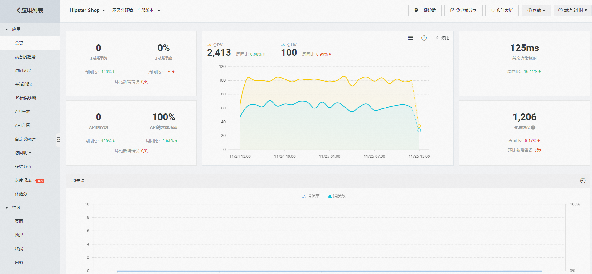

# 前端性能优化与监控

## 前言

在现代Web开发中，前端性能优化与监控至关重要，它们直接关系到用户体验和应用稳定性。性能优化能提升页面加载与交互响应速度，而监控则有助于实时了解应用运行状态，及时发现并解决问题。本文将系统介绍前端性能优化与监控的相关知识、实践方法及业内标准。

## 前端监控：关注内容与日常实践

### 什么是前端监控，其意义和目的



前端监控是指在前端应用中实施的一系列监测和分析机制，用于实时收集和分析应用的性能数据、错误信息以及用户体验相关数据。其主要意义在于：

1. 提升用户体验：通过实时监测和优化应用性能，确保用户获得流畅、高效的交互体验。
2. 快速定位和解决问题：及时发现并解决应用中的性能瓶颈、错误和异常情况，减少对用户的影响。
3. 优化应用性能：基于监控数据进行针对性的性能优化，提高应用的整体性能和稳定性。
4. 保障业务稳定性：确保前端应用在各种环境下稳定运行，支持业务的持续发展。

### 前端监控需要监控什么内容

前端监控主要关注以下几个方面：


1. 性能指标：包括FP、FCP、LCP、CLS、FID等，用于评估页面加载和交互性能。
2. 错误监控：捕获JavaScript错误、资源加载失败、网络请求错误等，及时发现和修复问题。
3. 用户体验监控：收集用户行为数据，如点击、滚动、停留时间等，了解用户对页面的使用情况和满意度。
4. 网络请求监控：监测API请求的响应时间、成功率，优化后端服务和网络配置。
5. 资源加载监控：跟踪CSS、JavaScript、图片等资源的加载时间、加载顺序，确保资源高效加载。
6. 业务指标监控：跟踪PV、UV等流量指标，以及业务数据埋点，确保业务流程的顺畅。

### 前端监控的核心技术要点

1. 性能监控技术：
   - Performance API：使用浏览器提供的Performance API收集性能数据。
   - Resource Timing API：收集资源加载性能数据。
2. 错误监控技术：
   - window.onerror：捕获全局JavaScript错误。
   - Promise.catch：捕获异步操作中的错误。
3. 用户体验监控技术：
   - 事件监听：捕获用户交互事件，如点击、滚动等。
   - 用户行为分析：通过分析用户行为数据，了解用户需求和偏好。
4. 网络请求监控技术：
   - Fetch API 和 XMLHttpRequest：监听网络请求的发送和响应，捕获错误和性能数据。
   - Service Workers：拦截和处理网络请求，实现缓存策略和离线支持。
5. 资源加载监控技术：
   - Resource Timing API：收集资源加载性能数据。
   - 懒加载和预加载：优化资源加载策略，提升性能。
6. 业务指标监控技术：
   - 分析工具集成：使用Google Analytics、百度统计等工具跟踪PV、UV等指标。
   - 自定义埋点：通过编写埋点代码收集特定的用户行为数据。

### 实践示例：前端监控的实现

#### 性能监控示例

```javascript
// 收集性能数据
const performanceData = window.performance.getEntriesByType('navigation')[0];
console.log('Performance Data:', performanceData);

// 监听性能指标变化
new PerformanceObserver((list) => {
    list.getEntries().forEach((entry) => {
        console.log('Performance Entry:', entry);
        // 将性能数据发送到服务器
        sendPerformanceData(entry);
    });
}).observe({ entryTypes: ['largest-contentful-paint', 'layout-shift', 'first-input'] });
```

#### 错误监控示例

```javascript
// 全局错误处理
window.onerror = function(message, source, lineno, colno, error) {
    console.error('JavaScript Error:', message, error);
    // 将错误信息发送到服务器
    sendErrorToServer({ message, source, lineno, colno, stack: error?.stack });
    return true;
};

// 捕获Promise拒绝错误
window.addEventListener('unhandledrejection', function(event) {
    console.error('Unhandled Promise Rejection:', event.reason);
    sendErrorToServer({ message: event.reason.message, stack: event.reason.stack });
    event.preventDefault();
});
```

#### 用户体验监控示例

```javascript
// 监听用户交互事件
document.addEventListener('click', function(event) {
    console.log('User Click:', event.target);
    // 记录点击事件，可发送到服务器
    sendUserInteraction({ type: 'click', target: event.target.tagName, time: new Date().toISOString() });
});

document.addEventListener('scroll', function() {
    console.log('Scroll Position:', window.scrollY);
    // 记录滚动位置，可发送到服务器
    sendUserInteraction({ type: 'scroll', position: window.scrollY, time: new Date().toISOString() });
}, { passive: true });
```

#### 业务指标监控示例

```javascript
// 使用分析工具（如Google Analytics）跟踪PV和UV
ga('send', 'pageview'); // 发送页面浏览数据

// 自定义埋点示例
document.getElementById('submit-btn').addEventListener('click', function() {
    // 发送埋点数据到服务器
    sendAnalyticsData({
        eventType: 'button_click',
        elementId: 'submit-btn',
        page: window.location.pathname,
        timestamp: new Date().toISOString()
    });
});
```

## 前端性能优化通用指标及提升手段

### 性能指标及其优化手段

1. **FCP（First Contentful Paint）**

    **解释**：FCP衡量从网页开始加载到任何部分呈现在屏幕上所用的时间。

    **数据采集和计算方式**：

    ```javascript
    const fcpObserver = new PerformanceObserver((list) => {
        const entries = list.getEntriesByType('paint');
        entries.forEach((entry) => {
            if (entry.name === 'first-contentful-paint') {
                console.log('FCP:', entry.startTime);
            }
        });
    });

    fcpObserver.observe({ entryTypes: ['paint'] });
    ```

    **提升手段**：
    - **减少关键路径的资源大小**：
        - **压缩CSS、JavaScript文件，减少代码冗余**：

          ```javascript
          // 使用Webpack进行代码压缩
          const TerserPlugin = require('terser-webpack-plugin');

          module.exports = {
              optimization: {
                  minimize: true,
                  minimizer: [new TerserPlugin()],
              },
          };
          ```

        - **使用图片压缩工具，减少图片文件大小**：

          ```javascript
          // 使用图像压缩工具，如imagemin
          const imagemin = require('imagemin');
          const imageminWebp = require('imagemin-webp');

          (async () => {
              const files = await imagemin(['images/*.jpg'], {
                  destination: 'build/images',
                  plugins: [
                      imageminWebp({ quality: 75 })
                  ]
              });

              console.log('Images optimized:', files);
          })();
          ```

    - **优化图片和视频等大资源的加载**：
        - **使用懒加载技术，减少初始加载时间**：

          ```html
          
          ```

        - **使用现代图片格式（如WebP），提高加载效率**：

          ```html
          <picture>
              <source srcset="image.webp" type="image/webp">
              
          </picture>
          ```

    - **使用`<link rel="preload">`提前加载关键资源**：

      ```html
      <link rel="preload" href="critical.css" as="style">
      ```

2. **LCP（Largest Contentful Paint）**

    **解释**：LCP衡量的是页面上最大的可见元素（如图像或文字块）变为可见所需的时间，这是用户感知页面加载完成的重要标志。

    **数据采集和计算方式**：

    ```javascript
    const lcpObserver = new PerformanceObserver((list) => {
        const entries = list.getEntriesByType('largest-contentful-paint');
        entries.forEach((entry) => {
            console.log('LCP Element:', entry.element);
            console.log('LCP Render Time:', entry.renderTime);
            console.log('LCP Load Time:', entry.loadTime);
        });
    });

    lcpObserver.observe({ type: 'largest-contentful-paint', buffered: true });
    ```

    **提升手段**：
    - **优化图片和视频等大资源的加载**：
        - **使用懒加载技术**：

          ```html
          
          ```

        - **压缩图片尺寸**：

          ```javascript
          // 使用图像压缩工具，如imagemin
          const imagemin = require('imagemin');
          const imageminWebp = require('imagemin-webp');

          (async () => {
              const files = await imagemin(['images/*.jpg'], {
                  destination: 'build/images',
                  plugins: [
                      imageminWebp({ quality: 75 })
                  ]
              });

              console.log('Images optimized:', files);
          })();
          ```

        - **使用现代图片格式（如WebP）**：

          ```html
          <picture>
              <source srcset="image.webp" type="image/webp">
              
          </picture>
          ```

    - **确保关键路径资源优先加载**：
        - **使用`<link rel="preload">`提前加载关键资源**：

          ```html
          <link rel="preload" href="main.js" as="script">
          ```

        - **通过代码分割，按需加载非关键资源**：

          ```javascript
          // 使用Webpack进行代码分割
          const mainModule = import('./main.js');
          const featureModule = import('./feature.js');
          ```

    - **使用骨架屏或占位符元素**：
        - **在资源加载完成前，显示骨架屏或占位符**：

          ```html
          <div class="skeleton-screen">
              <!-- 骨架屏内容 -->
          </div>
          <script>
              // 资源加载完成后隐藏骨架屏
              window.addEventListener('load', function() {
                  document.querySelector('.skeleton-screen').style.display = 'none';
              });
          </script>
          ```

3. **FID（First Input Delay）**

    **解释**：FID衡量从用户首次与页面互动（如点击链接或按钮）到浏览器实际能够响应该互动的时间。

    **数据采集和计算方式**：

    ```javascript
    const observer = new PerformanceObserver((list) => {
        for (const entry of list.getEntries()) {
            console.log('FID:', entry.processingStart - entry.startTime);
        }
    });

    observer.observe({ type: 'first-input', buffered: true });
    ```

    **提升手段**：
    - **减少JavaScript的阻塞**：
        - **使用代码拆分和异步加载**：

          ```javascript
          // 使用Webpack进行代码分割
          const mainModule = import('./main.js');
          const featureModule = import('./feature.js');
          ```

        - **使用Web Workers处理耗时任务**：

          ```javascript
          const worker = new Worker('worker.js');
          worker.postMessage('Start processing');
          worker.onmessage = function(e) {
              console.log('Result:', e.data);
          };
          ```

    - **优化服务器响应时间和网络连接**：
        - **使用CDN加速资源加载**：

          ```html
          <link rel="stylesheet" href="https://cdn.example.com/style.css">
          <script src="https://cdn.example.com/script.js"></script>
          ```

        - **使用HTTP/2减少请求延迟**：

          ```nginx
          # Nginx配置示例
          server {
              listen 443 ssl http2;
              server_name example.com;
              # 其他配置...
          }
          ```

4. **CLS（Cumulative Layout Shift）**

    **解释**：CLS衡量页面在加载过程中元素意外移动的总量，可能导致用户点击错误的链接或阅读被打断。

    **数据采集和计算方式**：

    ```javascript
    const clsObserver = new PerformanceObserver((list) => {
        const entries = list.getEntriesByType('layout-shift');
        let totalCLS = 0;
        entries.forEach((entry) => {
            if (!entry.hadRecentInput) {
                totalCLS += entry.value;
            }
            console.log('CLS Value:', entry.value);
            console.log('CLS Impact:', entry.hadRecentInput ? 'Low' : 'High');
        });
        console.log('Total CLS:', totalCLS);
    });

    clsObserver.observe({ type: 'layout-shift', buffered: true });
    ```

    **提升手段**：
    - **避免在页面加载期间修改已渲染元素的尺寸**：
        - **在CSS中提前定义好元素的尺寸**：

          ```css
          img {
              width: 300px;
              height: 200px;
              object-fit: cover;
          }
          ```

        - **使用固定尺寸或百分比布局**：

          ```css
          .container {
              display: flex;
              flex-direction: column;
          }
          .item {
              flex: 1;
              height: 100px;
          }
          ```

    - **动态插入内容时预留空间或使用CSS动画**：
        - **在动态内容插入前预留空间**：

          ```javascript
          // 在插入内容前设置容器高度
          const container = document.getElementById('content-container');
          container.style.height = '300px'; // 预留高度
          // 插入内容
          container.innerHTML = '<div>Dynamic content</div>';
          ```

        - **使用CSS动画平滑过渡**：

          ```css
          .content-container {
              transition: height 0.3s ease;
          }
          ```

5. **TTI（Time to Interactive）**

    **解释**：TTI衡量从页面开始加载到能够快速可靠地响应用户输入的时间。

    **数据采集和计算方式**：

    ```javascript
    const ttiObserver = new PerformanceObserver((list) => {
        const entries = list.getEntriesByType('longtask');
        entries.forEach((entry) => {
            console.log('TTI:', entry.startTime);
        });
    });

    ttiObserver.observe({ entryTypes: ['longtask'] });
    ```

    **提升手段**：
    - **减少JavaScript的阻塞**：
        - **使用代码拆分和异步加载**：

          ```javascript
          // 使用Webpack进行代码分割
          const mainModule = import('./main.js');
          const featureModule = import('./feature.js');
          ```

        - **使用Web Workers处理耗时任务**：

          ```javascript
          const worker = new Worker('worker.js');
          worker.postMessage('Start processing');
          worker.onmessage = function(e) {
              console.log('Result:', e.data);
          };
          ```

    - **优化服务器响应时间和网络连接**：
        - **使用CDN加速资源加载**：

          ```html
          <link rel="stylesheet" href="https://cdn.example.com/style.css">
          <script src="https://cdn.example.com/script.js"></script>
          ```

        - **使用HTTP/2减少请求延迟**：

          ```nginx
          # Nginx配置示例
          server {
              listen 443 ssl http2;
              server_name example.com;
              # 其他配置...
          }
          ```

6. **TBT（Total Blocking Time）**

    **解释**：TBT测量FCP和TTI之间的总时间，主线程处于屏蔽状态的时间足以阻止输入响应。

    **数据采集和计算方式**：

    ```javascript
    const tbtObserver = new PerformanceObserver((list) => {
        const entries = list.getEntriesByType('longtask');
        let totalTBT = 0;
        entries.forEach((entry) => {
            totalTBT += entry.duration;
        });
        console.log('TBT:', totalTBT);
    });

    tbtObserver.observe({ entryTypes: ['longtask'] });
    ```

    **提升手段**：
    - **减少JavaScript的阻塞**：
        - **使用代码拆分和异步加载**：

          ```javascript
          // 使用Webpack进行代码分割
          const mainModule = import('./main.js');
          const featureModule = import('./feature.js');
          ```

        - **使用Web Workers处理耗时任务**：

          ```javascript
          const worker = new Worker('worker.js');
          worker.postMessage('Start processing');
          worker.onmessage = function(e) {
              console.log('Result:', e.data);
          };
          ```

    - **优化服务器响应时间和网络连接**：
        - **使用CDN加速资源加载**：

          ```html
          <link rel="stylesheet" href="https://cdn.example.com/style.css">
          <script src="https://cdn.example.com/script.js"></script>
          ```

        - **使用HTTP/2减少请求延迟**：

          ```nginx
          # Nginx配置示例
          server {
              listen 443 ssl http2;
              server_name example.com;
              # 其他配置...
          }
          ```

7. **INP（Interaction to Next Paint）**

    **解释**：INP衡量用户与页面交互后的延迟时间，选择最差的互动延迟时间作为代表性值。

    **数据采集和计算方式**：

    ```javascript
    const inpObserver = new PerformanceObserver((list) => {
        const entries = list.getEntriesByType('interaction');
        entries.forEach((entry) => {
            console.log('INP:', entry.interactionId, entry.startTime, entry.duration);
        });
    });

    inpObserver.observe({ entryTypes: ['interaction'] });
    ```

    **提升手段**：
    - **减少JavaScript的阻塞**：
        - **使用代码拆分和异步加载**：

          ```javascript
          // 使用Webpack进行代码分割
          const mainModule = import('./main.js');
          const featureModule = import('./feature.js');
          ```

        - **使用Web Workers处理耗时任务**：

          ```javascript
          const worker = new Worker('worker.js');
          worker.postMessage('Start processing');
          worker.onmessage = function(e) {
              console.log('Result:', e.data);
          };
          ```

    - **优化服务器响应时间和网络连接**：
        - **使用CDN加速资源加载**：

          ```html
          <link rel="stylesheet" href="https://cdn.example.com/style.css">
          <script src="https://cdn.example.com/script.js"></script>
          ```

        - **使用HTTP/2减少请求延迟**：

          ```nginx
          # Nginx配置示例
          server {
              listen 443 ssl http2;
              server_name example.com;
              # 其他配置...
          }
          ```

8. **FPS（Frames Per Second）**

    **解释**：FPS表示每秒钟画面更新次数，影响动画的流畅度。

    **数据采集和计算方式**：

    ```javascript
    let frameCount = 0;
    let lastTime = 0;

    function countFrames(timestamp) {
        if (timestamp < lastTime) {
            console.log('FPS:', frameCount);
            frameCount = 0;
        } else {
            frameCount++;
        }
        lastTime = timestamp;
        requestAnimationFrame(countFrames);
    }

    requestAnimationFrame(countFrames);
    ```

    **提升手段**：
    - **减少DOM操作**：
        - **避免频繁的重绘和回流**：

          ```javascript
          // 使用DocumentFragment减少DOM操作
          const fragment = document.createDocumentFragment();
          for (let i = 0; i < items.length; i++) {
              const item = document.createElement('div');
              item.textContent = items[i];
              fragment.appendChild(item);
          }
          document.getElementById('container').appendChild(fragment);
          ```

        - **使用CSS动画和硬件加速**：

          ```css
          .slide-in {
              animation: slideIn 0.5s ease-out;
              will-change: transform;
          }
          @keyframes slideIn {
              from {
                  transform: translateX(-100%);
              }
              to {
                  transform: translateX(0);
              }
          }
          ```

9. **FP（First Paint）**

    **解释**：FP标志着浏览器开始在屏幕上渲染任何内容，包括背景颜色改变。

    **数据采集和计算方式**：

    ```javascript
    const fpObserver = new PerformanceObserver((list) => {
        const entries = list.getEntriesByType('paint');
        entries.forEach((entry) => {
            if (entry.name === 'first-paint') {
                console.log('FP:', entry.startTime);
            }
        });
    });

    fpObserver.observe({ entryTypes: ['paint'] });
    ```

    **提升手段**：
    - **减少初始CSS和JavaScript的体积**：
        - **通过压缩、合并文件，减少代码冗余**：

          ```javascript
          // 使用Webpack进行代码压缩
          const TerserPlugin = require('terser-webpack-plugin');

          module.exports = {
              optimization: {
                  minimize: true,
                  minimizer: [new TerserPlugin()],
              },
          };
          ```

        - **使用代码分割，按需加载非关键资源**：

          ```javascript
          // 使用Webpack进行代码分割
          const mainModule = import('./main.js');
          const featureModule = import('./feature.js');
          ```

    - **优先加载关键CSS**：
        - **将首屏需要的CSS提前加载，非关键CSS可以异步加载**：

          ```html
          <link rel="stylesheet" href="critical.css">
          <link rel="preload" href="non-critical.css" as="style">
          ```

        - **使用`<link rel="preload">`提前加载关键资源**：

          ```html
          <link rel="preload" href="critical.css" as="style">
          ```

## 业务自定义埋点，数据上报的核心技术方案和示例代码

### 业务自定义埋点

业务自定义埋点是前端监控的重要组成部分，用于收集特定的用户行为数据，以支持业务分析和优化。以下是业务自定义埋点的核心技术方案和示例代码。

### 核心技术方案

1. 手动埋点：在关键业务逻辑中手动插入埋点代码，适用于需要精确控制的场景。
2. 自动埋点：通过重写DOM事件处理函数或使用Proxy等技术，自动捕获用户交互事件，适用于大规模的用户行为收集。
3. 可视化埋点：通过可视化工具配置埋点规则，减少手动编码的工作量，适用于需要快速迭代的项目。

### 示例代码

#### 手动埋点示例

```javascript
// 定义埋点数据结构
const analyticsData = {
    eventType: 'button_click', // 事件类型
    elementId: 'submit-btn', // 元素ID
    page: window.location.pathname, // 当前页面路径
    timestamp: new Date().toISOString() // 事件发生时间
};

// 发送埋点数据到服务器
function sendAnalyticsData(data) {
    // 使用fetch API发送POST请求
    fetch('/api/analytics', {
        method: 'POST',
        headers: {
            'Content-Type': 'application/json'
        },
        body: JSON.stringify(data)
    })
    .then(response => response.json())
    .then(data => {
        console.log('Analytics data sent successfully:', data);
    })
    .catch(error => {
        console.error('Error sending analytics data:', error);
    });
}

// 在业务代码中手动调用埋点
document.getElementById('submit-btn').addEventListener('click', function() {
    sendAnalyticsData(analyticsData);
});
```

#### 自动埋点示例

```javascript
// 使用事件代理监听点击事件
document.body.addEventListener('click', function(event) {
    const target = event.target;
    if (target.matches('.tracked-button')) {
        sendAnalyticsData({
            eventType: 'button_click',
            elementId: target.id,
            page: window.location.pathname,
            timestamp: new Date().toISOString()
        });
    }
}, true); // 使用捕获阶段确保监听
```

#### 可视化埋点示例

```javascript
// 定义埋点规则配置
const data = {
    'button#submit-btn': {
        eventType: 'button_click',
        elementId: 'submit-btn',
        page: window.location.pathname,
        timestamp: new Date().toISOString()
    },
    'a[href="/checkout"]': {
        eventType: 'checkout_click',
        elementId: 'checkout-link',
        page: window.location.pathname,
        timestamp: new Date().toISOString()
    }
};

// 遍历埋点规则配置，为匹配的元素添加事件监听器
for (const selector in data) {
    const elements = document.querySelectorAll(selector);
    elements.forEach(element => {
        element.addEventListener('click', function(event) {
            const analyticsData =埋点规则配置[selector];
            sendAnalyticsData(analyticsData);
        });
    });
}
```

### 数据上报

数据上报是将收集到的监控数据发送到服务器的过程，确保数据的完整性和及时性是关键。以下是数据上报的核心技术方案和示例代码。

### 核心技术方案

1. 批量上报：将多条数据打包成一个请求发送，减少网络请求数。
2. 使用Beacon API：在页面卸载时确保数据上报完成，避免数据丢失。
3. 延迟上报：对于非关键数据，可以延迟上报，减少对用户交互的影响。

### 示例代码

#### 批量上报示例

```javascript
// 批量上报示例
const analyticsDataBatch = [];

function sendAnalyticsDataBatch() {
    if (analyticsDataBatch.length > 0) {
        fetch('/api/analytics/batch', {
            method: 'POST',
            headers: {
                'Content-Type': 'application/json'
            },
            body: JSON.stringify({ data: analyticsDataBatch })
        })
        .then(response => response.json())
        .then(data => {
            console.log('Batch analytics data sent successfully:', data);
            // 清空数据批
            analyticsDataBatch.length = 0;
        })
        .catch(error => {
            console.error('Error sending batch analytics data:', error);
        });
    }
}

// 定时发送数据批
setInterval(sendAnalyticsDataBatch, 30000);

// 使用Beacon API在页面卸载时上报数据
window.addEventListener('beforeunload', function() {
    if (analyticsDataBatch.length > 0) {
        navigator.sendBeacon('/api/analytics/batch', JSON.stringify({ data: analyticsDataBatch }));
    }
});

// 在visibilitychange事件中上报数据，提高可靠性
document.addEventListener('visibilitychange', function() {
    if (document.visibilityState === 'hidden') {
        navigator.sendBeacon('/api/analytics', data);
    }
});
```

#### 使用Beacon API示例

```javascript
// 使用Beacon API发送单条数据
function sendAnalyticsDataWithBeacon(data) {
    const blob = new Blob([JSON.stringify(data)], { type: 'application/json' });
    navigator.sendBeacon('/api/analytics', blob);
}

// 在页面卸载时发送数据
window.addEventListener('beforeunload', function() {
    sendAnalyticsDataWithBeacon({
        eventType: 'page_unload',
        page: window.location.pathname,
        timestamp: new Date().toISOString()
    });
});
```

#### 延迟上报示例

```javascript
// 延迟上报示例
const delayedAnalyticsData = [];

function sendDelayedAnalyticsData() {
    if (delayedAnalyticsData.length > 0) {
        fetch('/api/analytics/delayed', {
            method: 'POST',
            headers: {
                'Content-Type': 'application/json'
            },
            body: JSON.stringify({ data: delayedAnalyticsData })
        })
        .then(response => response.json())
        .then(data => {
            console.log('Delayed analytics data sent successfully:', data);
            // 清空延迟数据批
            delayedAnalyticsData.length = 0;
        })
        .catch(error => {
            console.error('Error sending delayed analytics data:', error);
        });
    }
}

// 在用户不活跃时发送延迟数据
document.addEventListener('visibilitychange', function() {
    if (document.visibilityState === 'visible') {
        sendDelayedAnalyticsData();
    }
});

// 定时检查发送延迟数据
setInterval(sendDelayedAnalyticsData, 60000);
```

## 业内比较好的数值

### 性能指标目标值

1. LCP（Largest Contentful Paint）：目标值在2.5秒内，确保用户快速看到页面主要内容。
2. FID（First Input Delay）：目标值小于100毫秒，保证用户交互的即时响应。
3. CLS（Cumulative Layout Shift）：目标值小于0.1，减少页面加载过程中的布局跳动。
4. TTI（Time to Interactive）：目标值小于5秒，确保页面在合理时间内可交互。
5. TBT（Total Blocking Time）：目标值小于300毫秒，减少主线程阻塞。
6. INP（Interaction to Next Paint）：目标值小于200毫秒，提升用户交互体验。
7. FPS（Frames Per Second）：目标值达到50-60 FPS，确保动画流畅。

### 业务指标目标值

1. PV（Page View）：根据业务目标设定，通常追求持续增长，表明内容吸引力和用户活跃度提升。
2. UV（Unique Visitor）：根据业务规模和市场定位设定，目标是稳定增长，反映用户群体的扩大。

## 总结

前端性能优化与监控是提升用户体验、保障应用稳定性和实现业务目标的关键手段。通过优化页面加载速度、渲染性能和交互响应速度，结合全面的性能监控、异常捕获和业务指标跟踪，可以全面了解应用的运行状态，及时发现并解决问题。在实际项目中，应综合运用各种优化技术和监控手段，确保应用在性能、稳定性和业务表现上达到最佳状态，从而提升用户满意度和业务成功率。
