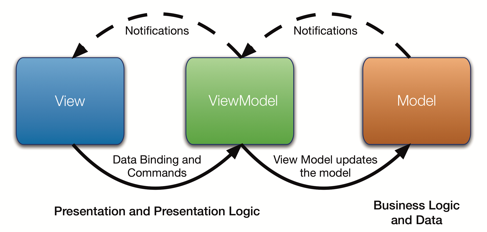
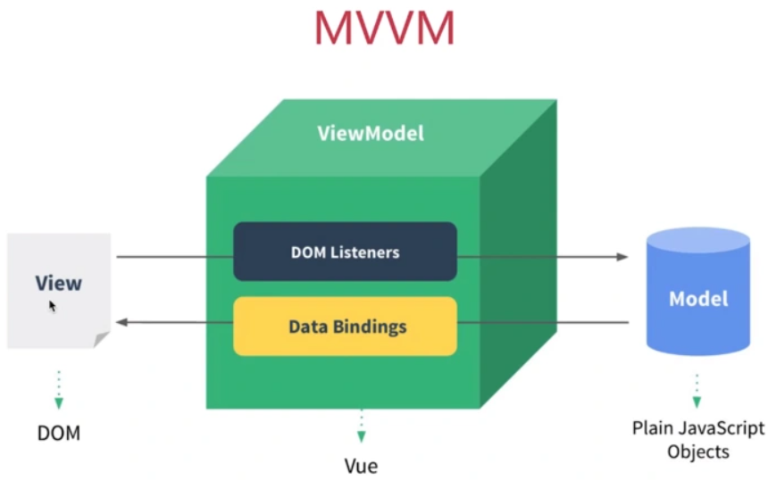
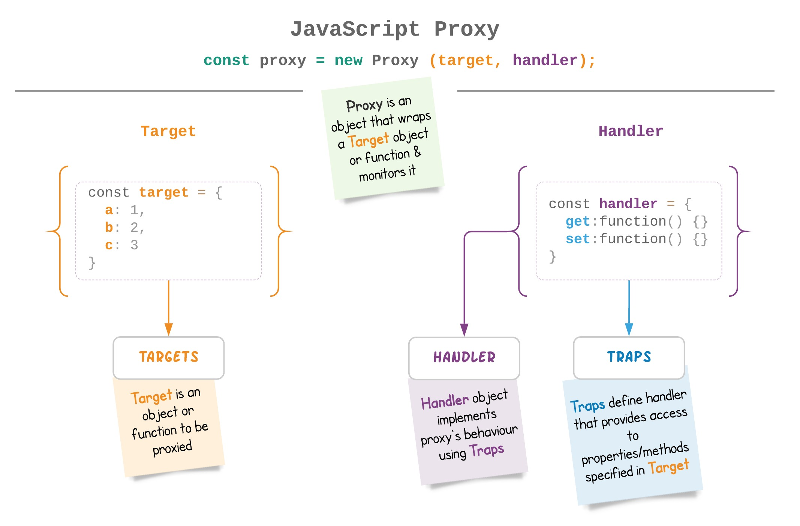

# 双向绑定实现方案深度解析

双向绑定是现代前端框架中常见的特性之一，它允许数据模型与视图之间自动同步更新。本文将详细探讨三种主要的双向绑定实现方案：`Object.defineProperty + 发布-订阅模式`、`Proxy + 发布-订阅模式` 以及 `AngularJS 的脏检查机制`，并分析它们的技术原理、优缺点及适用场景。



## 方案1：`Object.defineProperty + 发布-订阅模式`



### 技术原理

此方案利用了 JavaScript 的 `Object.defineProperty` 方法来劫持对象属性的访问和修改操作。每当一个属性被读取时（通过 getter），它会收集依赖关系；而当该属性被设置新值时（通过 setter），它会触发所有依赖于它的视图更新。此外，还引入了发布-订阅模式（Dep），用于管理和通知依赖。

### 核心代码实现

```javascript
class Dep {
  constructor() {
    this.subscribers = new Set(); // 使用Set避免重复订阅
  }

  depend() {
    if (Dep.target) {
      this.subscribers.add(Dep.target); // 收集当前依赖
    }
  }

  notify() {
    this.subscribers.forEach(sub => sub()); // 通知所有依赖更新
  }
}

function defineReactive(obj, key, value) {
  const dep = new Dep();
  Object.defineProperty(obj, key, {
    get() {
      dep.depend(); // 收集依赖
      return value;
    },
    set(newVal) {
      if (newVal !== value) {
        value = newVal;
        dep.notify(); // 通知依赖更新
      }
    }
  });
}

function observer(obj) {
  if (!obj || typeof obj !== 'object') return;
  Object.keys(obj).forEach(key => defineReactive(obj, key, obj[key]));
}

// 测试
Dep.target = null; // 全局依赖
function autorun(update) {
  Dep.target = update;
  update(); // 触发依赖收集
  Dep.target = null;
}

const data = { name: 'Vue', age: 2 };
observer(data);

autorun(() => console.log(`Name: ${data.name}`));
data.name = 'Vue 2'; // 触发视图更新
```

### 代码解读

* 依赖收集：可以画一个数据对象（例如 data.name）与一个名为 Dep 的类实例之间的关系图。当访问 data.name 时，应该展示出如何通过 getter 方法触发 Dep.depend() 函数来收集当前正在执行的更新函数作为依赖。
* 通知机制：在另一个图中，当设置新的 data.name 值时，展示 setter 方法是如何调用 dep.notify() 来触发所有已注册依赖（即之前收集的更新函数）的执行。

```mermaid
graph TD;
    A[访问 data.name] --> B[触发 getter];
    B --> C{Dep.depend()};
    C -->|收集依赖| D[添加更新函数到 Dep];
    D --> E[返回值];

    F[设置新的 data.name 值] --> G[触发 setter];
    G --> H{dep.notify()};
    H --> I[执行所有已注册的更新函数];
```

### 优点

* **易于理解**：逻辑清晰，容易上手。
* **兼容性好**：支持较旧版本的浏览器。

### 缺点

* **局限性**：无法监听新增或删除的属性，对数组的变化也缺乏直接的支持。

## 方案2：`Proxy + 发布-订阅模式`



### 技术原理

借助 ES6 引入的 `Proxy` 对象，可以更灵活地拦截对象的操作，包括获取属性值（get）、设置属性值（set）等。这使得不仅可以监听属性的变化，还能处理数组方法调用、属性增删等情况。同样地，这里也应用了发布-订阅模式来管理依赖关系。

### 核心代码实现

```javascript
class Dep {
  constructor() {
    this.subscribers = new Set();
  }

  depend() {
    if (Dep.target) {
      this.subscribers.add(Dep.target);
    }
  }

  notify() {
    this.subscribers.forEach(sub => sub());
  }
}

function reactive(obj) {
  const depMap = new Map(); // 每个属性独立的依赖管理

  function getDep(target, key) {
    if (!depMap.has(target)) depMap.set(target, new Map());
    const targetMap = depMap.get(target);
    if (!targetMap.has(key)) targetMap.set(key, new Dep());
    return targetMap.get(key);
  }

  return new Proxy(obj, {
    get(target, key, receiver) {
      const dep = getDep(target, key);
      dep.depend(); // 收集依赖
      return Reflect.get(target, key, receiver);
    },
    set(target, key, value, receiver) {
      const dep = getDep(target, key);
      const result = Reflect.set(target, key, value, receiver);
      dep.notify(); // 通知依赖更新
      return result;
    }
  });
}

// 测试
Dep.target = null;
function autorun(update) {
  Dep.target = update;
  update();
  Dep.target = null;
}

const data = reactive({ name: 'Vue', age: 2 });
autorun(() => console.log(`Name: ${data.name}`));
data.name = 'Vue 3'; // 触发视图更新
```

### 代码解读

* 拦截器工作原理：使用图形表示如何利用 Proxy 对象拦截对目标对象属性的 get 和 set 操作。对于每个操作，都应展示 getDep(target, key) 如何获取对应的 Dep 实例，并且如何通过 depend() 收集依赖以及 notify() 更新视图。
* 复杂场景处理：特别强调 Proxy 在处理数组方法调用、属性增删等情况下的优势，可以通过流程图展示这些情况的处理逻辑。

```mermaid
graph TD;
    A[尝试访问或修改属性] --> B[通过 Proxy 拦截];
    B --> C{操作类型};
    C -->|get| D[调用 getDep(target, key)];
    D --> E[dep.depend() 收集依赖];
    E --> F[返回原始值];

    C -->|set| G[调用 getDep(target, key)];
    G --> H[dep.notify() 更新视图];
    H --> I[完成属性设置];
```

### 优点

* **功能强大**：能够监听属性的增删和数组的变化，适用于复杂的场景。
* **现代特性**：更好地符合未来的发展趋势，如 Vue 3 所采用的技术栈。

### 缺点

* **浏览器支持**：需要现代浏览器的支持，对于老旧环境可能不友好。

## 方案3：`AngularJS 的脏检查机制`

### 技术原理

脏检查机制通过周期性地遍历所有被监控的数据项，对比它们的新旧状态，一旦发现差异就执行相应的视图更新逻辑。这种做法不需要显式地代理或劫持数据属性，而是依靠定时任务来驱动整个流程。

### 核心代码实现

```javascript
class Scope {
  constructor() {
    this.$$watchers = [];
  }

  $watch(expr, listener) {
    this.$$watchers.push({ expr, listener, last: expr() });
  }

  $digest() {
    let dirty;
    do {
      dirty = false;
      this.$$watchers.forEach(watcher => {
        const newValue = watcher.expr();
        const oldValue = watcher.last;
        if (newValue !== oldValue) {
          watcher.listener(newValue, oldValue);
          watcher.last = newValue;
          dirty = true;
        }
      });
    } while (dirty);
  }
}

// 测试
const scope = new Scope();
let name = 'Angular';

scope.$watch(() => name, (newValue, oldValue) => {
  console.log(`Name changed: ${oldValue} -> ${newValue}`);
});

name = 'AngularJS';
scope.$digest(); // 手动触发脏检查
```

### 代码解读

* watch和digest 循环：绘制一个包含 $watchers 列表和 $digest 循环过程的图表。显示每次循环时如何比较表达式的旧值和新值，并根据结果决定是否调用监听器函数。
* 性能影响：为了突出性能问题，可以添加一个图表，模拟随着 $watchers 数量增加，需要进行更多次比较的过程，从而直观地展示为什么这种方法可能不适合大型应用。

```mermaid
graph TD;
    A[调用 $scope.$watch()] --> B[添加监听器到 $$watchers];
    B --> C[数据变化];
    C --> D[调用 $scope.$digest()];
    D --> E[遍历 $$watchers];
    E --> F{表达式旧值 == 新值?};
    F -->|否| G[调用监听器];
    F -->|是| H[继续下一个];
    G --> H;
    H --> I{还有更多 watchers?};
    I -->|是| E;
    I -->|否| J[$digest 结束];
```

### 优点

* **实现简单**：无需额外的代理层，适合早期的开发环境。
* **灵活性高**：开发者可以根据需要自定义检测频率和范围。

### 缺点

* **性能问题**：随着数据量的增长，频繁的循环检查会导致性能下降。
* **实时性差**：不适合对响应速度有较高要求的应用场景。

## 总结对比

| 方案 | 优点 | 缺点 | 使用场景 |
| --- | ---- | ---- | ------- |
| `Object.defineProperty + 发布订阅` | 简单易用，兼容性好 | 无法监听新增/删除属性，数组监听有限 | Vue 2 等传统框架 |
| `Proxy + 发布订阅` | 功能强大，支持新增/删除属性及数组操作 | 需要现代浏览器支持 | Vue 3 等现代框架 |
| `脏检查` | 实现简单，适用于早期浏览器 | 性能较低，适合小型项目 | AngularJS 等早期框架 |

## 推荐选择

* **现代项目**：推荐使用 `Proxy + 发布-订阅模式`，因为其功能全面且更适应未来的开发需求。
* **兼容性优先**：如果目标环境包含较多旧版浏览器，则可以选择 `Object.defineProperty + 发布-订阅模式`。
* **简单项目或老项目**：对于那些对性能要求不高或者已经稳定运行的老系统，`脏检查机制` 仍然是一个可行的选择。
