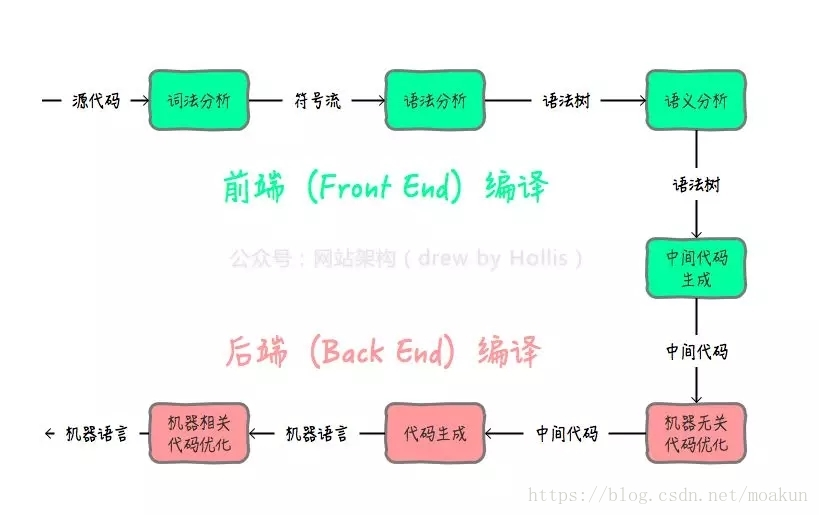

# 深入理解 Vue3 模板编译原理

本文通过系统化的讲解，结合代码示例和结构化分析，帮助读者掌握 Vue3 模板编译的核心流程。即使您是前端开发的初学者，也能通过本文理解模板编译的四个关键阶段。



## 前置知识

1. **模板**：类似于 HTML 的代码片段，例如 `<div>{{ message }}</div>`。
2. **虚拟 DOM**：使用 JavaScript 对象描述页面结构。
3. **AST（抽象语法树）**：一种结构化的数据表示，类似于乐高图纸。

## 整体流程概述

Vue3 模板编译可以分为四个核心阶段：

1. **解析阶段**：将模板字符串转换为结构化的 AST。
2. **转换阶段**：对 AST 进行优化和增强。
3. **代码生成阶段**：将优化后的 AST 转换为可执行的渲染函数。
4. **运行时执行阶段**：通过渲染函数生成虚拟 DOM 并渲染页面。

## 一、解析阶段（Parsing）—— 将模板转换为 AST

### 核心目标

将模板字符串解析为抽象语法树（AST），以便后续阶段能够高效地处理模板结构。

### 实现代码

```javascript
let currentParent;
const stack = [];
const ast = { type: 'Root', children: [] };
currentParent = ast;

function parse(template) {
  const regex = /<(\w+)([^>]*)>|<\/\w+>|{{(.*?)}}|([^<]+)/g;

  template.replace(regex, (match, startTag, attrs, interpolation, text) => {
    if (startTag) {
      const element = {
        type: 'Element',
        tag: startTag,
        attrs: parseAttrs(attrs),
        children: [],
      };
      currentParent.children.push(element);
      stack.push(element);
      currentParent = element;
    } else if (match.startsWith('</')) {
      stack.pop();
      currentParent = stack[stack.length - 1] || ast;
    } else if (interpolation) {
      currentParent.children.push({
        type: 'Interpolation',
        content: interpolation.trim(),
      });
    } else if (text?.trim()) {
      currentParent.children.push({
        type: 'Text',
        content: text.trim(),
      });
    }
  });

  return ast;
}

function parseAttrs(attrsStr) {
  return attrsStr
    .split(/\s+/)
    .filter((attr) => attr)
    .map((attr) => {
      const [name, value] = attr.split('=');
      return { name, value: value?.replace(/['"]/g, '') };
    });
}

// 测试复杂模板
const template = `
  <div class="container">
    <p>欢迎您，{{ userName }}！</p>
    <button @click="handleClick">点击</button>
  </div>
`;
console.log(parse(template));
```

### AST 输出示例

```json
{
  "type": "Root",
  "children": [
    {
      "type": "Element",
      "tag": "div",
      "attrs": [{ "name": "class", "value": "container" }],
      "children": [
        {
          "type": "Element",
          "tag": "p",
          "attrs": [],
          "children": [
            { "type": "Text", "content": "欢迎您，" },
            { "type": "Interpolation", "content": "userName" },
            { "type": "Text", "content": "！" }
          ]
        },
        {
          "type": "Element",
          "tag": "button",
          "attrs": [{ "name": "@click", "value": "handleClick" }],
          "children": [{ "type": "Text", "content": "点击" }]
        }
      ]
    }
  ]
}
```

### 常见问题解答

1. **Q**: 为什么需要 AST？ **A**: AST 是模板的结构化表示，类似于建筑的蓝图，为后续处理提供基础。

2. **Q**: 正则表达式如何处理复杂情况？ **A**: 实际 Vue 编译器使用状态机解析模板，本文使用正则简化演示。

---

## 二、转换阶段（Transforming）—— 对 AST 进行优化

### 核心目标

对 AST 进行优化和增强，为其添加必要的信息以支持后续代码生成。

```javascript
function transform(ast) {
  const context = {
    helpers: new Set(['toDisplayString']),
    currentNode: null,
  };

  function traverse(node) {
    context.currentNode = node;

    if (node.type === 'Interpolation') {
      node.content = `_ctx.${node.content}`;
    }

    if (node.type === 'Element') {
      node.props = node.attrs.filter((attr) => {
        if (attr.name.startsWith('@')) {
          node.events = node.events || [];
          node.events.push({
            name: attr.name.slice(1),
            handler: attr.value,
          });
          return false;
        }
        return true;
      });
    }

    if (node.children) {
      node.children.forEach((child) => traverse(child));
    }

    context.currentNode = null;
  }

  traverse(ast);

  return {
    ast,
    helpers: Array.from(context.helpers),
  };
}

// 执行转换
const transformed = transform(ast);
console.log(transformed.ast);
```

### 转换后变化

1. 插值表达式添加 `_ctx.` 前缀。
2. 事件指令被提取到 `events` 属性。
3. 收集需要的辅助函数。

---

## 三、代码生成阶段（Code Generation）—— 生成渲染函数

### 核心目标

将优化后的 AST 转换为可执行的渲染函数。

```javascript
function generate(transformed) {
  const { ast, helpers } = transformed;

  const code = `
    ${helpers.map((h) => `const ${h} = Vue.${h}`).join('\n')}

    return function render(_ctx) {
      return ${genNode(ast.children[0])}
    }
  `;

  function genNode(node) {
    switch (node.type) {
      case 'Element':
        return `h('${node.tag}', {${genProps(node)}}, [${node.children.map(genNode).join(', ')}])`;
      case 'Interpolation':
        return `toDisplayString(${node.content})`;
      case 'Text':
        return `"${node.content}"`;
    }
  }

  function genProps(node) {
    const props = [];
    if (node.attrs) {
      props.push(
        ...node.attrs.map(
          (attr) =>
            `${JSON.stringify(attr.name)}: ${JSON.stringify(attr.value)}`,
        ),
      );
    }
    if (node.events) {
      props.push(
        ...node.events.map(
          (event) =>
            `on${event.name[0].toUpperCase() + event.name.slice(1)}: ${event.handler}`,
        ),
      );
    }
    return props.join(', ');
  }

  return code;
}

// 生成代码
const generatedCode = generate(transformed);
console.log(generatedCode);
```

### 生成的渲染函数

```javascript
const toDisplayString = Vue.toDisplayString;

return function render(_ctx) {
  return h('div', { class: 'container' }, [
    h('p', {}, ['欢迎您，', toDisplayString(_ctx.userName), '！']),
    h(
      'button',
      {
        onClick: handleClick,
      },
      ['点击'],
    ),
  ]);
};
```

---

## 四、运行时执行阶段（Runtime Execution）—— 渲染页面

### 核心流程

```javascript
// Vue 的运行时帮助函数
const h = Vue.h;
const toDisplayString = Vue.toDisplayString;

// 生成的渲染函数
function render(_ctx) {
  // ...上面的生成代码
}

// 组件实例
const app = {
  setup() {
    const userName = Vue.ref('张三');
    const handleClick = () => alert('点击事件');
    return { userName, handleClick };
  },
  render,
};

// 挂载到页面
Vue.createApp(app).mount('#app');
```

### 最终虚拟 DOM

```javascript
{
  tag: 'div',
  props: { class: 'container' },
  children: [
    {
      tag: 'p',
      children: ['欢迎您，', '张三', '！']
    },
    {
      tag: 'button',
      props: { onClick: handleClick },
      children: ['点击']
    }
  ]
}
```

---

## 总结

Vue3 模板编译通过解析、转换、代码生成和运行时执行四个阶段，将模板字符串转换为高效的虚拟 DOM 渲染逻辑。理解这一过程有助于开发者优化模板性能，并深入掌握 Vue3 的工作原理。
