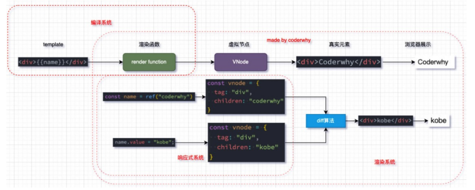

# Vue 3 渲染原理

Vue 3 的渲染机制是其核心特性之一，它通过虚拟 DOM（Virtual DOM）、响应式系统（Reactive System）和高效的 Diffing 算法（Diffing Algorithm）来实现高效且自动化的 UI 更新。这些机制共同作用，使得开发者可以构建性能优越、用户体验流畅的单页面应用（SPA）。以下是关于这些概念及其在 Vue 3 中如何工作的详细解析。

## 核心概念

### 1. 虚拟 DOM（Virtual DOM）

虚拟 DOM 是一个轻量级的 JavaScript 对象树，用来表示实际的 DOM 结构。Vue 使用虚拟 DOM 来优化对真实 DOM 的操作，因为直接操作真实 DOM 是昂贵的操作。虚拟 DOM 可以更快速地创建、更新和删除节点，并且只会在必要时将这些更改同步到真实的 DOM 中。

### 2. 响应式系统（Reactive System）

Vue 3 的响应式系统是基于 ECMAScript 的 Proxy 对象构建的，它能够拦截对象属性的读取和设置操作，从而追踪数据依赖关系。每当被代理的数据发生变化时，Vue 可以精确地知道哪些组件依赖于该数据，并仅重新渲染那些受影响的部分，而不是整个应用程序。

### 3. Diffing 算法

当 Vue 需要更新视图时，它会生成一个新的虚拟 DOM 树，并与现有的虚拟 DOM 树进行比较（即 diffing）。这个过程帮助识别出最小的差异集，然后只应用这些差异到真实的 DOM 中，这样就可以避免不必要的重绘和回流，提高性能。

## 渲染过程


### 1. 创建虚拟节点

Vue 使用 `h` 函数（或 `createVNode`）来创建描述用户界面的虚拟节点。每个虚拟节点都包含了标签名、属性和子节点等信息。

### 2. 响应式数据绑定

所有用于驱动视图的数据都被包裹在一个 `reactive` 或 `ref` 函数中，这使得它们成为响应式的。任何对这些数据的修改都会触发相应的视图更新。

### 3. 渲染虚拟 DOM 到真实 DOM

Vue 通过一个称为“协调”（reconciliation）的过程，将虚拟 DOM 映射到真实 DOM。首次渲染时，Vue 将根据虚拟 DOM 构建真实的 DOM 元素；之后每次数据变化时，Vue 会执行 diffing 算法，只更新必要的部分。

### 4. Diffing 更新

在检测到数据变化后，Vue 会创建一个新的虚拟 DOM 树并与旧的虚拟 DOM 树做对比。它使用一系列优化策略来确定哪些元素需要更新、添加或移除，然后把这些变更应用到实际的 DOM 上。

## Vue 3 渲染原理的核心代码实现


为了更好地理解 Vue 3 的渲染机制，我们可以简化地展示一些关键功能的实现：

### 1. 创建虚拟节点

```javascript
function createVNode(type, props = {}, children = []) {
  return { type, props, children };
}
```

### 2. 响应式数据代理

Vue 3 使用了 `Proxy` 来实现响应式：

```javascript
function reactive(obj) {
  return new Proxy(obj, {
    get(target, key, receiver) {
      track(target, key); // 收集依赖
      return Reflect.get(target, key, receiver);
    },
    set(target, key, value, receiver) {
      const result = Reflect.set(target, key, value, receiver);
      if (result) {
        trigger(target, key); // 触发更新
      }
      return result;
    }
  });
}

// 简化版的依赖收集函数
function track(target, key) {
  if (!activeEffect) return;
  let depsMap = targetMap.get(target);
  if (!depsMap) {
    depsMap = new Map();
    targetMap.set(target, depsMap);
  }
  let dep = depsMap.get(key);
  if (!dep) {
    dep = new Set();
    depsMap.set(key, dep);
  }
  dep.add(activeEffect);
}

// 简化版的触发更新函数
function trigger(target, key) {
  const depsMap = targetMap.get(target);
  if (!depsMap) return;
  const effects = depsMap.get(key);
  effects && effects.forEach(effect => effect());
}
```

### 3. 依赖收集和通知机制

这里我们定义了一个简单的依赖收集器 Dep 和一个全局变量 activeEffect 来跟踪当前激活的效果函数（effect function），例如由 `watchEffect` 创建的函数。

```javascript
let activeEffect = null;
const targetMap = new WeakMap();

class Dep {
  constructor() {
    this.effects = new Set();
  }

  addEffect(effect) {
    this.effects.add(effect);
  }

  trigger() {
    this.effects.forEach(effect => effect());
  }
}
```

### 4. 渲染虚拟 DOM 到真实 DOM



这是一个简化的渲染函数，它递归地遍历虚拟节点并将其转换为真实的 DOM 元素。

```javascript
function render(vnode, container) {
  if (!vnode) {
    if (container._vnode) {
      container.innerHTML = '';
    }
    return;
  }
  patch(container._vnode || null, vnode, container);
  container._vnode = vnode;
}

function patch(oldVNode, newVNode, container) {
  if (oldVNode === newVNode) return;

  if (newVNode == null) {
    // 卸载旧节点
    container.removeChild(oldVNode.el);
  } else if (typeof newVNode.type === 'string') {
    // 处理普通元素节点
    processElement(oldVNode, newVNode, container);
  } else if (typeof newVNode.type === 'object') {
    // 处理组件节点
    processComponent(oldVNode, newVNode, container);
  } else {
    // 文本节点
    processTextVNode(oldVNode, newVNode, container);
  }
}

function processElement(oldVNode, newVNode, container) {
  if (!oldVNode) {
    mountElement(newVNode, container);
  } else {
    patchElement(oldVNode, newVNode);
  }
}

function mountElement(vnode, container) {
  const el = vnode.el = document.createElement(vnode.type);
  const { children, props } = vnode;

  if (props) {
    for (const key in props) {
      setAttribute(el, key, props[key]);
    }
  }

  if (typeof children === 'string') {
    el.textContent = children;
  } else if (Array.isArray(children)) {
    children.forEach(child => patch(null, child, el));
  }

  container.appendChild(el);
}

function patchElement(oldVNode, newVNode) {
  const el = newVNode.el = oldVNode.el;
  const oldProps = oldVNode.props || {};
  const newProps = newVNode.props || {};

  patchProps(el, oldProps, newProps);

  patchChildren(oldVNode, newVNode, el);
}

function patchProps(el, oldProps, newProps) {
  for (const key in newProps) {
    if (newProps[key] !== oldProps[key]) {
      setAttribute(el, key, newProps[key]);
    }
  }
  for (const key in oldProps) {
    if (!(key in newProps)) {
      setAttribute(el, key, null);
    }
  }
}

function patchChildren(oldVNode, newVNode, container) {
  const c1 = oldVNode.children;
  const c2 = newVNode.children;

  if (typeof c2 === 'string') {
    if (Array.isArray(c1)) {
      container.innerHTML = '';
    }
    if (c2 !== c1) {
      container.textContent = c2;
    }
  } else if (Array.isArray(c2)) {
    if (Array.isArray(c1)) {
      updateChildren(container, c1, c2);
    } else {
      container.innerHTML = '';
      c2.forEach(child => patch(null, child, container));
    }
  } else {
    if (Array.isArray(c1)) {
      container.innerHTML = '';
    }
  }
}

function updateChildren(container, oldChildren, newChildren) {
  let lastIndex = 0;
  for (let i = 0; i < newChildren.length; i++) {
    const newChild = newChildren[i];
    let found = false;
    for (let j = 0; j < oldChildren.length; j++) {
      const oldChild = oldChildren[j];
      if (isSameVNodeType(newChild, oldChild)) {
        patch(oldChild, newChild, container);
        if (j < lastIndex) {
          // 移动节点
          const nextSibling = container.childNodes[j + 1] || null;
          container.insertBefore(newChild.el, nextSibling);
        } else {
          lastIndex = j;
        }
        found = true;
        break;
      }
    }
    if (!found) {
      // 新增节点
      container.insertBefore(patch(null, newChild, container), container.childNodes[i] || null);
    }
  }
  // 移除多余的旧节点
  for (let i = newChildren.length; i < oldChildren.length; i++) {
    container.removeChild(oldChildren[i].el);
  }
}

function setAttribute(el, key, value) {
  if (key.startsWith('on')) {
    el.addEventListener(key.slice(2).toLowerCase(), value);
  } else if (value == null || value === false) {
    el.removeAttribute(key);
  } else {
    el.setAttribute(key, value);
  }
}

function processTextVNode(oldVNode, newVNode, container) {
  if (oldVNode) {
    const el = newVNode.el = oldVNode.el;
    if (newVNode.children !== oldVNode.children) {
      el.nodeValue = newVNode.children;
    }
  } else {
    const el = newVNode.el = document.createTextNode(newVNode.children);
    container.appendChild(el);
  }
}

function processComponent(oldVNode, newVNode, container) {
  if (!oldVNode) {
    mountComponent(newVNode, container);
  } else {
    updateComponent(oldVNode, newVNode);
  }
}

function mountComponent(initialVNode, container) {
  const instance = new initialVNode.type(initialVNode.props);
  const subTree = instance.render();
  patch(null, subTree, container);
  initialVNode.el = subTree.el;
}

function updateComponent(oldVNode, newVNode) {
  newVNode.el = oldVNode.el;
  const instance = newVNode.component = oldVNode.component;
  if (instance.props !== newVNode.props) {
    instance.props = newVNode.props;
    const subTree = instance.render();
    patch(oldVNode.component.subTree, subTree, oldVNode.el.parentNode);
    newVNode.component.subTree = subTree;
  }
}

function isSameVNodeType(n1, n2) {
  return n1.type === n2.type && n1.key === n2.key;
}
```

### 5. 依赖收集和响应式更新

当我们在模板中使用响应式数据时，Vue 会自动创建一个副作用函数（side effect function），并通过 `watchEffect` 来追踪依赖关系。

```javascript
function watchEffect(effectFn) {
  activeEffect = effectFn;
  activeEffect();
  activeEffect = null;
}
```

### 6. Diffing 算法

Vue 3 的 Diffing 算法考虑到了多种优化策略，比如 key 属性的支持、静态节点提升以及同层级比较等，以确保尽可能少地操作 DOM。

### 7. 响应式数据和视图更新

当响应式数据发生变化时，Vue 会自动触发相关的视图更新。下面是一个例子，展示了如何结合响应式数据和视图更新：

```javascript
import { h, render, watchEffect } from 'vue';

// 响应式数据
const state = reactive({
  message: 'Hello, Vue 3!',
  count: 0
});

// 创建应用
function App() {
  return h('div', { id: 'app' }, [
    h('h1', {}, state.message),
    h('p', {}, `Count: ${state.count}`)
  ]);
}

// 挂载到 DOM
const root = document.getElementById('root');
render(h(App), root);

// 监听数据变化并更新视图
watchEffect(() => {
  render(h(App), root);
});

// 模拟数据变化
setInterval(() => {
  state.count++;
}, 1000);
```

## 总结

Vue 3 的渲染原理基于以下几大支柱：

- **虚拟 DOM**：提供了一种高效的方式来管理和更新 UI。
- **响应式系统**：利用 Proxy 提供了强大且灵活的数据绑定能力。
- **Diffing 算法**：通过智能比较新旧虚拟 DOM 树，实现了最小化的 DOM 操作。

这些技术相结合，不仅提升了开发体验，还保证了应用的高性能。Vue 3 的设计允许开发者专注于构建逻辑，而框架本身处理了复杂的 UI 更新细节。
