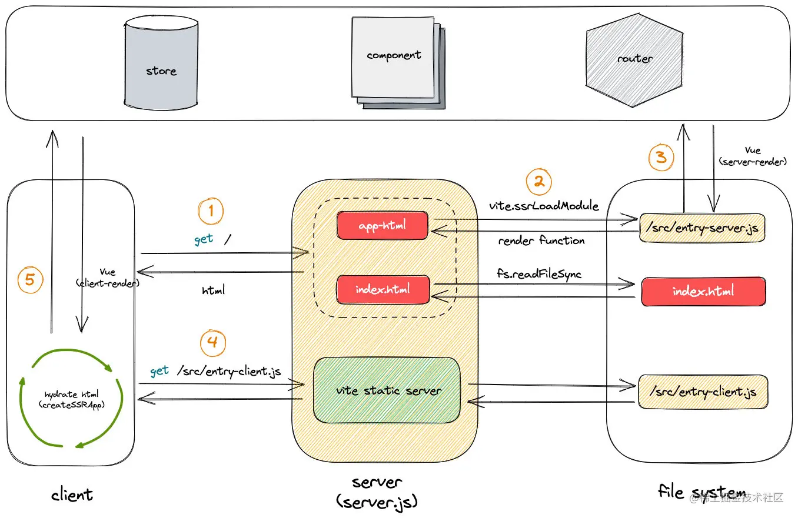

# Vue 3 SSR 深度解析：从原理到实战

## 一、SSR 的历史与意义

### 1. SSR 的历史

服务器端渲染（Server-Side Rendering，SSR）技术由来已久，在 Web 开发的早期阶段，动态网页主要依赖服务器端生成 HTML 内容。随着前端技术的发展，尤其是 JavaScript 框架的兴起，客户端渲染（Client-Side Rendering，CSR）逐渐成为主流。然而，CSR 在首屏加载速度和 SEO 方面存在一些不足，这促使开发者重新关注 SSR 技术。Vue 3 在 SSR 方面进行了全面的优化和改进，提供了更高效、更灵活的 SSR 支持。

### 2. SSR 的意义

- **提升首屏加载速度**：SSR 在服务器端完成页面的初次渲染，将生成的 HTML 直接发送给客户端，用户可以更快地看到页面内容，提升用户体验。
- **优化 SEO**：搜索引擎爬虫可以直接抓取渲染后的页面内容，提高页面的可索引性，有助于提升网站的搜索排名。
- **减少客户端负担**：SSR 减少了客户端 JavaScript 的初始负载，尤其是在低性能设备上，可以显著改善性能。

## 二、SSR 的优缺点

### 1. 优点

- **首屏加载更快**：SSR 在服务器端完成页面的初次渲染，用户可以更快地看到页面内容。
- **SEO 更友好**：SSR 生成的页面内容可以直接被搜索引擎爬虫抓取，提高页面的可索引性。
- **减少客户端负担**：SSR 减少了客户端 JavaScript 的初始负载，尤其是在低性能设备上，可以显著改善性能。

### 2. 缺点

- **服务器压力增大**：SSR 需要在服务器端完成页面渲染，增加了服务器的负担，尤其是在高并发场景下。
- **开发复杂度增加**：SSR 需要同时处理服务器端和客户端的逻辑，增加了开发和维护的复杂度。
- **动态内容更新延迟**：SSR 的页面内容在服务器端生成，动态内容的更新可能会有延迟，需要通过数据预取等手段进行优化。

## 三、SSR 的技术原理


### 1. SSR 的工作流程

SSR 的工作流程主要包括以下步骤：

1. **服务器接收请求**：用户通过浏览器发起请求，服务器接收到请求后，开始处理 SSR 逻辑。
2. **创建 Vue 应用实例**：在服务器端，使用 `createSSRApp` 创建 Vue 应用实例。
3. **路由匹配**：使用 `vue-router` 匹配请求的 URL，确定需要渲染的组件。
4. **渲染组件为 HTML 字符串**：使用 `vue-server-renderer` 将 Vue 组件渲染为 HTML 字符串。
5. **发送 HTML 到客户端**：将生成的 HTML 字符串发送到客户端，客户端接收到 HTML 后，可以直接显示内容。
6. **客户端 hydration 激活交互**：客户端加载 JavaScript 脚本，将静态 HTML 转换为动态的 Vue 应用。

### 2. 核心技术

- **`vue-server-renderer`**：Vue 官方提供的 SSR 支持库，用于在服务器端渲染 Vue 组件。
- **`vue-router`**：用于处理路由匹配，确保服务器端和客户端的路由一致。
- **`createSSRApp`**：用于在服务器端创建 Vue 应用实例。

## 四、工程实践上的注意事项



### 1. 项目结构

一个典型的 Vue 3 SSR 项目结构如下：

```plaintext
project/
├── src/
│   ├── App.vue
│   ├── main.js
│   ├── entry-client.js
│   └── entry-server.js
├── server.js
└── vite.config.js
```

- **`entry-client.js`**：客户端入口文件，用于激活服务器端渲染的结果。
- **`entry-server.js`**：服务器端入口文件，用于创建 Vue 应用实例并渲染组件。
- **`server.js`**：服务器端主文件，用于处理 HTTP 请求并返回渲染后的 HTML。

### 2. 依赖安装

安装必要的依赖：

```bash
npm install vue@next vue-router@4 @vue/server-renderer express
```

### 3. 配置 Vite

在 `vite.config.js` 中配置 SSR：

```javascript
import { defineConfig } from 'vite';
import vue from '@vitejs/plugin-vue';

export default defineConfig({
  plugins: [vue()],
  server: {
    middlewareMode: 'ssr',
  },
  build: {
    outDir: 'dist',
    ssr: true,
  },
});
```

### 4. 服务器端渲染逻辑

在 `entry-server.js` 中编写服务器端渲染逻辑：

```javascript
import { createApp } from './main';

export async function renderApp(url) {
  const { app, router } = createApp();

  router.push(url);
  await router.isReady();

  return app;
}
```

### 5. 客户端激活逻辑

在 `entry-client.js` 中编写客户端激活逻辑：

```javascript
import { createApp } from './main';

const { app, router } = createApp();

router.isReady().then(() => {
  app.$mount('#app');
});
```

### 6. 服务器端主文件

在 `server.js` 中编写服务器端主文件：

```javascript
import express from 'express';
import { renderToString } from '@vue/server-renderer';
import { renderApp } from './dist/entry-server.js';

const server = express();
server.use(express.static('dist'));

server.get('*', async (req, res) => {
  const app = await renderApp(req.url);
  const html = await renderToString(app);

  res.send(`
    <!DOCTYPE html>
    <html>
      <head>
        <title>Vue 3 SSR</title>
      </head>
      <body>
        <div id="app">${html}</div>
        <script src="/entry-client.js"></script>
      </body>
    </html>
  `);
});

server.listen(3000, () => {
  console.log('SSR Server running on port 3000');
});
```

## 五、脱水和注水的原理

### 1. 脱水原理

脱水是指在服务器端渲染 Vue 组件时，将组件的状态信息（如数据、方法等）序列化为 JSON 字符串，嵌入到生成的 HTML 中。这样，客户端在加载页面时，可以直接使用这些状态信息，而无需重新获取数据。

```javascript
// 服务器端
const context = { url: req.url };
const app = await renderApp(context.url);
const html = await renderToString(app);

res.send(`
  <!DOCTYPE html>
  <html>
    <head>
      <title>Vue 3 SSR</title>
    </head>
    <body>
      <div id="app">${html}</div>
      <script>
        window.__INITIAL_STATE__ = ${JSON.stringify(context.state)};
      </script>
      <script src="/entry-client.js"></script>
    </body>
  </html>
`);
```

### 2. 注水原理

注水是指在客户端加载页面后，将嵌入到 HTML 中的状态信息（如数据、方法等）反序列化为 JavaScript 对象，并将其注入到 Vue 应用中。这样，客户端可以直接使用这些状态信息，而无需重新获取数据。

```javascript
// 客户端
import { createApp } from './main';

const { app, router } = createApp();

router.isReady().then(() => {
  app.$mount('#app');
});

// 注入状态信息
app.config.globalProperties.$initialState = window.__INITIAL_STATE__;
```

## 六、示例代码

### 1. 服务器端渲染示例

```javascript
// server.js
import express from 'express';
import { renderToString } from '@vue/server-renderer';
import { renderApp } from './dist/entry-server.js';

const server = express();
server.use(express.static('dist'));

server.get('*', async (req, res) => {
  const app = await renderApp(req.url);
  const html = await renderToString(app);

  res.send(`
    <!DOCTYPE html>
    <html>
      <head>
        <title>Vue 3 SSR</title>
      </head>
      <body>
        <div id="app">${html}</div>
        <script src="/entry-client.js"></script>
      </body>
    </html>
  `);
});

server.listen(3000, () => {
  console.log('SSR Server running on port 3000');
});
```

### 2. 客户端激活示例

```javascript
// entry-client.js
import { createApp } from './main';

const { app, router } = createApp();

router.isReady().then(() => {
  app.$mount('#app');
});
```

### 3. 组件示例

```vue
<!-- App.vue -->
<template>
  <div id="app">
    <h1>Vue 3 SSR Demo</h1>
    <router-view></router-view>
  </div>
</template>

<script setup>
import { onMounted } from 'vue';

onMounted(() => {
  console.log('App mounted on client');
});
</script>
```

## 七、总结

Vue 3 的 SSR 技术通过在服务器端渲染页面，显著提升了首屏加载速度和 SEO 效果。通过合理的项目结构和配置，可以实现高效的 SSR 应用。脱水和注水的原理是 SSR 的核心，通过在服务器端和客户端之间传递状态信息，确保应用的无缝衔接。希望本文能帮助您深入理解 Vue 3 SSR 的原理和实践，为您的项目带来更好的性能和用户体验。

## 八、参考

[从头到尾彻底理解服务端渲染SSR原理](https://segmentfault.com/a/1190000023468442)

[这一篇，带你更深入的理解 Vite SSR](https://juejin.cn/post/7072272115470172190)
