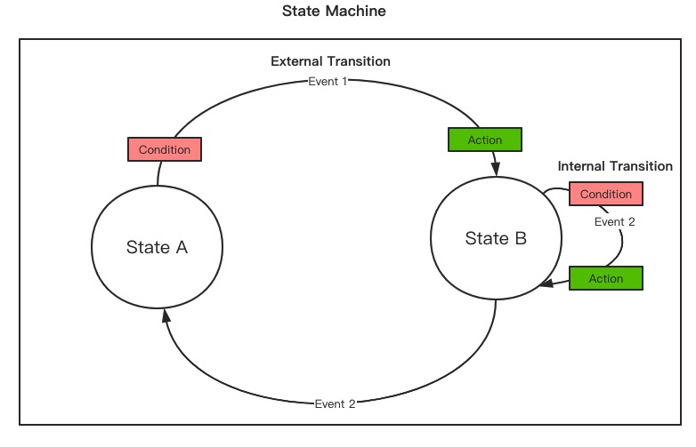
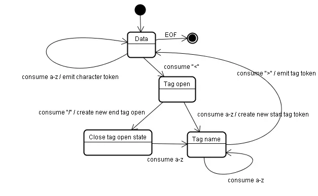

# 状态机：理论与 HTML 状态机的深度解析

## 一、状态机的基本概念



状态机（Finite State Machine, FSM）是一种数学模型，用于描述系统在不同状态之间的转换行为。它由以下几个核心部分组成：

1. **状态（State）**：系统在某一时刻的特定条件或模式。
2. **事件（Event）**：触发状态转换的外部输入或条件。
3. **转换（Transition）**：根据事件从一个状态切换到另一个状态的规则。
4. **动作（Action）**：在状态转换时执行的操作。

状态机的核心思想是通过有限的状态集合和明确的转换规则，描述系统的动态行为。它的优势在于：

- **模块化**：将复杂问题分解为有限的状态和转换。
- **可预测性**：状态和转换规则明确，便于分析和调试。
- **健壮性**：能够处理各种输入和边界情况。

### 状态机的典型应用场景

1. **协议解析**：如 HTTP、TCP 等协议的状态管理。
2. **游戏开发**：角色状态管理（如行走、攻击、死亡）。
3. **UI 状态管理**：如表单验证、页面导航。
4. **编译器设计**：词法分析和语法解析。

## 二、HTML 状态机详解



HTML 状态机是浏览器解析 HTML 文档的核心机制之一。它的任务是将 HTML 字符串解析为 DOM 树。HTML 状态机的设计基于 [WHATWG HTML 标准](https://html.spec.whatwg.org/multipage/parsing.html#parsing)，确保浏览器能够一致地解析 HTML 文档。

### HTML 状态机的核心组成部分

1. **输入流**：HTML 字符串，逐字符处理。
2. **状态**：描述解析器当前的工作模式。
3. **输出流**：生成的 DOM 节点。
4. **转换规则**：根据输入字符和当前状态决定下一步操作。

### HTML 状态机的主要状态

HTML 状态机包含多个状态，以下是几个关键状态及其作用：

1. **数据状态（Data State）**
   - 处理普通字符。
   - 当遇到 `<` 时，切换到标签打开状态。

2. **标签打开状态（Tag Open State）**
   - 处理 `<` 后的字符。
   - 如果是 `/`，切换到标签关闭状态；如果是 `!`，切换到标记声明状态；否则，开始解析标签名称。

3. **标签名称状态（Tag Name State）**
   - 解析标签名称（如 `div`、`p`）。
   - 当遇到空格或 `>` 时，切换到属性名称状态或标签结束状态。

4. **属性名称状态（Attribute Name State）**
   - 解析属性名称（如 `class`、`id`）。
   - 当遇到 `=` 时，切换到属性值状态。

5. **属性值状态（Attribute Value State）**
   - 解析属性值，支持单引号、双引号或无引号。
   - 根据引号类型切换到相应的引号状态。

6. **标签结束状态（Tag End State）**
   - 处理 `>`，完成标签解析。

### HTML 状态机的工作流程

HTML 状态机的工作流程可以总结为以下步骤：

1. 初始化状态为数据状态。
2. 逐字符读取输入流。
3. 根据当前状态和输入字符，执行相应的动作并切换状态。
4. 生成 DOM 节点并构建 DOM 树。
5. 处理特殊情况（如注释、DOCTYPE 声明）。

### HTML 状态机的代码示例

以下是一个简化的 HTML 状态机实现，用于解析简单的 HTML 字符串：

```javascript
class HTMLStateMachine {
  constructor() {
    this.state = 'Data';
    this.currentToken = null;
    this.currentAttribute = null;
    this.tokens = [];
  }

  parse(input) {
    for (let char of input) {
      this[stateMap[this.state]](char);
    }
    return this.tokens;
  }

  Data(char) {
    if (char === '<') {
      this.state = 'TagOpen';
    } else {
      this.emitToken({ type: 'Text', content: char });
    }
  }

  TagOpen(char) {
    if (char === '/') {
      this.state = 'TagClose';
    } else if (char === '!') {
      this.state = 'MarkupDeclaration';
    } else if (char.match(/[A-Za-z]/)) {
      this.currentToken = { type: 'StartTag', tagName: char };
      this.state = 'TagName';
    }
  }

  TagName(char) {
    if (char.match(/\s/)) {
      this.state = 'AttributeName';
    } else if (char === '>') {
      this.emitToken(this.currentToken);
      this.state = 'Data';
    } else {
      this.currentToken.tagName += char;
    }
  }

  AttributeName(char) {
    if (char === '=') {
      this.currentAttribute = { name: '', value: '' };
      this.state = 'AttributeValue';
    } else if (char === '>') {
      this.emitToken(this.currentToken);
      this.state = 'Data';
    } else {
      this.currentToken.attributes = this.currentToken.attributes || [];
      this.currentToken.attributes.push({ name: char, value: '' });
    }
  }

  AttributeValue(char) {
    if (char === '"') {
      this.state = 'AttributeValueDoubleQuoted';
    } else if (char === "'") {
      this.state = 'AttributeValueSingleQuoted';
    } else {
      this.currentAttribute.value += char;
    }
  }

  emitToken(token) {
    this.tokens.push(token);
  }
}

const stateMap = {
  Data: 'Data',
  TagOpen: 'TagOpen',
  TagClose: 'TagClose',
  TagName: 'TagName',
  AttributeName: 'AttributeName',
  AttributeValue: 'AttributeValue',
  AttributeValueDoubleQuoted: 'AttributeValueDoubleQuoted',
  AttributeValueSingleQuoted: 'AttributeValueSingleQuoted',
  MarkupDeclaration: 'MarkupDeclaration'
};

// 测试解析
const parser = new HTMLStateMachine();
const input = '<div class="container"><p>Hello World</p></div>';
console.log(parser.parse(input));
```

### HTML 状态机的输出示例

对于输入 `<div class="container"><p>Hello World</p></div>`，状态机的输出可能如下：

```javascript
[
  { type: 'StartTag', tagName: 'div', attributes: [{ name: 'class', value: 'container' }] },
  { type: 'Text', content: 'Hello World' },
  { type: 'EndTag', tagName: 'p' },
  { type: 'EndTag', tagName: 'div' }
]
```

## 三、状态机的优势与局限性

### 优势

1. **模块化设计**：状态和转换规则清晰，便于维护和扩展。
2. **健壮性**：能够处理各种输入，包括错误和边界情况。
3. **可预测性**：状态和转换规则明确，便于调试和优化。

### 局限性

1. **复杂性**：状态和转换规则过多时，维护成本增加。
2. **性能开销**：频繁的状态切换可能导致性能下降。
3. **表达能力有限**：无法处理无限状态或复杂逻辑。

## 四、总结

状态机是一种强大的工具，广泛应用于协议解析、编译器设计和 UI 状态管理等领域。HTML 状态机作为浏览器解析 HTML 的核心机制，通过有限的状态和明确的转换规则，确保了 HTML 文档的一致性解析。理解状态机的原理和应用，能够帮助开发者设计更高效、健壮的系统。
