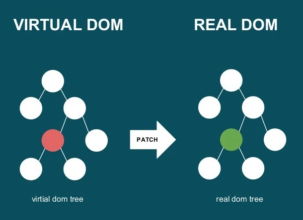
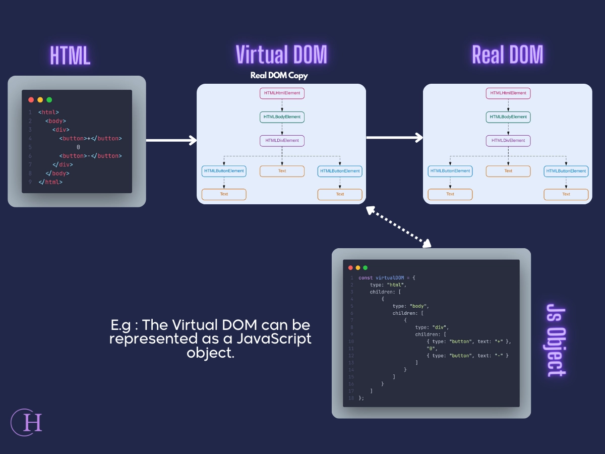

# Virtual DOM 介绍

## 虚拟 DOM 的历史



**背景**

在前端开发的早期阶段，页面动态更新主要依赖于直接操作真实 DOM（Document Object Model）。这种方式虽然直观，但随着应用复杂度增加，频繁的 DOM 操作带来了性能问题。浏览器为了重新渲染页面需要进行重绘（Repaint）和重排（Reflow），这会消耗大量资源，特别是当这些操作嵌套或过于频繁时。此外，直接操作 DOM 导致代码难以维护，并且增加了开发的复杂性。

**Virtual DOM 的引入**

虚拟 DOM 的概念最早是由 Facebook 团队在 React.js 中提出的。React 在 2013 年发布，它通过创建一个轻量级的 JavaScript 对象树来模拟真实的 DOM 结构，从而优化了 UI 更新过程。虚拟 DOM 的设计目的是为了减少直接与真实 DOM 交互的需求，提高应用程序的性能。由于其显著的优势，这一理念很快被其他框架如 Vue、Svelte 等采纳或受其启发发展出类似的机制。

## Virtual DOM 的作用和意义

**抽象能力的提升**

- **跨平台能力**：虚拟 DOM 提供了一种抽象层，使得同一套逻辑可以在不同的环境中运行，比如 Web、移动应用甚至是桌面应用。
- **逻辑与视图分离**：开发者可以更专注于业务逻辑的实现，而将具体的视图更新交给框架处理。

**性能优化**

- **批量更新**：框架可以在内存中先构建新的虚拟 DOM 树，然后一次性地将所有更改同步到实际的 DOM 中，减少了不必要的 DOM 操作次数。
- **差异计算（Diffing）**：通过对新旧虚拟 DOM 树进行比较，找出最小的差异集，确保只对发生变化的部分进行更新，避免了整个页面的重绘和重排。

**提升开发体验**

- **简化开发流程**：开发者不必关心底层的 DOM 操作细节，只需要描述界面的状态变化，就能让框架自动完成视图更新。
- **促进组件化开发**：借助虚拟 DOM 和响应式系统，前端组件化变得更加容易，提高了代码复用性和可维护性。

## Virtual DOM 的核心技术原理

**Virtual DOM 的结构**



虚拟 DOM 是一种轻量级的数据结构，用来表示 HTML 文档的一个状态快照。它通常由一组 JavaScript 对象组成，每个对象代表一个 DOM 元素及其属性和子元素。例如：

```javascript
const vnode = {
  tag: 'div',
  props: { id: 'app', class: 'container' },
  children: [
    { tag: 'h1', props: {}, children: ['Hello, Virtual DOM!'] },
    { tag: 'p', props: {}, children: ['This is a paragraph.'] },
  ],
};
```

- `tag` 表示节点类型（如 div、p）。
- `props` 包含了节点的所有属性（如 id、class）。
- `children` 列表则包含了该节点下的所有子节点，可以是文本或其他虚拟节点。

**Virtual DOM 的核心步骤**

1. **创建 Virtual DOM**：根据模板或者 JSX 语法，生成虚拟 DOM 树。
2. **Diffing 算法**：当数据发生变化时，比较新旧两棵虚拟 DOM 树，识别出它们之间的差异。
3. **Patch 算法**：根据 Diffing 的结果，仅对有差异的地方进行最小化的 DOM 更新。

**Diffing 的实现原理**

React 的 diff 算法基于以下几个假设来提高效率：

- **同层比较**：只会对比同一层级的节点，不会跨越多个层级去寻找匹配项。
- **节点类型相同**：如果两个节点的标签名不同，则认为它们完全不同，直接替换整个节点。
- **按顺序对比子节点**：默认情况下，子节点按照它们在父节点中的出现顺序进行比较，除非特别指定了 key 属性用于标识唯一性。

## Virtual DOM 为前端带来的价值

**性能提升**

- 减少了 DOM 操作的频率，降低了因频繁触发重绘和重排所带来的性能开销。
- 通过智能调度和最小化更新策略，进一步提升了渲染效率。

**开发效率**

- 简化了复杂用户界面的构建过程，提高了开发速度。
- 组件化的设计思想结合虚拟 DOM，使得代码更加模块化、易于管理和扩展。

**跨平台开发**

- 抽象掉了不同平台之间的差异，允许同样的代码库服务于多种终端设备。
- 如 React Native 就是利用虚拟 DOM 的思想实现了 web 技术栈向移动端的迁移。

**生态扩展**

- 提供了丰富的插件和工具链支持，促进了社区的发展和技术的进步。
- 例如 React Fiber 引入了更为灵活的任务调度机制，Vue 的模板编译器提供了高效的编译和优化功能。

## 核心代码示例：Virtual DOM 的实现与 Diffing

下面是一个简化的虚拟 DOM 实现及其 Diffing 算法的例子：

```javascript
// 创建虚拟节点
function createVNode(tag, props = {}, children = []) {
  return { tag, props, children };
}

// 渲染虚拟节点到真实 DOM
function render(vnode, container) {
  const el = document.createElement(vnode.tag);

  // 设置属性
  if (vnode.props) {
    for (const key in vnode.props) {
      if (key.startsWith('on')) {
        el.addEventListener(key.slice(2).toLowerCase(), vnode.props[key]);
      } else {
        el.setAttribute(key, vnode.props[key]);
      }
    }
  }

  // 渲染子节点
  if (Array.isArray(vnode.children)) {
    vnode.children.forEach((child) => {
      if (typeof child === 'string') {
        el.appendChild(document.createTextNode(child));
      } else if (child !== null && typeof child === 'object') {
        render(child, el);
      }
    });
  }

  container.appendChild(el);
  vnode.el = el; // 记录对应的 DOM 元素
}

// Diff 算法：比较新旧虚拟节点，更新真实 DOM
function diff(oldVNode, newVNode, parent) {
  if (!oldVNode) {
    // 新节点存在，旧节点不存在，新增节点
    render(newVNode, parent);
  } else if (!newVNode) {
    // 旧节点存在，新节点不存在，删除节点
    parent.removeChild(oldVNode.el);
  } else if (oldVNode.tag !== newVNode.tag) {
    // 节点类型不同，直接替换
    parent.replaceChild(
      render(newVNode, document.createElement('div')),
      oldVNode.el,
    );
  } else {
    // 更新属性
    const el = oldVNode.el;
    const oldProps = oldVNode.props || {};
    const newProps = newVNode.props || {};

    // 添加/更新属性
    for (const key in newProps) {
      if (key.startsWith('on')) {
        if (oldProps[key] !== newProps[key]) {
          el.removeEventListener(key.slice(2).toLowerCase(), oldProps[key]);
          el.addEventListener(key.slice(2).toLowerCase(), newProps[key]);
        }
      } else if (oldProps[key] !== newProps[key]) {
        el.setAttribute(key, newProps[key]);
      }
    }

    // 移除不再存在的属性
    for (const key in oldProps) {
      if (!(key in newProps)) {
        if (key.startsWith('on')) {
          el.removeEventListener(key.slice(2).toLowerCase(), oldProps[key]);
        } else {
          el.removeAttribute(key);
        }
      }
    }

    // 递归对比子节点
    const oldChildren = Array.isArray(oldVNode.children)
      ? oldVNode.children
      : [];
    const newChildren = Array.isArray(newVNode.children)
      ? newVNode.children
      : [];

    const commonLength = Math.min(oldChildren.length, newChildren.length);
    for (let i = 0; i < commonLength; i++) {
      diff(oldChildren[i], newChildren[i], el);
    }

    // 处理新增加的子节点
    if (newChildren.length > oldChildren.length) {
      for (let i = commonLength; i < newChildren.length; i++) {
        render(newChildren[i], el);
      }
    }

    // 处理移除的子节点
    if (oldChildren.length > newChildren.length) {
      for (let i = commonLength; i < oldChildren.length; i++) {
        el.removeChild(oldChildren[i].el);
      }
    }
  }
}

// 测试
const oldVNode = createVNode('div', { id: 'app' }, [
  createVNode('h1', {}, ['Hello, Virtual DOM!']),
  createVNode('p', {}, ['This is a paragraph.']),
]);

const newVNode = createVNode('div', { id: 'app' }, [
  createVNode('h1', {}, ['Hello, Updated Virtual DOM!']),
  createVNode('p', {}, ['This is an updated paragraph.']),
]);

const container = document.getElementById('root');
render(oldVNode, container); // 渲染初始 Virtual DOM
setTimeout(() => diff(oldVNode, newVNode, container), 2000); // 两秒后执行更新
```

这段代码展示了如何使用 JavaScript 实现一个简单的虚拟 DOM 及其更新逻辑。它包括了创建虚拟节点、将虚拟节点渲染成真实 DOM 以及通过 Diffing 算法来高效地更新现有 DOM 的方法。此示例旨在说明虚拟 DOM 的基本工作原理，而在实际的库或框架中，这些算法会更加复杂和优化。

## 总结

虚拟 DOM 是现代前端开发中的一个重要概念，它不仅解决了传统 DOM 操作带来的性能瓶颈，还极大地改善了开发体验。通过提供一层抽象，虚拟 DOM 使得开发者能够以声明式的方式定义用户界面，并让框架负责最优化的视图更新。随着技术的发展，虚拟 DOM 已经成为许多主流前端框架的核心组成部分，推动了前端领域的创新和发展。
